```{r setup, include=FALSE}
options(htmltools.dir.version = FALSE)
knitr::opts_chunk$set(echo = F, fig.width = 8, fig.height = 8, dpi = 300, fig.path = "image/")
library(tidyverse)
library(nullabor)
source("code/photo_lineup.R")
```

```{r data-setup, include = F}
### Prepare modeldata data frame ###
modeldata <- read.csv("../JSM2016/modeldata.csv", stringsAsFactors = F) %>%
  mutate(start_time = lubridate::ymd_hms(start_time),
         end_time = lubridate::ymd_hms(end_time),
         k = factor(k, levels = c(3, 5)),
         plottype = factor(plottype, levels = c("plain", "trend", "color",
                                                "shape", "colorShape", "colorEllipse",
                                                "colorTrend",  "trendError",
                                                "colorShapeEllipse",
                                                "colorEllipseTrendError"))
  )

```

.center[
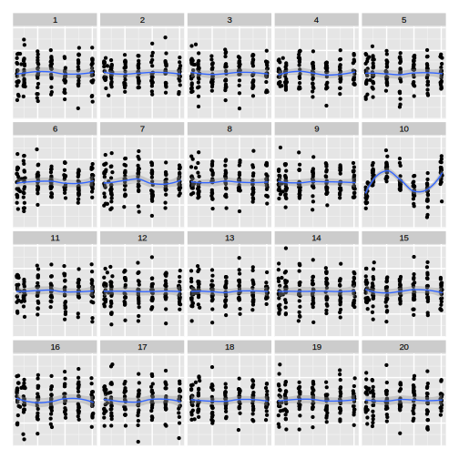
]
.bottom[Lineup from Loy et al (2017)]
---
## Lineup Logic
.pull-left[
1. A statistic is a function of the sample data, so a plot is a __(visual) statistic__

2. Generate __null plots__ by randomizing the data or sampling from the null distribution

3. Construct a __visual hypothesis test__ consisting of $m$ plots, with $m_0$ null plots and $m-m_0$ target plots

4. User testing: $K$ evaluations of the lineup with panel selection counts $c_1, ..., c_m$ where $\displaystyle K = \sum_{i=1}^m c_i$ 

].pull-right[
.center[

]]

.bottom[Lineup from Loy et al (2017)]

---
## Visual P-values

- $K$ evaluations of the lineup by different individuals
- Panel selection counts $c_i, i = 1, ..., m$ where $\sum_i c_i = K$

--
***
Option 1: All plots are equally likely to be selected 
$$\vec{c} \sim\text{Multinomial}(1/20, K)$$

--
***
Option 2: Some null plots may be visually interesting by chance

We can model the panel selection counts $$\vec{c} \sim\text{Multinomial}(\vec{\theta}, K)$$

with panel selection probabilities $\theta_i$ distributed as a symmetric Dirichlet distribution $$\vec\theta \sim \text{Dirichlet}(\alpha)$$

---
## Visual P-values

Option 1 | Option 2
:------: | :------:
All plots are equally likely to be selected | Some null plots may be visually interesting by chance
$$\vec{c} \sim\text{Multinomial}(1/20, K)$$ | $$\vec{c} \sim\text{Multinomial}(\vec{\theta}, K)$$ $$\vec\theta \sim \text{Dirichlet}(\alpha)$$

Either method allows us to calculate a "visual p-value" analogous to a simulation-based hypothesis test

---

.center[
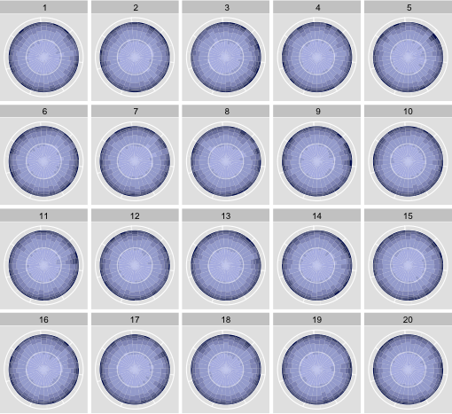
]
.bottom[Lineup from Hofmann et al (2012)]

---

.center[
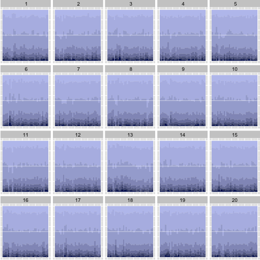
]
.bottom[Lineup from Hofmann et al (2012)]

---
## Visual Power

Lineups allow us to determine the (visual) power of different plot types

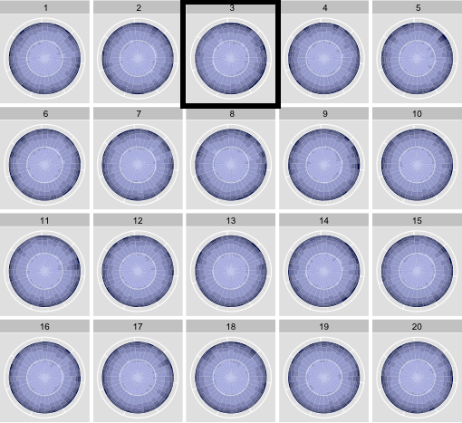
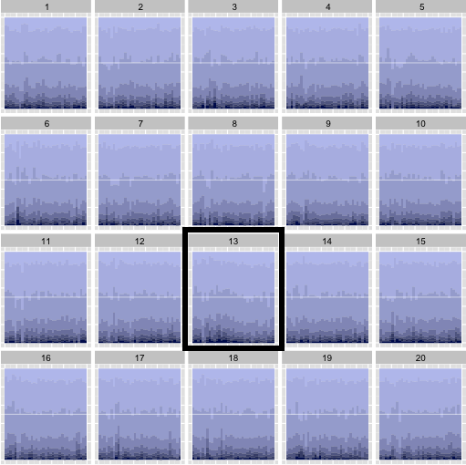

.bottom[Lineups from Hofmann et al (2012)]
--

Whichever design results in the target being identified more often is more visually powerful.

---

.center[

]
.bottom[Lineup from Vanderplas & Hofmann (2017)]

---

.center[
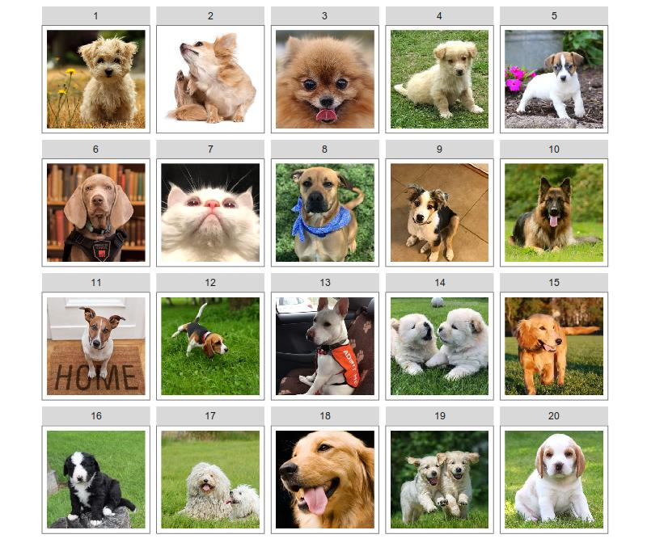
]

---

.center[

]
.bottom[Lineup from Vanderplas & Hofmann (2017)]

---
## Two-Target Lineups

.pull-left[

- Original lineup design modeled on classical hypothesis testing: <br/>under $H_0$, $$P(\text{target plot selected}) = 0.05$$

- Two-target lineups use simulated data from two different data-generating models

- Null plots are a mixture between the two models

].pull-right[
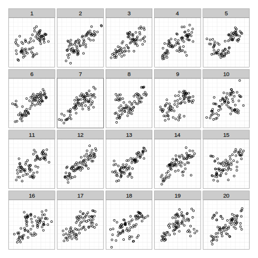
]

.bottom[Lineup from Vanderplas & Hofmann (2017)]

---
## The Giant Two-Target Lineup Factorial Study


Each lineup contains: 

- 1 trend model dataset - "trend target"
- 18 mixture model datasets for null plots
- 1 cluster model dataset - "cluster target"

Goal: Which of the two target plots are most likely to be selected?

- influence of aesthetic choices
- influence of summary objects
???

We can also construct lineups which compare two extremes. Here, the null plots are mixtures of the two base models. The goal of these lineups is to determine which model is more visually salient (and, with different aesthetics, how that answer changes)

---
## The Giant Two-Target Lineup Factorial Study


Data generating parameters:
- $\sigma_T$ - variability around the trend line
- $\sigma_C$ - variability around cluster centers
- $k$ - number of clusters ( $k\in\{3, 5\}$ )
- $N$ - number of points (fixed at $15\cdot k$ )

Levels of data generating parameters chosen to be easy, medium, and hard to discriminate, based on numerical assessments - correlation, Gini inequality

---
## The Giant Two-Target Lineup Factorial Study

### Big picture: 
How do Gestalt principles of perception apply to statistical graphics, and which effects are stronger?

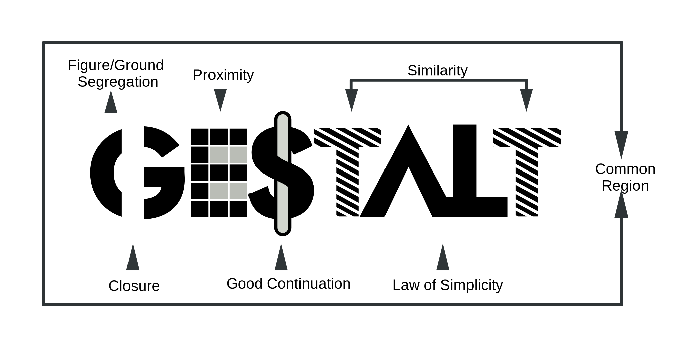

.bottom[Figure modified from [Valessio CC BY  https://creativecommons.org/licenses/by/4.0](https://commons.wikimedia.org/wiki/File:Gestalt.svg)]

---
## The Giant Two-Target Lineup Factorial Study

<table width="100%" class="blank">
<tr class="blank"><td>

</td><td>
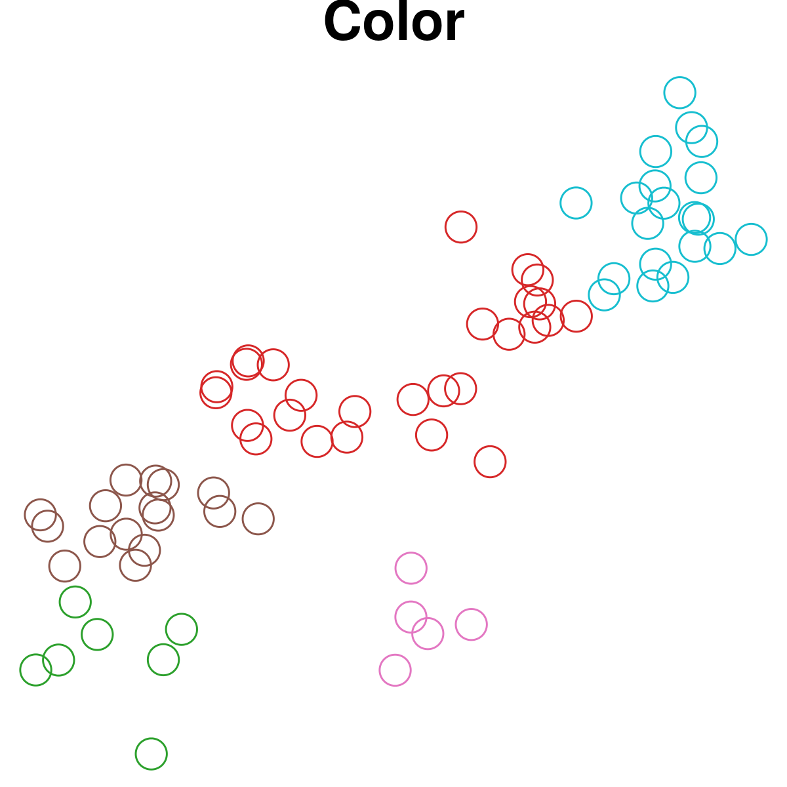
</td><td>

</td><td>
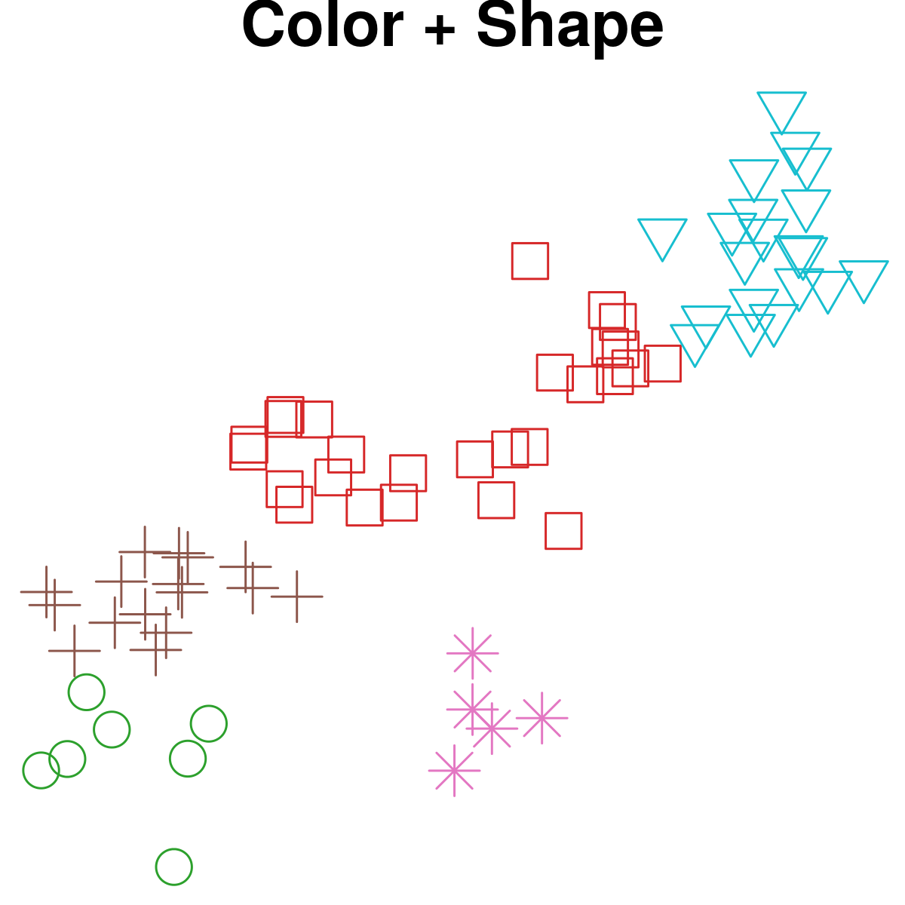
</td><td>
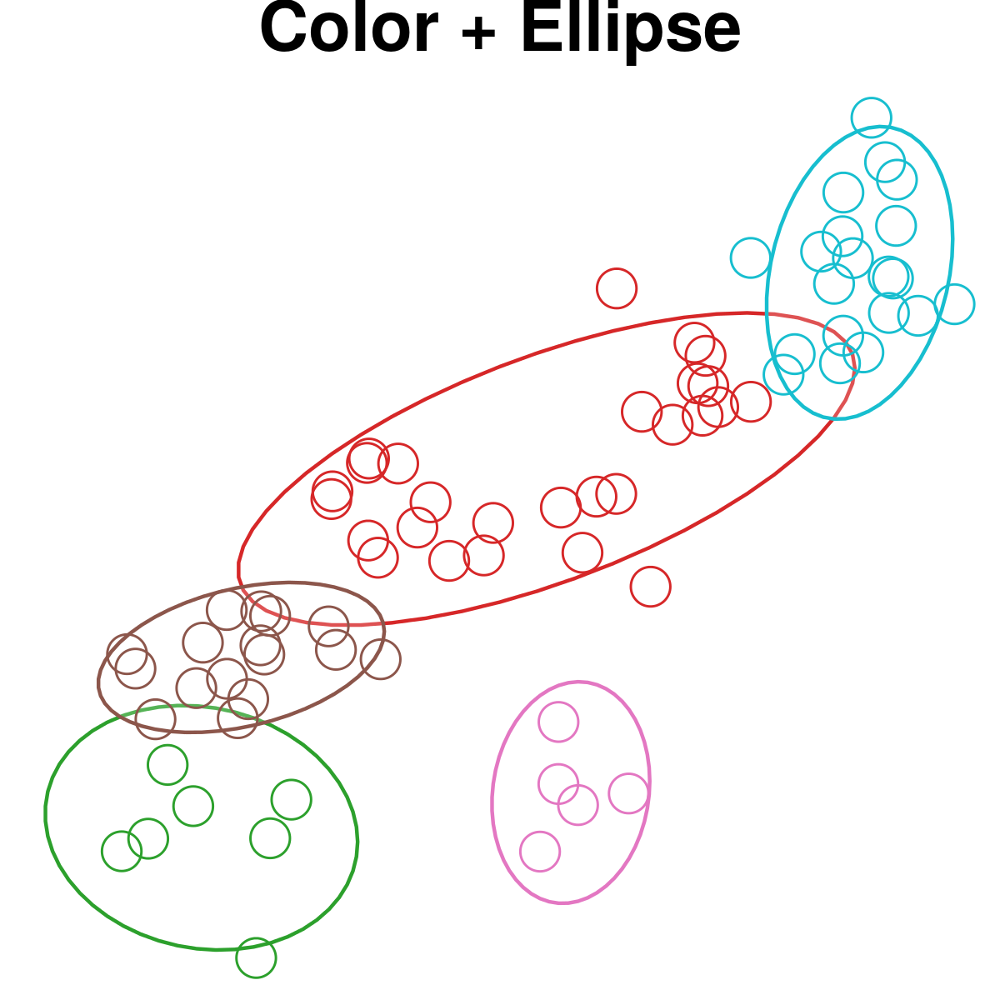
</td></tr>
<tr class="blank"><td>
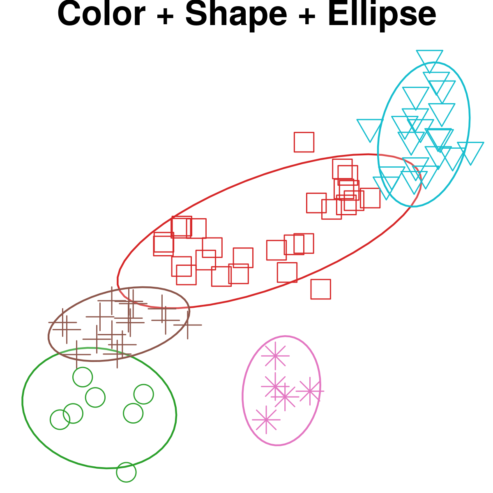
</td><td>
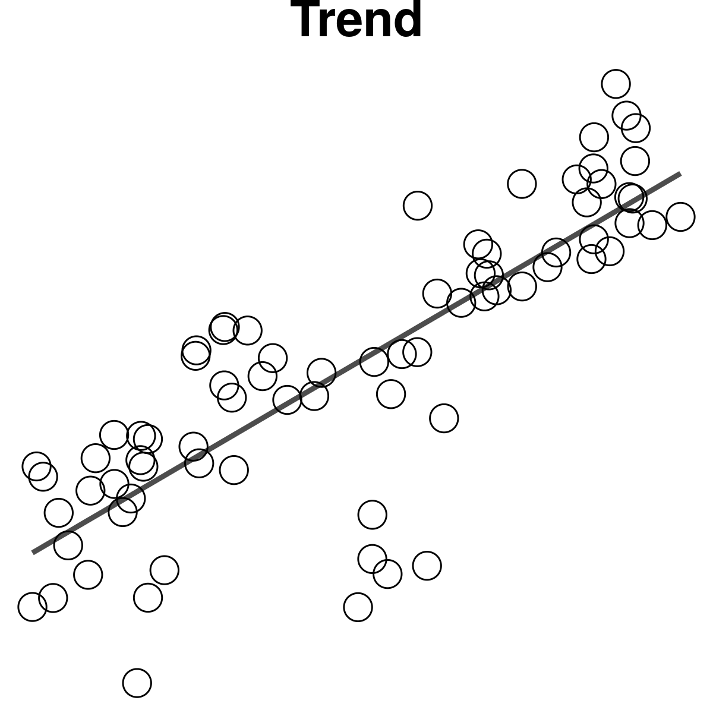
</td><td>

</td><td>

</td><td>

</td></tr>
</table>


- 10 different combinations of aesthetics

- Each combination emphasizes clusters (color, shape, ellipse) or linear trends (trend line, prediction interval)


---
## The Giant Two-Target Lineup Factorial Study

In the end...

3 levels of variability for cluster model    
3 levels of variability for trend model    
2 levels of # clusters (3, 5)    

= 18 parameter combinations

--

x 3 lineup datasets per parameter combination **= 54 datasets**
***

--

x 10 aesthetic combinations per lineup dataset **= 540 different plots**

***

1201 participants x 10 evaluations each    
$=$ 12010 participant evaluations of 540 different plots

$\approx$ 22 evaluations per plot

---
## The Giant Two-Target Lineup Factorial Study

```{r accuracy, fig.width = 8, fig.height = 5, message = F, warning = F}
md <- data.frame(plottype = levels(modeldata$plottype),
                 tendency = c("none", "trend", "cluster", "cluster",
                              "cluster", "cluster", "conflict",
                              "trend", "cluster", "conflict"))

modeldata$label <- modeldata$plottype
modeldata$label <- modeldata$plottype %>%
  str_replace("color", "Color + ") %>%
  str_replace("[sS]hape", "Shape + ") %>%
  str_replace("[tT]rend", "Trend + ") %>%
  str_replace("Ellipse", "Ellipse + ") %>%
  str_replace("Error", "Error + ") %>%
  str_replace("plain", "Plain") %>%
  str_replace("( \\+ )$", "") %>%
  str_replace_all(c("Color" = "C", "Shape" = "S", "Ellipse" = "L",
                    "Trend" = "T", "Error" = "E")) %>%
  str_replace_all(" \\+ ", "+")

faceoff <- subset(modeldata, trend.correct | cluster.correct)

fac.order <- levels(with(faceoff, reorder(label,label,function(x) -length(x))))
modeldata$label <- factor(modeldata$label, levels = fac.order)

totals <- modeldata %>%
  group_by(label, plottype) %>%
  summarize(eval = length(label), type = "Total")

correct.totals <- faceoff %>%
  group_by(label, plottype) %>%
  summarize(eval = length(label), type = "Correct")

sub.totals <- modeldata %>%
  group_by(label, plottype, simpleoutcome) %>%
  summarize(eval = length(label)) %>%
  full_join(md, by = "plottype")

totals <- bind_rows(totals, correct.totals) %>%
  left_join(md, by = "plottype") %>%
  ungroup(label) %>%
  mutate(tendency = factor(tendency,
                          levels = c("none", "trend", "cluster", "conflict")),
         label = factor(label, levels = fac.order, ordered = T))

md <- full_join(md, subset(totals, type == "Correct")[,c("plottype", "label", "eval")],
            by = "plottype") %>%
  arrange(tendency, eval)

totals$label <- factor(totals$label, levels = md$label)
totals$nlabel = as.numeric(totals$label)
sub.totals$nlabel = as.numeric(factor(sub.totals$label, levels = md$label))
sub.totals$simpleoutcome <- factor(
  sub.totals$simpleoutcome,
  levels = c("cluster", "both", "trend", "neither"))
sub.totals$tendency <- factor(sub.totals$tendency,
                              levels = c("none", "trend", "cluster", "conflict"))

ggplot() +
  geom_bar(aes(x = label, fill = simpleoutcome, weight = eval), data = sub.totals,
           colour = "grey40") +
  facet_grid(.~tendency, space = "free", scales = "free_x") +
  scale_y_continuous(expand = c(0, 0), trans = "reverse") + 
  scale_x_discrete(expand = c(0, 0)) + 
  xlab("Plot Type") + ylab("# of target evaluations") +
  theme_bw() +
  theme(axis.text.x = element_text(vjust = 1), legend.position = "right", axis.text.y = element_text(angle = 90, hjust = .5, vjust = .5)) +
  scale_fill_manual("Target\nIdentified", values = c("skyblue4", "grey90", "skyblue", "darkorange"),
                    guide = guide_legend(reverse = TRUE))

```


---
## The Giant Two-Target Lineup Factorial Study

Modeling $P(\text{Cluster selected} | \text{Cluster or Trend target selected})$, 

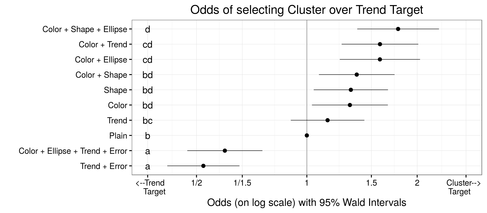

Fitting models is one thing, but we might get some more clarity from asking participants why they selected their answer.

???

- Error bands increase the likelihood of selecting the trend target
- Color, Shape, Ellipses increase the likelihood of selecting the cluster target

- Color beats trend
- Error bands beat color + ellipse


---
## The Giant Two-Target Lineup Factorial Study

But how do participants justify their choices?

When shown a **plain** plot... Participants who chose .underline[.hidden[some plot]] said: 

Cluster | Null | Trend
------- | ---- | -------
 | 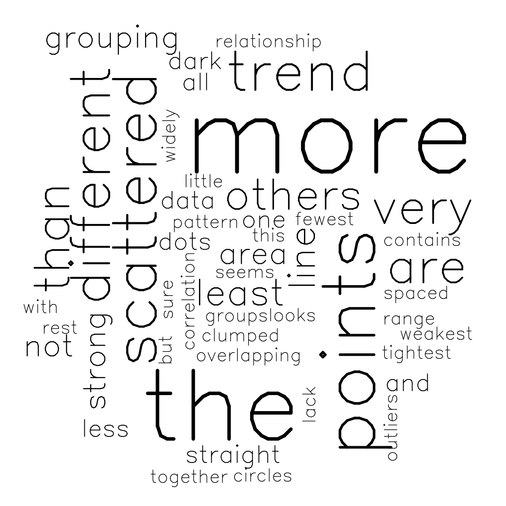 |  


---
## The Giant Two-Target Lineup Factorial Study

But how do participants justify their choices?

When shown a **color** plot... Participants who chose .underline[.hidden[some plot]] said: 

Cluster | Null | Trend
------- | ---- | -------
 | 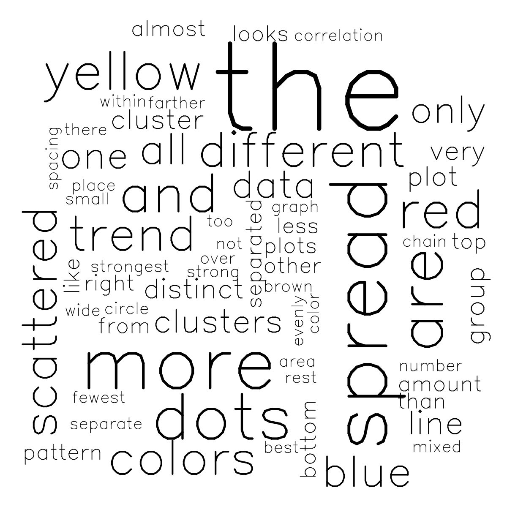 | 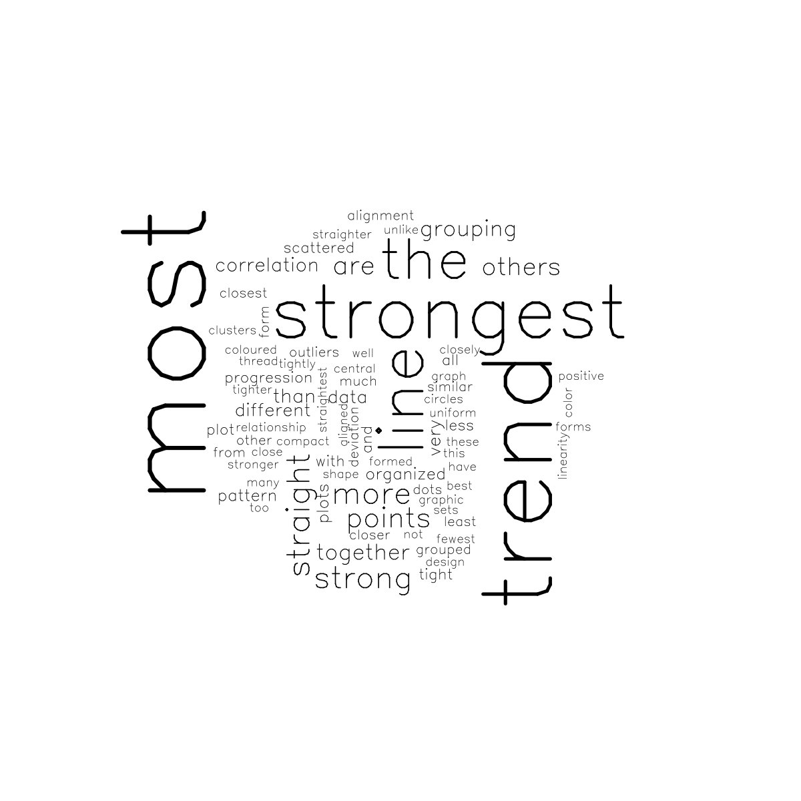 


---
## The Giant Two-Target Lineup Factorial Study

But how do participants justify their choices?

When shown a **line** plot... Participants who chose .underline[.hidden[some plot]] said: 

Cluster | Null | Trend
------- | ---- | -------
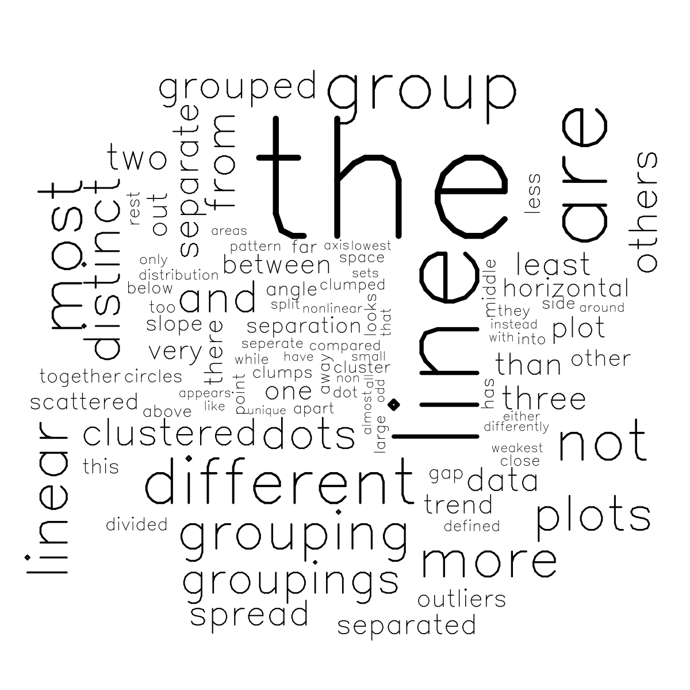 |  | 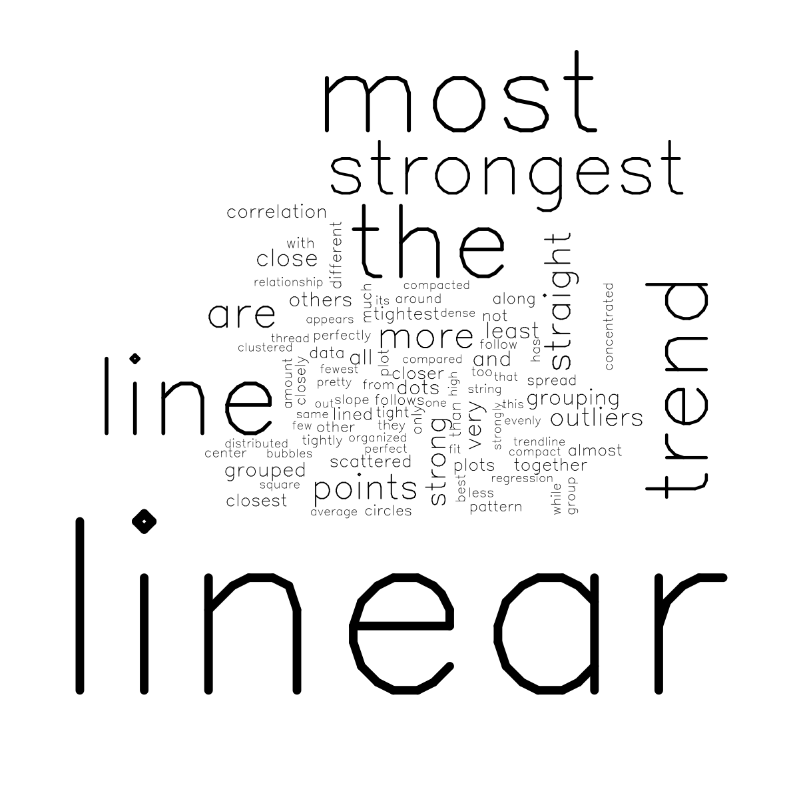 

---
## Conclusion

- Lineups are a powerful tool for examining the strength of a visual signal in data

- Lineups can be used to compare the visual power of different plot designs

- Two-target lineups can be used to explore the effect of different aesthetics and statistical layers 

- Visual exploration is equivalent to simultaneously running many different numerical tests for single features
    - Formalizing this in an experimental framework leverages the power of the visual system

---
## References

- [Wickham, H., Cook, D., Hofmann, H., & Buja, A. (2010). Graphical inference for infovis. IEEE Transactions on Visualization and Computer Graphics, 16(6), 973-979.](https://doi.org/10.1109/TVCG.2010.161)

- [Hofmann, H., Follett, L., Majumder, M., & Cook, D. (2012). Graphical tests for power comparison of competing designs. IEEE Transactions on Visualization and Computer Graphics, 18(12), 2441-2448.](https://doi.org/10.1109/TVCG.2012.230)

- [Majumder, M., Hofmann, H., & Cook, D. (2013). Validation of visual statistical inference, applied to linear models. Journal of the American Statistical Association, 108(503), 942-956.](https://doi.org/10.1080/01621459.2013.808157)

- [Loy, A., Hofmann, H., & Cook, D. (2017). Model Choice and Diagnostics for Linear Mixed-Effects Models Using Statistics on Street Corners. Journal of Computational and Graphical Statistics, 26(3), 478-492.](https://doi.org/10.1080/10618600.2017.1330207)

- [VanderPlas, S., & Hofmann, H. (2017). Clusters Beat Trend!? Testing Feature Hierarchy in Statistical Graphics. Journal of Computational and Graphical Statistics, 26(2), 231-242.](https://doi.org/10.1080/10618600.2016.1209116)

---

.center[

]
.bottom[Lineup from Vanderplas & Hofmann (2017)]
