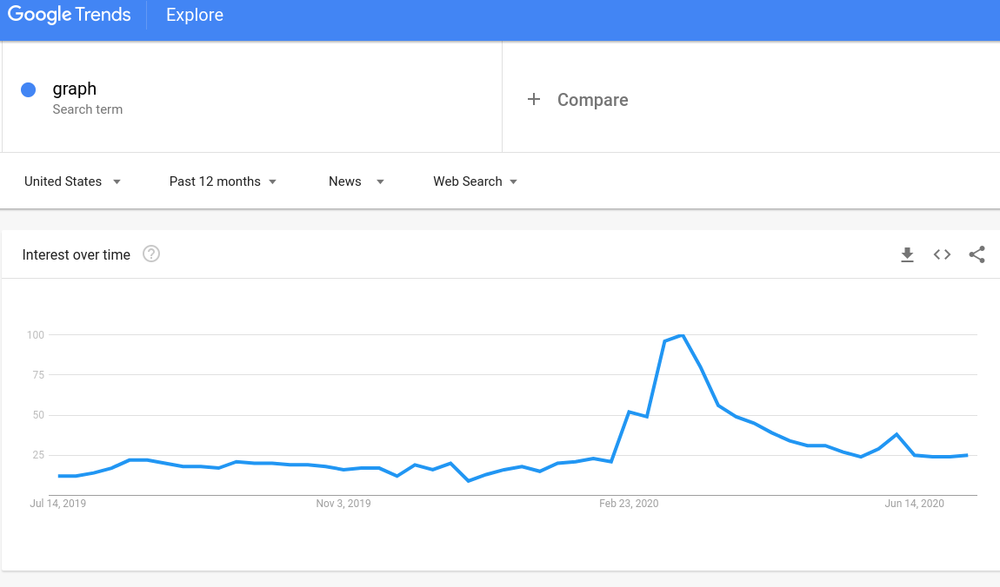
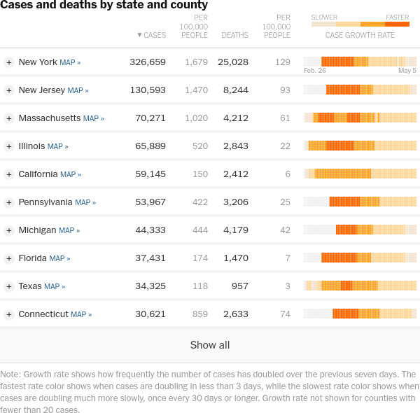

```{r load_refs, include=FALSE, cache=FALSE}
library(RefManageR)
BibOptions(check.entries = FALSE,
           bib.style = "authoryear",
           cite.style = "authoryear",
           style = "markdown",
           hyperlink = FALSE,
           dashed = FALSE)
myBib <- ReadBib("./refs.bib", check = FALSE)
```

```{css, echo = F}
.wrap
{
  width: 1050px;
  height: 550px;
  padding: 0;
  overflow: hidden;
  position: absolute;
}
.wrap2
{
  width: 1200px;
  height: 650px;
  padding: 0;
  overflow: hidden;
}


.scale-frame
{
  width: 1100px;
  height: 760px;
  border: 0;
  
  -ms-transform: scale(0.75);
  -moz-transform: scale(0.75);
  -o-transform: scale(0.75);
  -webkit-transform: scale(0.75);
  transform: scale(0.75);
  
  -ms-transform-origin: 0 0;
  -moz-transform-origin: 0 0;
  -o-transform-origin: 0 0;
  -webkit-transform-origin: 0 0;
  transform-origin: 0 0;
}
```

```{r setup, include=FALSE}
options(htmltools.dir.version = FALSE)
knitr::opts_chunk$set(echo = F, cache = F, 
                      dpi = 300, fig.width = 6, fig.height = 15/4, 
                      message = F, warning = F, 
                      dev.args=list(bg="transparent"))

# Read in the data from NYT
library(tidyverse)
library(lubridate)
library(zoo)
library(ggrepel)
library(gridExtra)
cvstate <- read_csv("https://raw.githubusercontent.com/nytimes/covid-19-data/master/us-states.csv")

cvstate <- cvstate %>%
  group_by(state, fips) %>%
  mutate(date_100th_case = min(date[cases >= 100]),
         days_100th_case = date - date_100th_case,
         daily_cases = cases - lag(cases, 1, default = 0),
         week_avg_cases = rollmean(cases, 7, align = "right", fill = c(0, NA, NA), na.pad = T, na.rm = T),
         daily_avg_cases = rollmean(daily_cases, 7, align = "right", fill = c(0, NA, NA), na.pad = T, na.rm = T),
         daily_deaths = deaths - lag(deaths, 1, default = 0),
         week_avg_deaths = rollmean(deaths, 7, align = "right", fill = c(0, NA, NA), na.pad = T, na.rm = T),
         daily_avg_deaths = rollmean(daily_deaths, 7, align = "right", fill = c(0, NA, NA), na.pad = T, na.rm = T)) %>%
  ungroup() %>%
  mutate(state = factor(state))

download.file("https://www2.census.gov/programs-surveys/popest/tables/2010-2019/state/totals/nst-est2019-01.xlsx", destfile = "census_pop_state.xlsx", quiet = T, mode = "wb")
pop_data <- readxl::read_xlsx("census_pop_state.xlsx", col_names = c("state", "pop2019"), col_types = c("text", rep("skip", 11), "numeric"), skip = 9) %>%
  mutate(state = str_remove(state, "[[:punct:]]"))

cvstate <- left_join(cvstate, pop_data, by = "state")

my_theme <- theme_bw() + 
  theme(plot.background = element_rect(fill = "transparent", color = NA), 
        panel.background = element_rect(fill = "transparent", color = NA), 
        legend.background = element_rect(fill = "transparent", color = NA),
        axis.text.y = element_text(angle = 90, hjust = 0.5)) 
theme_set(my_theme)

```

```{r colorpals, include = F}
main_colors <- c("#d00000", "#f5f1e7", "#c7c8ca")

# use as accents
secondary_colors <- c("#001226", "#249ab5")

# These are only to be used for infographics/charts
tertiary_colors <- c("#bccb2a", "#f58a1f", "#005d84", "#ffd74f", "#a5228d")

color_palette <- c("#d00000", "#249ab5",  "#1B8500", "#f58a1f", "#a5228d", "#001226", "#B1EB66", "#005d84", "#c25700")

heat_color_palette <- c("#ffd74f", "#f58a1f", "#c25700", "#d00000", "#9D0000", "#6A0000")

blueseqpal <- c("001226", "06293E", "0C3F56", "12566E", "186D85", "1E839D", 
                "249AB5", 
                "39ABC1", "4EBCCE", "64CDDA", "79DDE6", "8EEEF3", "A3FFFF") %>% 
  paste0("#", .) %>% rev()

blueseqpal_lt <- rev(c("#B2FFFF", "#C2FFFF", "#D1FFFF", "#E0FFFF", "#F0FFFF"))

darkblueseqpal <- colorspace::darken(blueseqpal, .2)
lightblueseqpal <- colorspace::lighten(blueseqpal, .2)
```

```{r modals, include = F, eval = T}

clean_file_name <- function(x) {
  basename(x) %>% str_remove("\\..*?$") %>% str_remove_all("[^[A-z0-9_]]")
}

img_modal <- function(src, alt = "", id = clean_file_name(src), other = "") {
  
  other_arg <- paste0("'", as.character(other), "'") %>%
    paste(names(other), ., sep = "=") %>%
    paste(collapse = " ")
  
  js <- glue::glue("<script>
        /* Get the modal*/
          var modal{id} = document.getElementById('modal{id}');
        /* Get the image and insert it inside the modal - use its 'alt' text as a caption*/
          var img{id} = document.getElementById('img{id}');
          var modalImg{id} = document.getElementById('imgmodal{id}');
          var captionText{id} = document.getElementById('caption{id}');
          img{id}.onclick = function(){{
            modal{id}.style.display = 'block';
            modalImg{id}.src = this.src;
            captionText{id}.innerHTML = this.alt;
          }}
          /* When the user clicks on the modalImg, close it*/
          modalImg{id}.onclick = function() {{
            modal{id}.style.display = 'none';
          }}
</script>")
  
  html <- glue::glue(
    " <!-- Trigger the Modal -->


<!-- The Modal -->
<div id='modal{id}' class='modal'>

  <!-- Modal Content (The Image) -->
  

  <!-- Modal Caption (Image Text) -->
  <div id='caption{id}' class='modal-caption'></div>
</div>
"
  )
  write(js, file = "libs/js-addins.html", append = T)
  return(html)
}

# Clean the file out at the start of the compilation
write("", file = "libs/js-addins.html")
```


```{r dl-nyt, include = F, eval = F}
dates <- seq.Date(as.Date("2020-03-01"), as.Date("2020-03-31"), by = "day")
dates <- seq.Date(as.Date("2020-01-01"), as.Date("2020-02-28"), by = "day")
urls <- format.Date(dates, "https://static01.nyt.com/images/%Y/%m/%d/nytfrontpage/scan.pdf")
paths <- file.path("NYT_PDF", format.Date(dates, "NYT%Y%m%d.pdf"))
idx <- !file.exists(paths)
if (sum(idx) > 0) download.file(urls[idx], paths[idx], quiet = T, mode = "wb", cacheOK = T)
```

.left-column[

<br/>
Jan 21 - April 30
]
.right-column[
<h3 class='emph cerulean'>General Timeline</h3>

- Dec 31, 2019 - China reports cluster of pneumonia cases
- Jan 13 - First case outside of China (Thailand)
- Jan 14 - WHO suggests human-to-human transmission
- Jan 21 - US announces first case
- Jan 23 - Hubei province is locked down
- Feb 4 - Diamond Princess cruise ship quarantined
- Feb 26 - California announces community transmission
- March 7 - 100k global cases
- March 11 - WHO declares COVID a pandemic
- Mid-March - Most US universities move online
- April 2 - WHO suggests evidence of asymptomatic/presymptomatic transmission
]

.bottom.small[NYT Front page graphic inspired by [@joshbegley](https://twitter.com/joshbegley/status/1243520269307838465).]

???

Because (for me, at least) the beginning of the pandemic seems like it was a decade ago, I thought I'd refresh your memory of the approximate timeline of major events. In attempting to nail these events down, I came across an animation of the New York Times front page articles which are covid-related. You can see that from the end of January to the end of March, the story slowly takes over almost the entire front page.

---
## Interest in news-related graphs



???

During that time, almost everyone I knew was constantly checking out this map or this chart of cases in the states or in countries across the world. Data bears this out - searches for news-related graphs spike at the end of February and slowly decrease back to near-normal levels in June. 

It wasn't just that we were all paying attention to charts more during this period - there was also an impressive array of different ways of showing the available data. Today, I'm going to look at a couple of broad classes of charts with different goals and (ideally) different audiences, and discuss the advantages and disadvantages of each. 

---
## Data
.middle.center[
[](https://github.com/nytimes/covid-19-data)
]

???

Throughout this talk, I'll be using data from [The New York Times github repository](https://github.com/nytimes/covid-19-data), which is based on reports from state and local health agencies.

---
class: middle,center,inverse
# High Detail

### Show me all of the data

???

The first class of charts I'm going to discuss is what I've started thinking of as "paleo" data - the chart generally shows the data in more-or-less whole, unprocessed form, in the same way that a health department might track the data. Like paleo recipes, these charts show the data in a form that has only enough processing to make it edible. 

For most of these charts, I'm going to focus on the form of the chart, rather than the specific implementations in the media, both because I think the interesting part is what is plotted, rather than the specific aesthetics, and because I think it will make it easier to compare different charts. Throughout this presentation, I'll be using the data from the NY Times. 

In the interests of showing only enough information to make the point, I'll be showing this data based on US states, and in most cases, I'll be picking a handful of states from different regions to showcase the important pieces of each chart.


---
## Changes over Time (March 15)

```{r}
show_states <- c("California", "Texas", "New York", "Arizona", "Iowa", "Washington")
tmp <- cvstate %>%
  filter(state %in% show_states) %>%
  filter(date <= ymd("2020-03-15"))

tmpsum <- tmp %>% group_by(state) %>% 
  filter(daily_avg_cases == max(daily_avg_cases)) %>%
  filter(date == min(date))

ggplot() + 
  geom_line(data = tmp, 
            aes(x = date, y = daily_avg_cases, color = state)) + 
  geom_text_repel(data = tmpsum, 
                  aes(x = date, y = daily_avg_cases, 
                      label = state, color = state), 
                  hjust = 0, nudge_x = 1) + 
  scale_color_manual(values = color_palette) + 
  guides(color = F) + 
  scale_x_date(expand = expansion(mult = c(.05, .2)), 
               date_breaks = "month", date_labels = "%B") + 
  scale_y_continuous("Daily cases (7 day rolling average)") + 
  my_theme + theme(axis.title.x = element_blank())
```

???

The simplest plots show the date compared to the number of deaths or cases. Ideally, since there is some effect of weekday on case count and death count reporting, these plots are smoothed by averaging or summation over a multiple of 7 days.

When the y axis scale is linear, we can more easily read counts off (and understand what's going on)


---
## Changes over Time (April 15)

```{r}
show_states <- c("California", "Texas", "New York", "Arizona", "Iowa", "Washington")
tmp <- cvstate %>%
  filter(state %in% show_states) %>%
  filter(date <= ymd("2020-04-15"))

tmpsum <- tmp %>% group_by(state) %>% 
  filter(daily_avg_cases == max(daily_avg_cases)) %>%
  filter(date == min(date))

ggplot() + 
  geom_line(data = tmp, 
            aes(x = date, y = daily_avg_cases, color = state)) + 
  geom_text_repel(data = tmpsum, 
                  aes(x = date, y = daily_avg_cases, 
                      label = state, color = state), 
                  hjust = 0, nudge_x = 1) + 
  scale_color_manual(values = color_palette) + 
  guides(color = F) + 
  scale_x_date(expand = expansion(mult = c(.05, .1)), 
               date_breaks = "month", date_labels = "%B") + 
  scale_y_continuous("Daily cases (7 day rolling average)") + 
  my_theme + theme(axis.title.x = element_blank())
```

???

But there is the compression factor once the epidemic gets going: the only state we can clearly read from the chart is New York, and while it is dramatic, that doesn't help us compare very well. 

---
## Changes over Time (Now)

```{r}
show_states <- c("California", "Texas", "New York", "Arizona", "Iowa", "Washington")
tmp <- cvstate %>%
  filter(state %in% show_states) %>%
  mutate(state = factor(state))

tmpsum <- tmp %>% group_by(state) %>% 
  filter(daily_avg_cases == max(daily_avg_cases)) %>%
  filter(date == min(date))

ggplot() + 
  geom_line(data = tmp, 
            aes(x = date, y = daily_avg_cases, color = state)) + 
  geom_text_repel(data = tmpsum, 
                  aes(x = date, y = daily_avg_cases, 
                      label = state, color = state), 
                  hjust = 0, nudge_x = 1) + 
  guides(color = F) + 
  scale_color_manual(values = color_palette) + 
  scale_x_date(expand = expansion(mult = c(.05, .2)), 
               date_breaks = "month", date_labels = "%B") + 
  scale_y_continuous("Daily cases (7 day rolling average)") + 
  my_theme + theme(axis.title.x = element_blank())
```

.center[Play with many variations of this type of chart at    
http://91-divoc.com/pages/covid-visualization/]

???

By the time you get to today, we end up with a clear separation between low population and higher population states, but it's very difficult to compare the magnitude of "how bad" it is in NY in April vs. Texas in July using this chart -- the two states have different populations, and the population dynamics are different as well. 

There have been a number of interesting arguments online about the virtues of scaling these graphs by population; early on in the epidemic, that may not have been useful (because the limit is in personal contact, not population); at this stage in the epidemic, it might be more reasonable. 

But there are a couple of other factors at play here that are 1) persistent across many types of covid charts, and 2) much more important in affecting our ability to read the charts. With interactive graphics we can 'zoom in' to  mitigate the scale issues. But, fundamentally, we have bigger problems. 

---
## Exponential Growth

```{r exp-growth, fig.height = 3.5, fig.width = 8, cache = T}
show_states <- c("California", "Texas", "New York", "Arizona", "Iowa", "Washington")

tmp2 <- cvstate %>%
  filter(state %in% show_states) %>%
  filter(date <= (ymd("2020-03-20"))) %>%
  mutate(state = factor(state)) %>%
  filter(state == "New York")

# Days used to anchor
tmp2.5 <- filter(tmp2, max(date) - date <= 1) %>%
  select(date, state, daily_avg_cases)

# Adjustment
tmp3 <- bind_rows(
  tmp2.5 %>%
    filter(date == max(date)),
  tmp2.5 %>% 
    group_by(state) %>% 
    mutate(daily_case_increase = daily_avg_cases[2] - daily_avg_cases[1]) %>%
    filter(date == max(date)) %>%
    mutate(date = date + days(5), 
           daily_avg_cases = daily_avg_cases + 5*daily_case_increase)
)

tmpsum2 <- tmp2 %>% group_by(state) %>% 
  filter(daily_avg_cases == max(daily_avg_cases)) %>%
  filter(date == min(date))

ggplot() + 
  geom_line(data = tmp2, 
            aes(x = date, y = daily_avg_cases, color = state)) + 
  geom_point(data = tmp2.5, 
            aes(x = date, y = daily_avg_cases, color = state)) + 
  geom_line(data = tmp3, 
            aes(x = date, y = daily_avg_cases, color = state), linetype = "dotted") + 
  geom_text_repel(data = tmpsum2, 
                  aes(x = date, y = daily_avg_cases, 
                      label = state, color = state), 
                  hjust = 1, nudge_x = 1, segment.alpha = .2) + 
  guides(color = F) + 
  scale_color_manual(values = color_palette, drop = F) + 
  scale_x_date(expand = expansion(mult = c(.05, .2)), 
               date_breaks = "1 week", date_labels = "%B %d") + 
  scale_y_continuous("Daily cases (7 day rolling average)") +
  coord_cartesian(ylim = c(0, 5000)) + 
  my_theme + 
  theme(axis.title.x = element_blank())


```

- People are consistently awful at forecasting exponential growth

- Forecasts always underestimate the next point (**anchor** + **adjust**)    
.small[`r Citep(myBib, c("goodwinHeuristicsBiasesImprovement1994", "timmersInverseStatisticsMisperception1977a"))`]


???

The fundamental problem we have is that people are horrible at forecasting exponential growth.

Let's look at the first instance of exponential (or nearly exponential) growth in the US: New York. 
The reason we're awful at exponential growth is because even though we know that the curve is likely to be exponential, our brains are lazy and decide to take shortcuts. 

Instead of trying to wrap our heads around what exponential growth looks like, we pick the two most recent data points and just extend that line segment outwards. So we predict linearly, even when we know the growth is exponential-ish.

---
## Exponential Growth

```{r exp-growth2, fig.height = 3.5, fig.width = 8, cache = T}
show_states <- c("California", "Texas", "New York", "Arizona", "Iowa", "Washington")

tmp2 <- cvstate %>%
  filter(state %in% show_states) %>%
  filter(date <= (ymd("2020-03-25"))) %>%
  mutate(state = factor(state)) %>%
  filter(state == "New York")

tmpsum2 <- tmp2 %>% group_by(state) %>% 
  filter(daily_avg_cases == max(daily_avg_cases)) %>%
  filter(date == min(date))

ggplot() + 
  geom_line(data = tmp2, 
            aes(x = date, y = daily_avg_cases, color = state)) + 
  geom_point(data = tmp2.5, 
            aes(x = date, y = daily_avg_cases, color = state)) + 
  geom_line(data = tmp3, 
            aes(x = date, y = daily_avg_cases, color = state), linetype = "dotted") + 
  geom_text_repel(data = tmpsum2, 
                  aes(x = date, y = daily_avg_cases, 
                      label = state, color = state), 
                  hjust = 1, nudge_x = 1, segment.alpha = .2) + 
  guides(color = F) + 
  scale_color_manual(values = color_palette, drop = F) + 
  scale_x_date(expand = expansion(mult = c(.05, .2)), 
               date_breaks = "1 week", date_labels = "%B %d") + 
  scale_y_continuous("Daily cases (7 day rolling average)") +
  coord_cartesian(ylim = c(0, 5000)) + 
  my_theme + 
  theme(axis.title.x = element_blank())


```

### .emph.center[What is the purpose of this chart?]

--

.center[To help people predict what is likely to happen?]

--

.center[(It doesn't do that very well)]

???

Note that even if the growth is polynomial, we would still end up underestimating the number of cases. 
So if our goal is to help people make good decisions (like, hey, cases are increasing exponentially, I should stay home), then a graph like this may not be the best way to go about it, because we know for a fact that people don't make effective forecasts from these types of plots.

The natural way to correct for graphs showing exponential growth is to use a log y-axis scale, which solves some problems and creates a whole host of new problems. 


---
## Log Scales


```{r, fig.height = 5, fig.width = 8, cache = T}
show_states <- c("California", "Texas", "New York", "Arizona", "Iowa", "Washington")
tmp <-  cvstate %>%
  filter(state %in% show_states) %>%
  mutate(state = factor(state))

tmpsum <- cvstate %>%
  filter(state %in% show_states) %>%
  mutate(state = factor(state)) %>% 
  group_by(state) %>% 
  filter(daily_avg_cases == max(daily_avg_cases)) %>%
  filter(date == min(date))

ggplot() + 
  geom_line(data = tmp, 
            aes(x = date, y = daily_avg_cases, color = state)) + 
  geom_text_repel(data = tmpsum, 
                  aes(x = date, y = daily_avg_cases, 
                      label = state, color = state), 
                  hjust = 0, nudge_x = 1) + 
  scale_color_manual(values = color_palette, drop = F) + 
  guides(color = F) + 
  scale_x_date(expand = expansion(mult = c(.05, .2)), 
               date_breaks = "month", date_labels = "%B") + 
  scale_y_continuous("Daily cases (7 day rolling average)", trans = "log10", breaks = c(1, 10, 100, 1000, 10000), labels = c(1, 10, 100, 1000, 10000), minor_breaks = c(2.5, 5, 7.5, 25, 50, 75, 250,  500, 750, 2500, 5000, 7500)) + 
  my_theme + theme(axis.title.x = element_blank())

```

???

It's much easier to compare the trajectory of the different states outbreaks when we look at the log-scale information, and, as a bonus, because we devote more vertical space to lower values, we can easily separate the lines from smaller states, compared to the lines from bigger states. 

We're again reading the slope off of the chart as the "useful information" here -- the slope indicates the change in the number of people dying (or being diagnosed with covid) over time. But, hopefully, this time, our instincts are slightly more accurate -- using the anchor and adjust phenomenon, we might actually be a bit more likely to get close to the next value.


---
## Comparisons 
```{r, fig.height = 5, fig.width = 8, cache = T}
show_states <- c("California", "Texas", "New York", "Arizona", "Iowa", "Washington")
tmp2 <- cvstate %>%
  filter(state %in% show_states) %>%
  mutate(state = factor(state)) %>%
  filter(state %in% c("Washington", "Texas"))
tmpsum2 <- cvstate %>%
  filter(state %in% show_states) %>%
  mutate(state = factor(state)) %>%
  filter(date%in% c(ymd("2020-03-15"), ymd("2020-06-15")), state %in% c("Washington", "Texas"))
tmpsum3 <- filter(tmp2, date == max(date))

ggplot() + 
  geom_line(data = tmp2, 
            aes(x = date, y = daily_avg_cases, color = state)) + 
  geom_path(data = tmpsum2, aes(x = date, y = daily_avg_cases, group = date)) + 
  geom_point(data = tmpsum2, aes(x = date, y = daily_avg_cases, color = state)) + 
  geom_text(data = tmpsum2, aes(x = date, y = daily_avg_cases, label = sprintf("%.1f", daily_avg_cases), hjust = -0.25, color = state)) + 
  scale_color_manual(values = color_palette, drop = F) + 
  geom_text(data = tmpsum3, 
                  aes(x = date, y = daily_avg_cases, 
                      label = state, color = state), 
                  hjust = 0, nudge_x = 1) + 
  guides(color = F) + 
  scale_x_date(expand = expansion(mult = c(.05, .2)), 
               date_breaks = "month", date_labels = "%B") + 
  scale_y_continuous("Daily cases (7 day rolling average)", trans = "log10",
                     breaks = c(1, 10, 100, 1000, 10000), 
                     labels = c(1, 10, 100, 1000, 10000),
                     minor_breaks = c(2.5, 5, 7.5, 25, 50, 75, 250, 
                                      500, 750, 2500, 5000, 7500)) +
  theme_bw() + theme(axis.title.x = element_blank())
```


.center[Sine Illusion: `r Citep(myBib, "vanderplasSignsSineIllusion2015")`    
Log perception: `r Citep(myBib, "varshneyWhyWePerceive2013")`]

???

This comes at a cost, though - our intuition for what is being shown is compromised. The number of deaths in Texas and Washington in mid-March look very similar, but in fact, there is a factor of 10 difference between them. 

Similarly, in mid June, a similar size gap between Washington and Texas counts occur (in the other direction), and while the ratio is the same, we have to do a fair bit of cognitive work to interpret it correctly. 

This is in spite of the fact that in many circumstances, our brains do work on log scales -- many perceptual things are log-scale based. 

Another factor at play here is that we're also somewhat terrible at assessing the difference between two curves due to the sine illusion - basically, we like to look at the distance perpendicular to the curve, rather than the vertical distance. 

I wish I had data, or guidelines, or any real information on the use of log scales and how we perceive them, but I've been looking for papers for two months, and haven't found any experiment which examines how people read and perceive graphics that use log scales, compared with linear scales. If you know of one, please message me by email, twitter, smoke signals... Either way, hopefully there will be such a paper within the next year. 

What we do know is that log scales seem to increase the amount of mental work necessary to assess the real-world implications of a situation. 

<!-- In the reduced-clutter version, you can also get a sense for the amount of mental effort it takes to decode a graph with many, many lines on it and get meaningful information out of it. The default in most of the online versions I've seen is to show 10+ curves for different states or countries, which is a *lot* of information. On top of that, most of the online versions provide additional information via mouseover and allow filtering based on state(s) of interest, which helps in some ways but adds cognitive load.  -->

<!---
## Log scales and Explanations

> This chart uses a logarithmic scale, which is meant to emphasize rate of change and allows for the display of a wide range of numbers. **Every axis line is 10 times greater than the previous one.** In the new daily cases chart, the x-axis uses total confirmed cases on a logarithmic scale rather than date to underscore the overall size of a state's outbreak relative to its daily growth. 

- [NPR Explanation](https://www.npr.org/sections/health-shots/2020/03/16/816707182/map-tracking-the-spread-of-the-coronavirus-in-the-u-s)


> The vertical axis of our charts are shown using a logarithmic scale, where **the same distance on the scale represents multiplying or dividing by the same amount, instead of adding or subtracting the same amount as is the case with a linear scale.** Log scales are particularly suited to displaying trends in relative rates of change, like a virus spreading. 

- [Financial Times](https://ig.ft.com/coronavirus-chart/?areas=usa&areas=gbr&areasRegional=usny&areasRegional=usca&areasRegional=usfl&areasRegional=ustx&cumulative=0&logScale=1&perMillion=0&values=deaths)


???

When the goal is to communicate with the general public, though, you have to be somewhat cautious about how you display information and what scaffolding you provide. I've pulled the two descriptions I could find from sites which are using log scales -- most sites didn't really have an explanation or scaffolding to show. 

-->

---
## Log scales are less useful over time

- About [10% of COVID-19 cases lead to 80% of the spread](https://www.sciencemag.org/news/2020/05/why-do-some-covid-19-patients-infect-many-others-whereas-most-don-t-spread-virus-all)
  - Most people infect at most 1 other person
  - Super spreading events make up the difference
  - Small increases in the number of cases may signal a huge problem

- Log scales may obscure increases in cases above a baseline

```{r, fig.height = 4, fig.width = 8, dev = "png"}
# ----- Set up labeller to tweak things ----------------------------------------
rlistmap <- function(x, myfun) {
  if ("list" %in% class(x)) return(purrr::map(x, ~rlistmap(., myfun)))
  
  return(myfun(x))
}
fix_labels <- function(x) {
  x  %>%
    str_replace('scale: (.*)', "\\1 scale") %>%
    str_replace("baseline: (\\d{1,})", "Baseline:\n\\1 cases")
}
label_custom <- function(labels, multi_line = T, sep = ": ") {
  out <- label_both(labels, multi_line = multi_line, sep = sep)
  
  out <- rlistmap(out, fix_labels)

  out
}
class(label_custom) <- "labeller"

# ----- Set up data ------------------------------------------------------------
growth <- rpois(30, 15*exp((1:30 - 20)/5))

tmp <- tibble(baseline = 15,
       x = 1:30,
       y = rpois(30, 15),
       y1 = growth) %>%
  bind_rows(
    tibble(baseline = 50,
       x = 1:30,
       y = rpois(30, 50),
       y1 = growth) 
  ) %>%
  bind_rows(
    tibble(baseline = 200,
       x = 1:30,
       y = rpois(30, 200),
       y1 = growth) 
  ) %>%
  pivot_longer(matches("y")) %>%
  mutate(name = str_replace_all(name, c("y$" = "Background", "y1" = "Exponential")))  %>%
  group_by(baseline, x) %>%
  mutate(Total = sum(value)) %>%
  pivot_wider(names_from = "name", values_from = "value") %>%
  pivot_longer(matches("Background|Exponential|Total")) %>%
  mutate(name = factor(name, levels = c("Total", "Exponential", "Background")))

tmp <- bind_rows(mutate(tmp, scale = "Log"), mutate(tmp, scale = "Linear")) %>%
  mutate(Baseline = reorder(paste0("Baseline: ", baseline, " cases"), baseline)) %>%
  mutate(scale = factor(scale, levels = c("Log", "Linear")))

# ----- Set up scales ----------------------------------------------------------
library(facetscales)
scales_y <- list(
  Log = scale_y_log10(),
  Linear = scale_y_continuous()
)

tmp %>%
ggplot(aes(x = x, y = value, color = name, size = name)) + 
  geom_line(alpha = .9) +
  facet_grid_sc(rows = vars(scale), cols = vars(Baseline), 
                scales = list(x = "fixed", y = scales_y)) +
  scale_size_manual(values = c(1.75, 1, 1)) +
  scale_color_manual(values = c("#249ab5", "#d00000", "#001226")) +
  scale_fill_discrete(name = "") + 
  theme(legend.position = "bottom", axis.title = element_blank(),
        legend.title = element_blank())
```

???

One other problem with log scales has been increasingly important over time. What we generally care about is the recent change in cases/deaths over time. Unfortunately, log scales show a percent change that is based on the total number of cases. This is usually a good thing, but doesn't work well for disease tracking.

With covid, cases tend to spread exponentially, and then "smoulder" once the exponential super-spread events are contained. Once we reach that baseline level of spread, where cases aren't increasing, people start to relax a bit.

If exponential spread then starts up again, it's hard to recognize that increase on a log scale. Here you can see 3 different levels of baseline case spread, combined with the same exponential spread. 

It's clear from the bottom that the magnitude of the change is similar, but it has so much less visual impact on the log scale.

I think initially, log scales were an excellent idea, but now that the epidemic is firmly established in the US, we're better off sticking with linear scales. Otherwise, we risk misleading the public and de-emphasizing the warning signs of increasing spread.

---
class:middle,center,inverse
# Creative Circumvention of Scale Issues

---
## From Exponential to Frequency

```{r, fig.width = 8, fig.height = 5}
show_states <- c("California", "Texas", "New York", "Arizona", "Iowa", "Washington")

n <- 10000
tmp <- cvstate %>%
  filter(state %in% show_states) %>%
  select(state, date, cases) %>%
  mutate(mod_num = cases %% n,
         whole_num = floor(cases/n)) %>%
  group_by(state, whole_num) %>%
  mutate(whole_num_days = n()) %>%
  group_by(state) %>%
  arrange(date) 

tmp2 <- bind_rows(
  # Day before first case detected:
  filter(tmp, whole_num == 0) %>%
    group_by(state) %>%
    summarize(date = min(date) - lubridate::days(1), y = 0, whole_num = 0, 
              whole_num_days = unique(whole_num_days), mod_num = 0) %>%
    unique() %>%
    ungroup(),
  # Date before the count rolls over
  tmp %>%
    group_by(state, whole_num) %>%
    filter(date == max(date)) %>%
    group_by(state) %>%
    mutate(y = ifelse(whole_num == max(whole_num), mod_num, n),
           whole_num_days = ifelse(whole_num == max(whole_num), whole_num_days/(y/10000), whole_num_days)),
  # Date after the count rolls over
  tmp %>%
    group_by(state, whole_num) %>%
    filter(date == min(date)) %>%
    mutate(y = 0, date = date - lubridate::days(1))
  ) %>%
  group_by(state, whole_num) %>%
  mutate(whole_num_days = max(whole_num_days))
  

ggplot(data = tmp2, aes(x = date, ymin = 0, ymax = y, 
                        color = whole_num_days, 
                        fill = whole_num_days, 
                        group = whole_num)) + 
  geom_ribbon() + 
  facet_grid(state~.) + 
  scale_x_date(date_breaks = "month", date_labels = "%B") +
  scale_y_continuous(breaks = c(n/2, n), labels = paste0(c(n/2000, n/1000), "k"))  + 
  scale_color_gradientn(guide = 'none', paste0("Days to ", n/1000, "k\nmore cases"), space = "Lab", 
    trans = "log10",
    colours = darkblueseqpal
    ) + 
  scale_fill_gradientn(paste0("Days to ", n/1000, "k\nmore cases"), space = "Lab", 
    trans = "log10",
    colours = blueseqpal) + 
  my_theme + 
  theme(axis.title = element_blank(), 
        legend.background = element_rect(fill = "transparent", color = NA), 
        legend.position = c(0, .66), legend.justification = c(0, 1), legend.direction = "horizontal")

```

.center[Recreated from a chart in a 
[tweet by Romain Vuillemot](https://twitter.com/romsson/status/1244316295094505472),     
who originally showed deaths by country. ]

???

One of the more interesting graphics I've seen on twitter was one which encoded covid deaths as time intervals to N cases. So if it takes 50 days to get to the first 10000 cases, and then 20,and then 5, and so on, the acceleration of pandemic progress is clear. I really, really like this idea, if only because it is one of the best ways I've seen to get around the exponential vs. log scale issue. The "pace" of the pandemic is perfectly clear while the number of spikes makes it obvious how many cumulative cases or deaths there have been. Shading in the triangles using deeper shades of a univariate color allows you to assess "total" subjectively by "amount of color".

I recreated the chart using a blue color scheme because the use of red and black in coloring is really problematic - it can cause panic, the connection to blood and death has an emotional impact, and while the emotional impact isn't bad, it's not necessary to communicate what we need to communicate here. 

<!---
## Horizon Charts


```{r, fig.width = 8, fig.height = 5, eval = T}
# remotes::install_github("hrbrmstr/ggalt")
library(ggalt)
show_states <- c("California", "Texas", "New York", "Arizona", "Iowa", "Washington")

n <- 10000
tmp <- cvstate %>%
  filter(state %in% show_states) %>%
  mutate(state = factor(state, levels = sort(show_states)))

nm <- max(ceiling(tmp$cases/n))

bks <- (1:floor(nm/10))*10

# heatpal <- colorRampPalette(colors = c("white", "yellow", "orange", "red"), bias = .5)(50)
heatpal <- scales::gradient_n_pal(heat_color_palette, values = sqrt(seq(0, 1, length.out = length(heat_color_palette))), space = "Lab")((1:nm)/nm)

ggplot(data = tmp, aes(x = date, y = cases)) + 
  geom_horizon(aes(alpha = as.numeric(..band..)/nm + .1), bandwidth = n) + 
  facet_grid(state~.) + 
  scale_x_date(date_breaks = "month", date_labels = "%B") + 
  scale_y_continuous(breaks = c(n/2, n), labels = paste0(c(n/2000, n/1000), "k")) + 
  scale_alpha_identity() +
  scale_fill_discrete("Total\nCases", type = heatpal,
                       breaks = (1:5)*10, labels = c("10k", "20k", "30k", "40k", "50k")) + 
  guides(fill = guide_legend(override.aes = list(alpha = bks/nm + .1))) + 
  theme(axis.title = element_blank(), 
        legend.background = element_rect(fill = "transparent", color = NA), 
        legend.position = c(0, 1), legend.justification = c(0, 1), legend.direction = "horizontal") 

```

???

The triangle-frequency chart is very similar to a horizon chart, but unlike a horizon chart, it doesn't attempt to show layers or fine grain detail; instead, it shows only the start and stop points. That helps to take our focus off of the y scale and put it back onto the actual meaning of the data.

In the corresponding horizon chart, shown here, there is almost too much detail. In addition, because there is not a sharp drop back to baseline, there is less visual emphasis on the

The lack of detail in the triangle version allows us to stop and think -- that is, it's better to have less detail, because we can actually think enough to make use of the information.
-->

---
## Population .small.cerulean.emph[(The March to Herd Immunity)]

```{r, fig.width = 8, fig.height = 5}
show_states <- c("California", "Texas", "New York", "Arizona", "Iowa", "Washington")

tmp <- cvstate %>%
  filter(state %in% show_states) %>%
  select(state, date, cases, pop2019) %>%
  mutate(n = round(pop2019/1000)) %>%
  mutate(mod_num = cases %% n,
         whole_num = floor(cases/n)) %>%
  group_by(state, whole_num) %>%
  mutate(whole_num_days = n()) %>%
  group_by(state) %>%
  arrange(date) 

tmp2 <- bind_rows(
  # Day before first case detected:
  filter(tmp, whole_num == 0) %>%
    group_by(state) %>%
    summarize(date = min(date) - lubridate::days(1), y = 0, whole_num = 0, 
              whole_num_days = unique(whole_num_days), mod_num = 0) %>%
    unique() %>%
    ungroup(),
  # Date before the count rolls over
  tmp %>%
    group_by(state, whole_num) %>%
    filter(date == max(date)) %>%
    group_by(state) %>%
    mutate(y = ifelse(whole_num == max(whole_num), mod_num, n),
           whole_num_days = ifelse(whole_num == max(whole_num), whole_num_days/(y/n), whole_num_days)),
  # Date after the count rolls over
  tmp %>%
    group_by(state, whole_num) %>%
    filter(date == min(date)) %>%
    mutate(y = 0, date = date - lubridate::days(1))
  ) %>%
  group_by(state, whole_num) %>%
  mutate(whole_num_days = max(whole_num_days))
  

ggplot(data = tmp2, aes(x = date, ymin = 0, ymax = y, 
                        color = whole_num_days, 
                        fill = whole_num_days, 
                        group = whole_num)) + 
  geom_ribbon() + 
  facet_grid(state~., scales = "free_y") + 
  scale_x_date(date_breaks = "month", date_labels = "%B") +  
  scale_color_gradientn(guide = 'none', paste0("Days to 0.1%\nof state pop"), space = "Lab", 
    trans = "log10",
    colours = darkblueseqpal
    ) + 
  scale_fill_gradientn(paste0("Days to 0.1%\nof state pop"), space = "Lab", 
    trans = "log10",
    colours = blueseqpal) + 
  my_theme + 
  theme(axis.title = element_blank(), axis.text.y = element_blank(),
        legend.background = element_rect(fill = "transparent", color = NA), 
        legend.position = c(0, .66), legend.justification = c(0, 1), legend.direction = "horizontal") 
```

???

As with all of the graphics so far, though, we have this battle between comparing raw numbers/counts in a geographic region and comparing the population prevalence. So if we redo this graph as a % population, it's much more effective at showing the progress of the pandemic moving through the population, and it's much easier to compare e.g. the success of control measures in NY and CA with Arizona and Iowa.

I'd say that when the graph is arranged this way, it's more like we're showing the progress toward some sort of herd immunity - by the time we get to 1000 spikes, we're "done". God forbid.


---
class:middle,center,inverse
# Low Detail

### Just tell us what to do

???

As we've all discovered since March, pandemics tax you in unexpected ways. By May or so, I was personally just done with charts, graphs and visualizations. I wanted to know how bad it was -- I wasn't completely tuning out -- but I couldn't process the details.

Many places came up with summary charts that used shading to convey "how bad" but didn't provide much in the way of numerical detail. So I thought I'd show you a couple of my favorites as we wrap up. 

---
## State-Level Progress

```{r}
library(tweetrmd)
tweet_embed("ASlavitt" %tweet% "1282024016254042112")
```


???

A couple of weeks ago, I was browsing Twitter and came across this Tweet. If you don't follow Andy Slavitt, you should - he's hilarious, and he knows his stuff. But of course, I had to see what the new color was for... so I followed the links, and found... 


---
<div class="wrap">
<iframe class="scale-frame" src = "https://www.covidexitstrategy.org/#hero-chart" width = "100%" height = "500px"/></div>

???

Perceptually, this map is a mess for colorblind individuals, because I can't differentiate the green from the light and dark red shades. Statistically, it's not 100% clear what metrics are being used to decide which states are in which category - the site mentions broad themes but doesn't provide any sort of formula that we might use to recreate the graph. So while it loses points for accessibility and transparency, it is a nice map that was very effective at communicating one thing.

On July 10 the calculations that contributed to the map changed -- they added a darker shade of red. There's something bigger communicated when you have to add a new color to the map to describe how bad things have gotten, and that broader theme is why this map is first in the low-detail category.

There are many other maps and spatial visualizations, but one of my absolute favorite charts doesn't actually have any spatial context. 


---
## Case Doubling

.center[
.width60[

]
]
.small.bottom[Source: https://www.nytimes.com/interactive/2020/us/coronavirus-us-cases.html]
???

The advantage to the shaded graphs that I've shown thus far is that they're very low-effort to read. You don't have to necessarily think too much about reading the chart, what you're interpreting, etc. That's really a good thing when you're communicating information that is stressful, and when there are a lot of other things going on that are demanding cognitive resources. 

The disadvantage to the NYT heatmaps is that it uses the case doubling rate. What that means is that early in the pandemic, things will look really bad, but similar case growth rates (on a linear scale) won't actually look as bad (because this is a log scale). Thus, subsequent outbreaks end up looking like not as much of an emergency, while going from one to two cases does look like an emergency. 

---
## Case Doubling

```{r, fig.width = 8, fig.height = 5.5}
# show_states2 <- c("Washington", "Texas", "California", "Arizona", "Nebraska", "New York")

cvstate %>%
  # filter(wday(date) == 1) %>%
  select(state, cases, date, pop2019) %>%
  group_by(state) %>%
  arrange(date) %>%
  mutate(last_week = lag(cases, 7, default = 1),
         doubling = log(cases/last_week, 2), 
         doubling_cat = case_when(doubling<7/30 ~ "Slower",
                                  doubling<1 ~ "Moderate",
                                  doubling<2 ~ "Fast",
                                  doubling>=2 ~ "Faster") %>%
           factor(levels = c("Slower", "Moderate", "Fast", "Faster"))) %>%
  filter(state %in% show_states) %>%
  # filter(wday(date) == 1) %>%
  ggplot(aes(x = date, y = 1, fill = doubling_cat)) + 
  facet_grid(state~.) + 
  geom_tile(color = "white") + 
  scale_fill_manual(values = c("#ffffb2", "#fecc5c", "#fd8d3c", "#e31a1c")) + 
  # scale_fill_gradient("# Case\nDoublings\nper week", low = "#c7e9c0", high = "#00441b") + 
  scale_x_date(date_breaks = "month", date_labels = "%B") + 
  scale_y_continuous(breaks = NULL) + 
  my_theme + 
  theme(legend.title = element_blank(),
        axis.text.y = element_blank(), axis.title = element_blank(),
        legend.position = "bottom", legend.direction = "horizontal")
```

???

For the sake of comparison, I managed to replicate the NYT graphic (at least approximately). Iowa recently experienced a surge in cases, but it's totally invisible on the chart Florida, Texas, Arizona, and California have all had surges recently as well, but compared to the early days of the epidemic, they look very tame. This graph de-emphasizes the outbreaks later in the pandemic.
  
The problems with using case doubling rate had been bugging me since mid-May, and while I was preparing for this presentation, I discovered that they'd changed the formula (on July 17 or thereabouts), presumably to address this issue. It turns out that they've tweaked the formula several times, and it's not always clear exactly what numerical formula they're using. 

Interestingly, the current formula (as of early this week, at least) uses the percentage of the population, and no longer has this problem. 

---
## Cases by Population

```{r, dependson='colorpals', fig.width = 8, fig.height = 5}
# show_states <- c("Washington", "Texas", "California", "Arizona", "Nebraska", "New York", "Iowa", "Florida")

cvstate %>%
  # filter(wday(date) == 1) %>%
  select(state, cases, date, pop2019) %>%
  group_by(state) %>%
  arrange(date) %>%
  mutate(last_week = lag(cases, 7, default = 1),
         week_cases = (cases - last_week + 1)/pop2019*100,
         doubling = log(cases/last_week, 2)) %>%
  filter(state %in% show_states) %>%
  # filter(wday(date) == 1) %>%
  ggplot(aes(x = date, y = 1, fill = week_cases)) + 
  facet_grid(state~.) + 
  geom_tile() + 
  scale_fill_gradientn("Weekly\ncases\n(% pop)", 
                       colors =  c("#ffffb2", "#fecc5c", "#fd8d3c", "#e31a1c"), #c(blueseqpal_lt[-1], blueseqpal),
                       space = "Lab", trans = "sqrt", breaks = c(.04, .16, .36), limits = c(0, .4)) + 
  scale_x_date(date_breaks = "month", date_labels = "%B") + 
  scale_y_continuous(breaks = NULL) + 
  theme(axis.text.y = element_blank(), axis.title = element_blank(), 
        legend.position = c(0, .66), legend.justification = c(0, 1), 
        legend.direction = "horizontal") 
```

???


Thinking through how to do this in a way that doesn't de-emphasize later data, I decided that a continuous linear scale made sense here and scaled everything by % of the population. Since I'm using graphs like this to see "how bad is it", and many of the consequences of "bad" also scale with population (like hospital capacity), that seemed like a reasonable compromise. 

I've also used a different color scheme because the red scheme sets off alarm bells; while alarm is called for in e.g. Florida, that should be a conscious data-driven decision and not a gut reaction. Transitioning from yellow to blue through green (slightly) also makes use of much of the area of the color spectrum we're good at discriminating, while working for colorblind individuals as well.

---
class:middle,center,inverse
# Conclusions

---
## Conclusions

1. Exponential growth data is very difficult to work with
    - What we know says we're bad at making predictions
    
2. We don't know much about how log scales are perceived, but we're using them anyways
    - Log scales are probably useful early on
    - They mask information as the pandemic evolves

3. It is often better to use carefully thought-out summaries of the data
    - Map values to color rather than position to cut down on the visual chaos

4. We need more research on how to effectively present data that is
    - quasi-exponentially increasing
    - has high emotional content
    - is intended to provoke action

---
## References

Packages used: ggplot2, curl, lubridate, tweetrmd, gridExtra, ggrepel, facetscales, zoo, xaringan, rmarkdown

```{r, results='asis'}
RefManageR::PrintBibliography(myBib, .opts = list(style = "html", no.print.fields = c("issn", "language", "urldate",  "url", "extra", "location", "note")))
```

