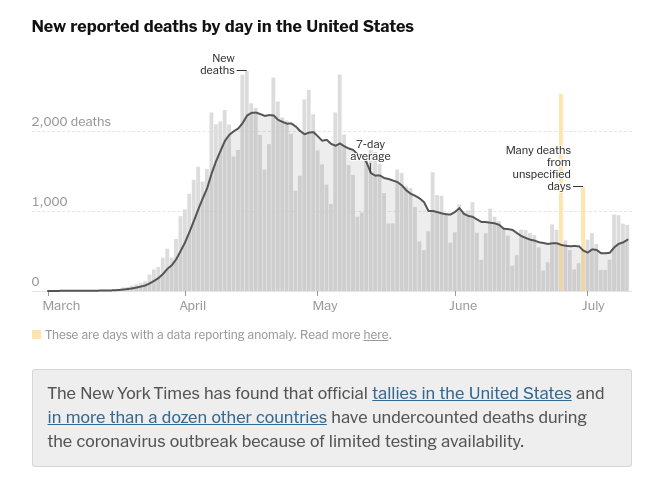
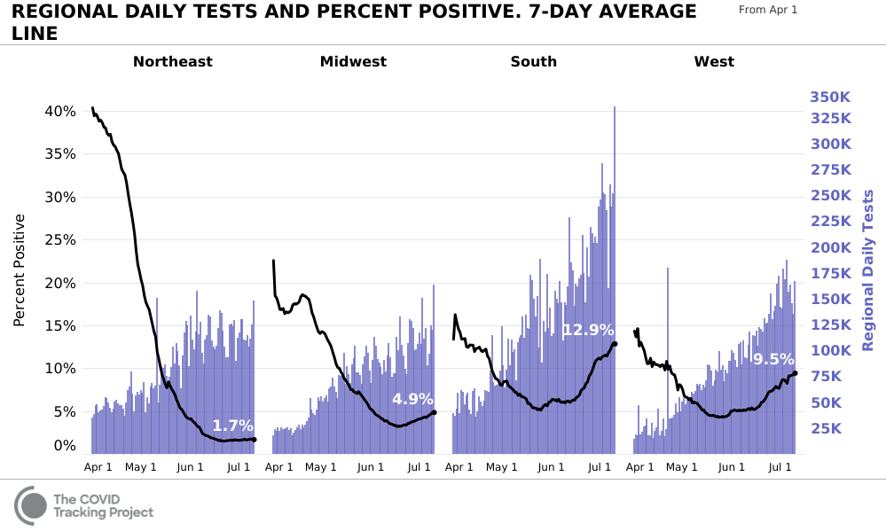
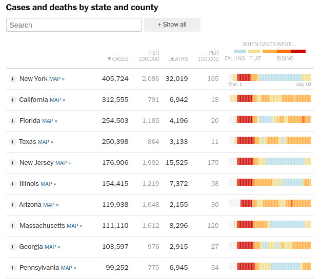
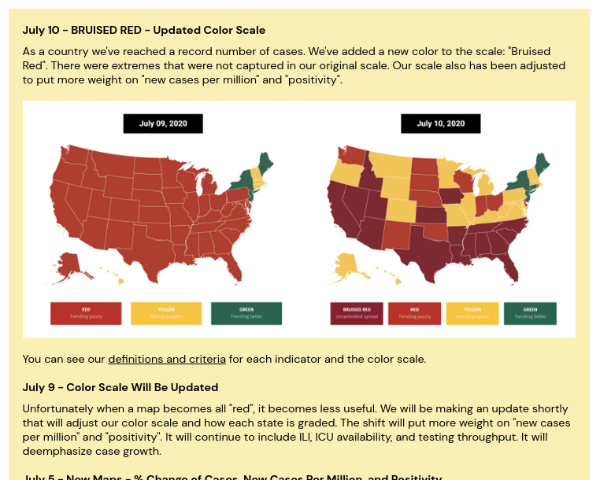

<!-- --- -->
<!-- ## Some charts were more successful than other charts -->

<!--  -->

<!-- ??? -->

<!-- And just to back up my claim about graphical creativity - even XKCD decided to poke fun at the wild array of covid graphs that were showing up in the news and on the internet.  -->

<!-- With all of the creativity that these charts exhibited, though, it's undeniable that there were some charts which were far more effective than others. So today, I'm hoping to show you a sampling of some of the charts which demonstrate various characteristics of effective graphics, and to discuss what we still don't know about creating effective charts.  -->


<!-- --- -->
<!-- ## Virus time or Human time? -->


<!-- ```{r out.extra = "class='pull-left'", fig.height = 5.5, fig.width = 4, dev = "png"} -->
<!-- show_states2 <- c("Washington", "Texas", "California", "Arizona", "Nebraska", "New York") -->
<!-- tmp2 <- cvstate %>% -->
<!--   filter(state %in% show_states2) %>% -->
<!--   mutate(state = factor(state))  -->
<!-- tmpsum2 <- tmp2 %>% group_by(state) %>%  -->
<!--   # filter(daily_avg_cases == max(daily_avg_cases)) %>% -->
<!--   filter(days_100th_case == max(days_100th_case)) -->

<!-- ggplot() +  -->
<!--   geom_line(data = tmp2,  -->
<!--             aes(x = days_100th_case, y = daily_avg_cases, color = state)) +  -->
<!--   geom_text_repel(data = tmpsum2,  -->
<!--             aes(x = days_100th_case, y = daily_avg_cases,  -->
<!--                 label = state, color = state),  -->
<!--             hjust = -.1) +  -->
<!--   guides(color = F) +  -->
<!--   scale_x_continuous("Days since 100th case", limits = c(0, NA),  -->
<!--                      expand = expand_scale(mult = c(0, .4))) +  -->
<!--   scale_y_log10("Daily cases (7 day rolling average)") +  -->
<!--   theme_bw() +  -->
<!--   theme(panel.background = element_rect(fill = "transparent", color = NA),  -->
<!--         plot.background = element_rect(fill = "transparent", color = NA)) -->

<!-- ``` -->
<!-- ```{r out.extra = "class='pull-right'", fig.height = 5.5, fig.width = 4, dev = "png"} -->
<!-- show_states2 <- c("Washington", "Texas", "California", "Arizona", "Nebraska", "New York") -->
<!-- tmp2 <- cvstate %>% -->
<!--   filter(state %in% show_states2) %>% -->
<!--   mutate(state = factor(state)) -->

<!-- tmpsum2 <- tmp2 %>% group_by(state) %>%  -->
<!--   # filter(daily_avg_cases == max(daily_avg_cases)) %>% -->
<!--   filter(date == max(date)) -->


<!-- ggplot() + -->
<!--   geom_vline(aes(xintercept = ymd(c("2020-05-25", "2020-04-12", "2020-07-04"))), -->
<!--              color = "grey") +  -->
<!--   geom_label(aes(x = ymd(c("2020-05-25", "2020-04-12", "2020-07-04")), y = 1,  -->
<!--                  label = c("Memorial\nDay", "Easter", "July 4"))) +  -->
<!--   geom_line(data = tmp2,  -->
<!--             aes(x = date, y = daily_avg_cases, color = state)) +  -->
<!--   geom_text_repel(data = tmpsum2,  -->
<!--             aes(x = date, y = daily_avg_cases,  -->
<!--                 label = state, color = state),  -->
<!--             hjust = -.1) +  -->
<!--   guides(color = F) +  -->
<!--   scale_x_date(name = "", expand = expansion(mult = c(.05, .4)),  -->
<!--                date_breaks = "month", date_labels = "%B", -->
<!--                limits = c(ymd("2020-03-15", NA))) +  -->
<!--   scale_y_log10("Daily cases (7 day rolling average)",position = "right") +  -->
<!--   theme_bw() +  -->
<!--   theme(panel.background = element_rect(fill = "transparent", color = NA),  -->
<!--         plot.background = element_rect(fill = "transparent", color = NA)) -->

<!-- ``` -->

<!-- .bottom[Data from [The New York Times github repository](https://github.com/nytimes/covid-19-data), based on reports from state and local health agencies.] -->

<!-- ??? -->

<!-- I'm not sure if you noticed, but I played a bit of a trick in the previous slides: I've been switching back and forth between an x-axis that tracks "days since 100 cases" in each state, and the actual calendar date.  -->

<!-- I like to think of these two axes as showing virus time and human time. They both have advantages - graphs that show days since N cases allow you to compare outbreaks that started at different times, which can be useful in assessing e.g. which measures at the government level are useful to contain the virus, and how different containment methods have been applied. Personally, I find this to be much more useful at the country level than the state level, because outbreaks in e.g. China, Italy, and Spain followed the same initial course as the outbreak in NYC, and as later outbreaks in Texas, Florida, and Arizona.  -->

<!-- But, it's also very important to be able to trace increases in cases across multiple states back to single calendar events - easter, Memorial Day, 4th of July. This is complicated by a 1 or 2-week lag in case increases, but it's fairly easy to see that cases in Nebraska increased not long after Easter, and again after July 4th. Not that there's causation there, but I can confirm that people were out and about more than usual in my part of the state, at least.  -->

<!-- One problem I have is that the difference between these two graphs is *very* subtle, and I've gone out of my way to try to pick states where the epidemic has followed a different course. The other thing that I'm not fond of is that it's arguable that the 100 cases threshold is affected by population and population density - 100 people in Nebraska is a lot more signifcant than 100 people in New York or California. I've seen some people arguing that e.g. a forest fire will burn at the same rate regardless of the size of the forest initially, but these graphs are being used long after that initial part is relevant. So while the 100 cases threshold may have been useful early in the pandemic, it's perhaps less useful now.  -->

<!---
## Other Interesting Approaches

```{r, fig.show='animate', ffmpeg.format='gif', fig.width = 8, fig.height = 5, dev = "jpeg", dpi = 300, interval = 1, cache = T}
show_states <- c("California", "Texas", "New York", "Arizona", "Iowa", "Washington")

cvstate <- cvstate %>%
  left_join(tibble(state = state.name, abb = state.abb))

plot_to_date <- function(dt) {
  data <- cvstate %>%
    filter(state %in% show_states,
           date <= dt, 
           cases >= 50) %>%
    mutate(state = factor(state, levels = sort(show_states))) %>%
    group_by(state) %>%
    filter(n() >= 2)
  p <- ggplot(data, aes(x = cases, y = daily_avg_cases, color = state)) + 
    geom_line() + 
    geom_label_repel(data = filter(data, date == max(date)), aes(label = abb), segment.alpha = .5) + 
    scale_x_log10("Total Cases",
                  limits = c(50, max(filter(cvstate, state %in% show_states)$cases)),
                  expand = expansion(mult = c(.05, .4)), 
                  breaks = 10^(1:8), labels = 10^(1:8)) + 
    scale_y_log10("Daily Cases (7 day average)", 
                  limits = c(1, max(cvstate$daily_avg_cases))) + 
    scale_color_manual(values = color_palette, drop = F) + 
    guides(color = F) + 
    theme_bw() + 
    ggtitle(format(dt, format = "%B %d, %Y"))
  print(p)
}
dates <- seq.Date(ymd("2020-03-11"), today(), by = "2 days")

purrr::walk(dates, plot_to_date)

```

.center[`r Citet(myBib, "logscalegraphs2014")` describes 
[some of the issues with log/log scales](https://ecologicallyoriented.wordpress.com/2014/03/20/interpreting-graphs-with-logarithmic-scales/).]

???

One of the other very interesting variations in plots I've seen takes time out of the equation entirely (for the static version) or animates the chart like the one I've included here. This chart shows the total progress of the epidemic over time; regions which suppress cases show steep declines in y, and resurgences look like bounces. It's an interesting paradigm, but I'm not convinced that it's that useful for a couple of reasons: First, it's probably the least useful when the epidemic isn't being controlled, because surges in cases take up less room on the chart in both dimensions - that is, the amount of space dedicated to an increase of 100 cases in the first portion of the epidemic is pretty large, but later in the epidemic, it isn't at all. 

On the bright side, though, there's really no need to scale this chart by per captia population, as what matters here is the trajectory of the epidemic over time. 

Another issue is that log-log charts don't show change very well - because both x and y are on log scale, many things that aren't linear will look linear. So while it's easy to make imprecise comparisons with this chart, it's much harder to see what exactly it means.
-->

---
## Counting Cases over Time

<div class = "wrap" style="position: absolute; left: 10px; top: 100px;">
<iframe class = "scale-frame" width="800px" height = "500px" src = "http://91-divoc.com/pages/covid-visualization/?chart=countries&highlight=United%20States&show=10&y=both&scale=linear&data=cases-daily-7&data-source=jhu&xaxis=right-all#countries"></iframe>
</iframe>
</div>

???

One of the most common ways to show the spread of the epidemic (or lack thereof) is to show the number of new confirmed cases each day. Now, keep in mind -- this is already showing the first derivative of the total number of cases. Sometimes, it's shown on a linear scale, and sometimes it's shown on a log scale. I'm using a graph from DIVOC-91 (COVID-19 backward) because it allows me to toggle between the two.

But this graph shows us some of the issues already: first off, what measure of time do we use? Do we compare based on today? Or based on the length of the epidemic?

Second, do we care about a linear scale of cases? log scale? Something in between? The problem with a linear scale typically is that it compresses the information that's lower orders of magnitude -- so in this case, it compresses the detail we can see about the early epidemic. But, the log scale is going to do the opposite - it's going to compress the amount of chart real estate dedicated to NOW. Which is better? It depends on what you care about, right?

The other point I'd make is that when you use a log scale, it becomes very hard to see "signals" - you barely notice that new daily cases is decreasing between mid-April and mid-June, even though there are almost 10k fewer daily cases diagnosed mid-June. Similarly, while you can notice the increase in cases mid-June if you look carefully, it doesn't look that significant on the log scale. 

As far as I know (and I've been looking for 2 months) there are not any empirical studies examining how people react to data that's on a log scale vs. a linear scale. Can we effectively read information off of a log scale? We don't know. Can people effectively predict exponential growth if a log scale is used? We know they do ok making forecasts with linear trends, but we don't know if that applies to exponential growth shown on a log scale. If this pandemic has taught us anything (beyond the value of a stockpile of toilet paper and jigsaw puzzles) it should help to highlight the gaps in visualization research. 


---
## Counting Deaths over Time

<div class = "wrap" style="position: absolute; left: 10px; top: 100px;">
<iframe class = "scale-frame" width="800px" height = "500px" src = "http://91-divoc.com/pages/covid-visualization/?chart=countries&highlight=United%20States&show=10&y=highlight&scale=linear&data=deaths-daily-7&data-source=jhu&xaxis=right-all&extra=New%20Jersey#countries
"></iframe>
</div>

???

We have the same types of problems when we count the number of deaths. But what I want to focus on here, is the jump in new daily deaths in the US at the beginning of July. What happened? Did people just suddenly start dying at a greater rate? In fact, New Jersey added almost two thousand probable deaths to the daily total -- even though most of those people had died long before. So not only does it look like there were a bunch of deaths all at once, but we also know that the death counts before that point aren't right either!

This isn't really anyone's fault -- it's the nature of the beast when you're working with data that is constantly changing. The thing that I want to highlight here is that showing the data (or working with the data) in an ongoing situation makes it seem like we have  better handle on things than we actually do. Visually, maybe we should add a giant asterisk? Or smudge the lines a bit? It's not clear what the answer is, but this highlights how important it is that we do more research into how to effectively communicate that our data aren't necessarily 100% correct. 

All of the examples I've shown you thus far are examples which were created with the best available data and good graphical practice. I'm not going to bother addressing the graphs created by certain states that were not created using best practice and are outright misleading, whether or not that was the intent. 

---
## Annotating Anomalies


.bottom[https://www.nytimes.com/interactive/2020/us/coronavirus-us-cases.html?#deaths]

???

Annotations can be useful when calling out weird stuff in the data, like spikes in the number of reported deaths. Excluding those days from the overall running average is also a good idea and helps to avoid visual artifacts like those present in the DIVOC-91 graph. Unfortunately, if your goal is to automate the site updates and not manually annotate your data, these types of annotations are much harder to pull off well. 

---
## Reference lines and Starting points

<div class = "wrap" style="position: absolute; left: 10px; top: 100px;">
<iframe class = "scale-frame" width="800px" height = "500px" src = "http://91-divoc.com/pages/covid-visualization/?chart=countries&highlight=United%20States&show=10&y=both&scale=linear&data=cases-daily-7&data-source=jhu&xaxis=left#countries"></iframe>
</div>

<!--  -->

???

The epidemic started at different times in different countries. We know now that it was in Italy much earlier than we thought. If we start our graph at 0 when each country had 100 cases, we can get a sense of how quickly their cases are doubling. This graph includes a reference line that shows us how many cases there would be if cases increased by 35% each day. Early in the pandemic, the way this line was set up was actually really helpful. 

---
## Reference lines and starting points


???

Here is a similar chart from the financial times, showing cumulative deaths by number of days since a country's 10th death - it was updated on March 23. It is more heavily annotated than the DIVOC-19 graph we were just looking at - there are several more reference lines, and it shows the point at which each country locked down. It's clear that these reference lines were really helpful early on in the pandemic; but it might be more helpful at this stage if the reference lines were extending backwards from the selected country, showing the current estimated growth rate. Because we would have to mentally shift the reference lines around to assess growth rate as it currently stands, the reference lines are much less useful in the later stages of the pandemic, even though (as  we've seen) we can still experience exponential growth after we've temporarily controlled the spread. 

The annotations showing lockdowns are helpful, but we know that any intervention takes at least 14 days to show an effect. It might be more helpful, then, to annotate the expected point at which the intervention has an effect -- otherwise, we're vulnerable to thinking that these measures don't do anything. 

---
## Foresight and Hindsight

```{r, out.extra = "center"}
library(tweetrmd)

tweet_embed("ASlavitt" %tweet% "1281710612352045057")

```

---
## Why are COVID counts so hard to visualize? Blame the...

.pull-left[
### .emph[Epidemic]

- Data quality
  - not enough testing
  - confirmed or suspected cases/deaths?
  - comparing across states/countries
  - past adjustments
  
- Different start dates - x axis choice

- Lag between exposure, symptoms, and death

]
.pull-right[
### .emph[Data]

- Exponential growth     
(but not all the time)

- log/linear scale

- Cumulative vs. New cases

- Per capita
]

???

Before we start in on looking at graphs, it's worth discussing briefly the reasons that the epidemic was particularly tricky to visualize

In my opinion, one of the biggest factors affecting COVID visualizations (even today) is that the data quality is... awful. Testing capacity is limited, but another factor is that because so many cases are relatively mild, even symptomatic individuals may not realize they have COVID and seek out testing. And, as we saw recently in Texas, Arizona, and Florida, when cases suddenly spike, there are not sufficient tests to go around, so many cases which are sufficiently symptomatic still can't be tested and counted appropriately. So it's not entirely clear that case counts have been measuring the same thing throughout the pandemic, and it's also not clear what percentage of covid cases would show up on tests -- there are persistent issues with false negatives if testing is done too late. 

The same issues plague mortality data as well - many places do not count deaths as COVID related if the individual was not tested, and when testing capacity is limited, you don't spend tests on people who are already dead. There are discrepancies in which states count deaths where COVID was contributory but not the main cause of death, and different countries report death totals differently as well. Even excess mortality isn't a great indicator, because during lockdowns, fewer people die of work and travel related accidents, while people with other medical emergencies may be unwilling to seek emergency room care because of concern over contracting the virus. 

Exponential growth of cases also makes it hard to visualize the spread of COVID. If you show cases on a log scale, people may not realize how serious exponential growth is, but on a linear scale, it's been consistently shown that we're awful at forecasting exponential growth. So it's almost a damned if you do, damned if you don't situation.

Then, the pandemic reached each country at a different time. So do you compare based on the pandemic start dates? Based on the actual date? What do you do when there are flare-ups later -- how do you effectively compare to previous situations, potentially across states or countries? If, as been hypothesized, this virus will flare up in waves that will move geographically, then we may need to compare the reaction of e.g. Texas in March to New York in May. 

---
## Other Variables: <h3>Test Positivity Rate</h3>




.bottom[Source: https://covidtracking.com/data/charts/regional-daily-tests-and-percent-positive]


---
## The Advantages of Less Data




---
## The Advantages of Less Data

<div class = "wrap2" style="position: absolute; left: 5px; top: 100px;">
<iframe class = "scale-frame" src = "https://projects.propublica.org/reopening-america/"></iframe>
</div>


---
### .emph[We're going to need a new color]



---