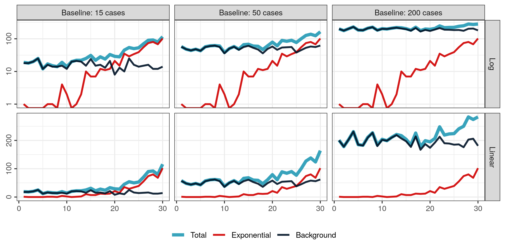
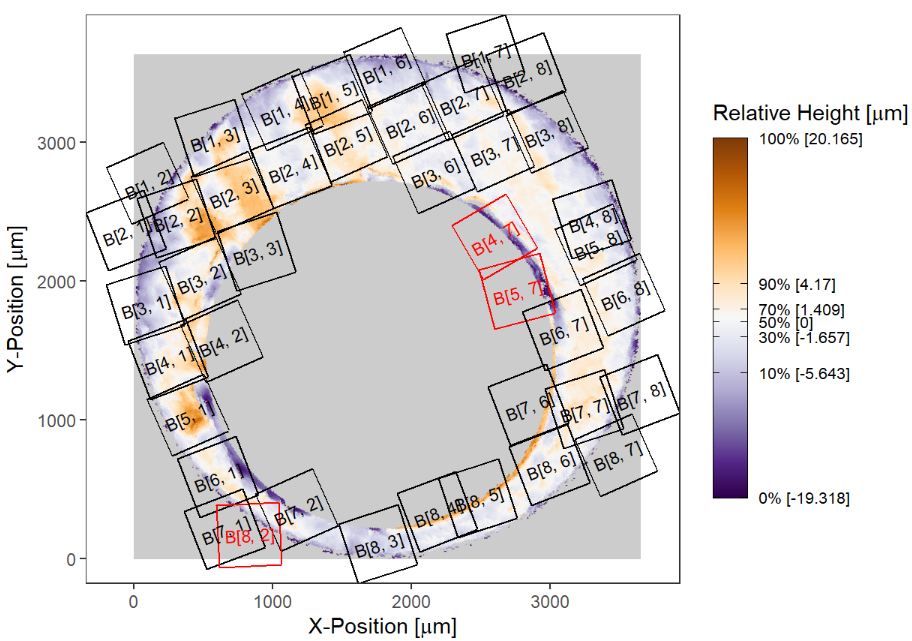

```{r setup, include=FALSE}
options(htmltools.dir.version = FALSE)
```

class:middle,center
# Current Research Projects

<h3 class="emph"> Susan Vanderplas</h3>

#### 2020-2021

---

## Perception of Log Scales

- How well do we read data off of log scales?
- Do we draw the correct conclusions when looking at data on a log scale?



.center.cerulean.emph[With Reka Howard and Emily Robinson]

---
## Forensics

.pull-left[
- Open source algorithms for forensic analysis of cartridge cases

- Sources of bias in forensic examinations with inconclusive decisions

- Assessment of algorithm error rates for bullet matching

- Shoe Scanning and Automatic Feature Recognition    
.cerulean.emph[Help wanted!]
  - Start data collection
  - Improve feature recognition using neural networks
].pull-right[



]

---
## Rural Shrink-smart Strategies

- Augment rural quality-of-life polls (Iowa and Nebraska) with government data

    - Improve survey strategy
    - Aggregate information over multiple spatial resolutions
    
- Develop (and test) visualizations for towns
    
    - Goal: maintain quality of life for residents even as the town shrinks
    - Make decisions based on successful strategies used in other towns with similar characteristics
    - Provide small towns with useful data and data science resources
    

.center.cerulean.emph[With Denise Bradford + Team from Iowa State]


