```{r setup, include=FALSE}
knitr::opts_chunk$set(echo = F, dpi = 300, message = F, warning = F, cache = T)
options(htmltools.dir.version = FALSE)
library(tidyverse)
```

```{r, include = F, eval = T, cache = F}
clean_file_name <- function(x) {
  basename(x) %>% str_remove("\\..*?$") %>% str_remove_all("[^[A-z0-9_]]")
}

img_modal <- function(src, alt = "", id = clean_file_name(src), other = "", link = "") {
  
  other_arg <- paste0("'", as.character(other), "'") %>%
    paste(names(other), ., sep = "=") %>%
    paste(collapse = " ")
  
  js <- glue::glue("<script>
        /* Get the modal*/
          var modal{id} = document.getElementById('modal{id}');
        /* Get the image and insert it inside the modal - use its 'alt' text as a caption*/
          var img{id} = document.getElementById('img{id}');
          var modalImg{id} = document.getElementById('imgmodal{id}');
          var captionText{id} = document.getElementById('caption{id}');
          img{id}.onclick = function(){{
            modal{id}.style.display = 'block';
            modalImg{id}.src = this.src;
            captionText{id}.innerHTML = this.alt;
          }}
          /* When the user clicks on the modalImg, close it*/
          modalImg{id}.onclick = function() {{
            modal{id}.style.display = 'none';
          }}
</script>")
  if (link != "") {
      html <- glue::glue(
     " <!-- Trigger the Modal -->


<!-- The Modal -->
<div id='modal{id}' class='modal'>

  <!-- Modal Content (The Image) -->
  
  <a href='{link}'>Link</a>
  <!-- Modal Caption (Image Text) -->
  <div id='caption{id}' class='modal-caption'></div>
</div>
"
  )
  } else {
      html <- glue::glue(
     " <!-- Trigger the Modal -->


<!-- The Modal -->
<div id='modal{id}' class='modal'>

  <!-- Modal Content (The Image) -->
  

  <!-- Modal Caption (Image Text) -->
  <div id='caption{id}' class='modal-caption'></div>
</div>
"
  )
  }

  write(js, file = "js-addins.html", append = T)
  return(html)
}

# Clean the file out at the start of the compilation
write("", file = "js-addins.html")
```

## Outline

- `electionViz` package

- A Brief Tour of (In)famous Election Graphics

- Why are election graphics complicated?

- Group Participation


.small[.bottom[Find these slides at https://srvanderplas.github.io/Presentations/2020-UNL-Election/]]

???

Today, I'll be talking a bit about election graphics, and showing off a package that I've been slowly building with Heike Hofmann and Kiegan Rice to provide a way to generate some of the most interesting election graphics in R. The package is still under active development (to be honest, we were waiting for some election results that weren't 2016 in the hopes that we could show some cool differences between 2016 and 2020 - the jury is still out on that one). 

I'll start by showing you the basic functionality of electionViz, and then I'll do a general tour of different types of election related charts, showing you the ones we've added to electionViz as we go along. With the election currently undecided (at least as of this morning) I'm sure we've all spent more time than expected staring at graphics like this. 

Feel free to interrupt, ask questions, and make comments as we go. I'm pretty awful at paying attention to the chat, and since that's usually my job to handle that for the presenter, I'm just going to ask you to speak up instead. 

I will also say I'm doing my best to keep the discussion on the graphics instead of the political situation. Should any snark creep in accidentally, please remember that snark is my own opinion and not that of the university. 


---
.pull-left[
## electionViz

[`r icons::fontawesome("github")`heike/electionViz](https://github.com/heike/electionViz)

```{r, eval = F, include = T}
devtools::install_github("heike/electionViz")
```

```{r, echo = T, out.extra="class: tiny"}
library(electionViz)
state_polls <- 
fivethirtyeight_update(
  polls="president_polls") %>% 
  filter(
    !is.na(state), 
    population %in% 
      c("lv", "rv")) %>%
  
  # Last 5 polls
  polls_filter(
    method="last_k", k = 5) 

state_poll_df <- state_polls %>%
  # Estimate from past
  polls_plus(electoral_votes_2016) 

```
].pull-right[
```{r, echo = F, fig.width = 6, fig.height = 8, out.width = "100%"}
state_poll_df <- state_poll_df %>%
  mutate(state = reorder(state, pct_diff, mean))

state_1 <- state_polls %>%
  mutate(
    state = reorder(factor(state), pct_diff, mean)
  ) 
state_3 <- state_1 %>%
  polls_plus(electoral_votes_2016) %>%
  mutate(
    state = reorder(state, pct_diff, mean)
  )

state_1 <- state_1 %>%
  mutate(state = factor(state, levels = levels(state_3$state)))

gg_states <- state_1 %>%
  filter(!(state %in% c("Maine CD-1", "Maine CD-2", "Nebraska"))) %>%
  ggplot(aes(x = pct_diff, y = state)) + 
  geom_rect(xmin=-5, xmax=+5, ymin=-Inf, ymax = +Inf, 
            fill="#fcfcc5", size=0) + 
  geom_vline(xintercept = 0, colour = "grey10") + 
  geom_point(colour = "grey50", alpha = 0.35) +
  geom_text(aes(label=rank), colour = "grey30", size = 2) +
  theme_bw() +
  ylab("") +
  scale_y_discrete(drop=FALSE) 

gg_states +
  geom_point(aes(x = pct_diff, colour = pct_diff>0, shape=source),
             size = 2, data = state_3) +
  scale_colour_party("Party", labels=c("Democrat", "Republican")) +
  scale_x_continuous("Percent Difference", breaks=c(-80, -60,-40,-20,0,20,40,60), 
                     limits=c(NA,65),
                     labels = c("←\nMore Dem", "60", "40","20",0,20, 40, "→\nMore Rep")) +
  theme(legend.position="bottom") +
  scale_shape_manual("Source", values = c(1, 19)) +
  ggtitle(sprintf("Polls of likely or registered voters,\n%s to %s", min(state_1$end_date), max(state_1$end_date))) + 
  theme(legend.position = c(1, 0), legend.direction = "vertical", legend.justification = c(1.1, -.1))
```
]

???

The ElectionViz package is at the moment available only on github and still under active development. We wanted to make it easy to include the most up-to-date data, so we have functions to get the latest polls from several different sources, as well as functions that will substitute data from the last election for areas that haven't been polled (which seems to at this point only include the third district in Nebraska.) Once election results are in and validated from 2020 we'll add that data to the package as well - currently, it contains data from past presidential elections and very detailed data on 2016's election. 

---
class:middle,center,inverse
# .emph[A Tour of (In)famous US Election Charts]

---
```{r results='asis', echo = F, include = T, cache=F}
i1 <- img_modal(src = "figure/1883-stat-atlas-county-map.jpg", alt = "1880 Election Results by County from the Statistical Atlas", other=list(width="90%", style="margin-left:auto;margin-right:auto;max-width='100%';", class ="center"))
i2 <- img_modal(src = "figure/1883-key.png", alt = "Key", other=list(height="50px"))
i3 <- img_modal(src = "figure/1883-by-state.png", alt = "1880 Election Results by State from the Statistical Atlas", other=list(height="50px"))
i4 <- img_modal(src = "figure/1883-popular-vote-sub2.png", alt = "1880 Election Results (Popular Vote)", other=list(height="50px"))
i5 <- img_modal(src = "figure/1883-electoral-vote-sub.png", alt = "1880 Election Results (Electoral Vote)", other=list(height="50px"))
i6 <- img_modal(src = "figure/1883-vote-ratio-sub.png", alt = "1880 Election Results (Vote Ratio)", other=list(height="50px"))
i7 <- img_modal(src = "figure/1883-presidential-vote.png", alt = "1880 Election Results (Presidential Vote)", other=list(height="50px"))

c(str_split(i1, "\\n", simplify = T)[1:2],
  str_split(i1, "\\n", simplify = T)[3:12],
  "<div style='display:inline-block;margin-left;auto;margin-right:auto;width=100%;'>",
  str_split(i2, "\\n", simplify = T)[1:2],
  str_split(i3, "\\n", simplify = T)[1:2],
  str_split(i4, "\\n", simplify = T)[1:2],
  str_split(i5, "\\n", simplify = T)[1:2],
  str_split(i6, "\\n", simplify = T)[1:2],
  str_split(i7, "\\n", simplify = T)[1:2],
  "</div>",
  "<div style='display:inline-block'><a href='https://www.youtube.com/watch?v=JHw5_1Hopsc' class='tiny'>Video Link: Lithography (how this chart was made)</a></div>",
  str_split(i2, "\\n", simplify = T)[3:12],
  str_split(i3, "\\n", simplify = T)[3:12],
  str_split(i4, "\\n", simplify = T)[3:12],
  str_split(i5, "\\n", simplify = T)[3:12],
  str_split(i6, "\\n", simplify = T)[3:12],
  str_split(i7, "\\n", simplify = T)[3:12]) %>% paste(collapse = "\n") %>% cat()
```


.small.bottom[[See the page from the Library of Congress](https://www.loc.gov/resource/g3701gm.gct00009/?sp=40)]

???

The first chart I want to show you is, as best as I can tell, the first US election chart ever generated. It is part of the Statistical Atlas of 1880, which was published in 1883, showing the results of the 10th census. 

The main part of the spread is this map, which isn't so different from our election maps today (except for e.g. the gaping hole in the middle of Oklahoma, Texas, Kansas, and Nebraska, where there weren't any votes for various resasons.) The map shows the popular vote as a proportion of the total vote, using a bivariate color scale for the two parties.

When we zoom in to see the key, though, we can see that the two parties are assigned colors that are exactly the opposite of what we use today (though the two parties in 1880 were very different from the parties of the same name today). Increasing amount/density of color is used to show an increasingly partisan vote. These maps were made with lithography, which meant that someone had to apply grease to stone very precisely to provide areas of color to the chart (and in mirror image, too!); for each color ink used, this process had to be repeated *precisely* in order to generate a color chart. It was a ton of work. You can see a little bit of misalignment in the greenback vote rectangle that shows how the process worked. 

Personally, I'll take a moment to be very grateful for ggplot2. I don't have the patience (or the steady hand) for lithography.

The spread also includes a state-level summnary map, which is again not so different from how we'd show things today.

There's also an analysis of the popular vote (with vote totals plotted, and the breakdown by candidate shown in the table.) I've cut this off so that it fit on the slide, but you can see that there's an index between the alphabetical state name and the rank, plus exact counts in the tables. It's a pretty cool display, really - the only thing I wish they'd included was the state population in addition to the rest of it so that we could see what the voter participation rate was. 

Even in 1880, though, there was a recognition that the total vote and the electoral vote weren't the same thing. So the electoral vote is shown as well; it looks like Garfield won handily. So even as far back as 1880, people were wrestling with this question of how to represent both the vote of the people and the vote of the electoral college, and even wrestling a bit with the visualization of people's votes vs. land votes.

The next piece of the chart that I want to highlight (and yes, there is a ton of information packed into this display) is this ratio of predominant to total vote. So earlier, we showed the black bar chart showing the total vote, and this is filling in the rest of the story - who won the state and by how much did they win? In 1880, Vermont was the safest state, followed by Louisiana, Georgia, South Carolina, Mississippi, and Texas... sounds like some things just don't change that much!

The last feature of this chart I'd like to highlight is one that I had to alter a bit to fit on the slide. Across the bottom of this spread is a chart showing the total vote, with all of the minor candidates as well. So you can very effectively see that Scattering and Weaver had very little support relative to Hancock and Garfield, but that either minor candidate could have thrown the popular vote!

We don't use scales like this very often anymore, which is something of a shame - it really makes the point effectively, even though I did have to chop the graph up into several pieces in order to get it to fit on my slide. 


---
## A few definitions

- **chloropleth** - a map which is shaded according to a numeric variable

- **cartogram** - a map which distorts the geometry of the regions to convey information about another variable (e.g. electoral vote or population rather than area)
    <!-- - [How cartograms are created](http://www.geog.ucsb.edu/~kclarke/G232/ToblerCartograms.pdf) -->

[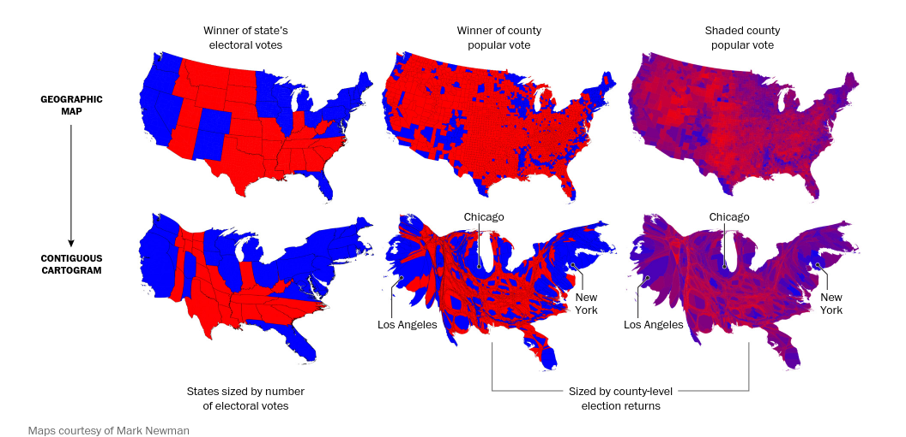](https://www.washingtonpost.com/graphics/politics/2016-election/how-election-maps-lie/)

```{r results='asis', echo = F, include = F, cache=F}
i1 <- img_modal(src = "figure/2016_countywinner_map.png", alt = "2016 Election Results by County", other=list(width="32%"))
i2 <- img_modal(src = "figure/2016-population-county-election-map.jpg", alt = "2016 Election Results by County (Population Area)", other=list(width="32%"))
i3 <- img_modal(src = "figure/2016-election-map-margin-white-balance.png", alt = "2016 Election Results by # votes and margin", other=list(width="32%"))
c(str_split(i1, "\\n", simplify = T)[1:2],
  str_split(i2, "\\n", simplify = T)[1:2],
  str_split(i3, "\\n", simplify = T)[1:2],
  str_split(i1, "\\n", simplify = T)[3:12],
  str_split(i2, "\\n", simplify = T)[3:12],
  str_split(i3, "\\n", simplify = T)[3:12]) %>% paste(collapse = "\n") %>% cat()
```

<!-- .small[.bottom[Maps from https://stemlounge.com/muddy-america-color-balancing-trumps-election-map-infographic/]] -->

???

A few definitions are in order here, since I decided to start in with maps. A chloropleth map is a map with shading corresponding to another (non spatial) variable, such as the percentage of the vote for a candidate (as in the 1880 map I just showed). 

A cartogram is a map which distorts the geometry of the regions to show information about another variable. 

Cartograms have become more popular since the advent of computer graphics meant that we didn't have to painstakingly apply layers of grease to stone by hand in order to create graphical forms. It's much easier to let a computer make a cartogram than to draw one by hand.

In the image shown here, which I have taken from the Washington post (if you are looking at these slides online, you can click on the picture to get the original source), shows several different ways to show the same data, summarized differently. You can shade the map differently to show the proportion of the vote instead of the winner, and you can shift the geography to show different levels of population density distribution. These types of continuous cartograms are sometimes very hard to read - so hard that they don't necessarily achieve the original point, which is to represent the individual voters instead of the geographic land where they reside, because your attention is so focused on the grotesque shape that doesn't bear any resemblance to the geographic area. 

As with many things in graphics, sometimes the cure is worse than the disease. 


---
[](https://www.nytimes.com/interactive/2016/11/01/upshot/many-ways-to-map-election-results.html)

```{r results='asis', echo = F, include = T, cache=F}
i1 <- img_modal(src = "figure/nyt-map-1896.png", alt = "1896 Election Results", other=list(width="32%"))
i3 <- img_modal(src = "figure/nyt-map-2004.png", alt = "2004 Election Results", other=list(width="32%"))
i4 <- img_modal(src = "figure/nyt-map-2004-popdens.png", alt = "2004 Election Results", other=list(width="32%"))
i2 <- img_modal(src = "figure/nyt-map-1992.png", alt = "1992 Election Results", other=list(width="32%"))
i5 <- img_modal(src = "figure/nyt-map-2012.png", alt = "2012 Election Results", other=list(width="32%"))
i6 <- img_modal(src = "figure/nyt-map-2012-popcirc.png", alt = "2012 Election Results", other=list(width="32%"))
c(str_split(i1, "\\n", simplify = T)[1:2],
  str_split(i3, "\\n", simplify = T)[1:2],
  str_split(i4, "\\n", simplify = T)[1:2],
  str_split(i2, "\\n", simplify = T)[1:2],
  str_split(i5, "\\n", simplify = T)[1:2],
  str_split(i6, "\\n", simplify = T)[1:2],
  str_split(i1, "\\n", simplify = T)[3:12],
  str_split(i3, "\\n", simplify = T)[3:12],
  str_split(i4, "\\n", simplify = T)[3:12],
  str_split(i2, "\\n", simplify = T)[3:12],
  str_split(i5, "\\n", simplify = T)[3:12],
  str_split(i6, "\\n", simplify = T)[3:12]) %>% paste(collapse = "\n") %>% cat()
```
<!-- [](https://www.nytimes.com/interactive/2020/us/politics/battleground-states-trump-biden.html) -->

???

This battle between fidelity to the geography and fidelity to the individual voter is one that is very well recognized as a hard, hard problem. The NYT published an article in 2016 showing several different ways they've historically tried to show election results. Again, if you click on the headline, you'll get to the original article, which is a great read.

The first map is from 1896, where William Jennings Bryan lost to William McKinley; it shows the print version of the election results, with Bryan's states in black.

By the advent of computer graphics, in 1992, the shapes were somewhat more precise, but things hadn't changed that much (other than representing some undecided states; I'm not sure if this is from just after the election or just before the election where there are only a couple of swing states). This is obviously computer generated, but still in the age of black-and-white newsprint.

The next two attempts are both from 2004; one is a square cartogram showing the electoral votes of each state; with shading that shows the percentage of the vote. I find this cartogram a bit odd in that somehow Kansas is east of and north of Nebraska (and North/south dakota?) - but cartograms are hard to make because it's not easy to compromise on area and still maintain the approximate shape. 

Another 2004 map shows the results by population density, which is I believe a relatively good attempt to show the popular vote as a result of "total amount of color" - what isn't clear is how easily we aggregate over color intensity. This is where research on how graphics are perceived is important - if we know how people make these types of decisions, then we can say "this is an effective way to make the point" or "this is not an effective way to make the point" - but now, we don't have the data to back it up.

In 2012, they also show two different attempts at displaying the results: county-level chloropleth maps first, and with county-level dots showing the size of the vote margin. In both cases, they're using county as a proxy for voting unit, but votes are aggregated at the precinct level and at the state level (or in the case of Nebraska and Maine, at the precinct, district, and state level). So county isn't a great approximation of anything, really; it's not totally clear to me whether either map actually achieves the objective. 

The point is that if there were one perfect way to show election results, NYT probably would have found it by now...

---
## Election Maps - NYT

```{r results='asis', echo = F, include = T, cache=F}
i1 <- img_modal(src = "figure/202011040822-nyt-map-bystate.png", alt = "2020 by state", 
                other=list(style="object-fit:contain;max-width:48%;max-height:200px;margin-left:auto;margin-right:auto;width:48%"))
i2 <- img_modal(src = "figure/202011040823-nyt-cartogram-results.png", alt = "2020 cartogram", 
                other=list(style="object-fit:contain;max-width:48%;max-height:200px;margin-left:auto;margin-right:auto;width:48%"))
i3 <- img_modal(src = "figure/202011040823-nyt-bubble-lead-size.png", alt = "2020 size of lead",
                other=list(style="object-fit:contain;max-width:48%;max-height:200px;margin-left:auto;margin-right:auto;width:48%"))
i4 <- img_modal(src = "figure/202011040824-nyt-shift-from-2016.png", alt = "2020 shift from 2016",
                other=list(style="object-fit:contain;max-width:48%;max-height:200px;margin-left:auto;margin-right:auto;width:48%"))
c(str_split(i1, "\\n", simplify = T)[1:2],
  str_split(i2, "\\n", simplify = T)[1:2],
  str_split(i3, "\\n", simplify = T)[1:2],
  str_split(i4, "\\n", simplify = T)[1:2],
  str_split(i1, "\\n", simplify = T)[3:12],
  str_split(i2, "\\n", simplify = T)[3:12],
  str_split(i3, "\\n", simplify = T)[3:12],
  str_split(i4, "\\n", simplify = T)[3:12]) %>% paste(collapse = "\n") %>% cat()
```
<!-- [](https://www.nytimes.com/interactive/2020/us/politics/battleground-states-trump-biden.html) -->

[Link](https://www.nytimes.com/interactive/2020/11/03/us/elections/results-president.html)
???

These charts are the NYT primary options to see the election results this year. They've opted to show the geographic map, the cartogram, the bubble chart with the size of the lead, and then a chart showing the change from 2016 which I'll talk about in more depth later. 

---
## Election Maps - Washington Post

[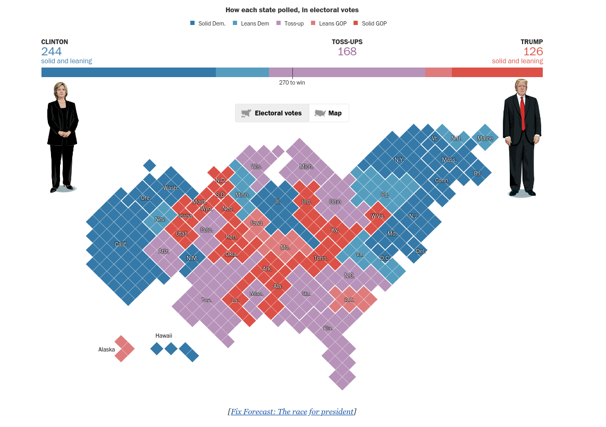](https://www.washingtonpost.com/graphics/politics/2016-election/50-state-poll/)

???

Here's another cartogram, this time from the washington post in 2016. It uses diamonds, which are an interesting choice; it's also showing polling instead of actual returns. 

<!-- --- -->
<!-- ## Election Maps - FiveThirtyEight -->

<!-- [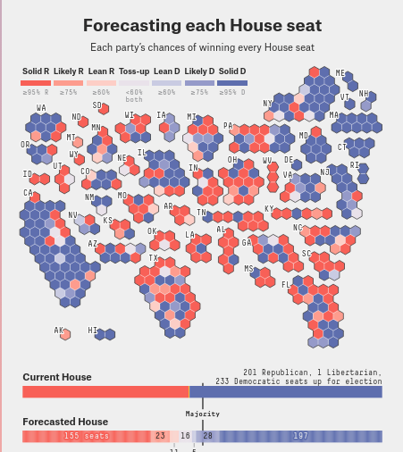](https://projects.fivethirtyeight.com/2020-election-forecast/house/) -->

<!-- ??? -->

<!-- The last cartogram I decided to show you from the media is actually for the House seats and not the presidential race. I put this presentation together over the weekend; and I've updated it somewhat to show the newest graphics, but I didn't have infinite time over the last day or so. I like the hexagonal cartogram too, and especially like the fact that each state is broken up - it makes it easier to maintain some sort of spatial similarity (though IL bordering NE is ... irritating).  -->

<!-- I also like the solid/likely/lean color scale - it preserves the important parts while reducing the visual complexity of the situation. The other part of this graphic I really like is the summary at the bottom comparing the forecast to the status quo, with the uncertainty shown as well - it's clear that there is a chance for an increased majority, but not a huge chance. So the aggregated summary really helps me with integrating the map information into a "what does this mean in reality" situation. -->


<!-- At any rate, I can't figure out why on earth their results coverage doesn't have the same format as their forecast coverage. They're using geographic maps for the results, which is really irritating because it's really hard to see the urban districts. I'll stop ranting now, but ugh. -->

<!-- --- -->
<!-- <iframe src="https://s3.us-east-2.amazonaws.com/wiscontext-viz/cartograms/election_gov_2018.html" width="100%" height="600px"></iframe> -->

<!-- .small[.bottom[https://urbanmilwaukee.com/2019/01/17/cartogram-makes-last-election-look-different/]] -->

---
## 2020 Roundup

```{r results='asis', echo = F, include = T, cache=F}
i1 <- img_modal(src = "figure/2020-nrk-results.png", 
                alt = "2020 NRK (Norwegian)",
                link="https://www.nrk.no/spesial/presidentvalget---resultater-1.15226425", 
                other=list(style="object-fit:contain;max-width:32%;max-height:200px;margin-left:auto;margin-right:auto;width:32%"))
i2 <- img_modal(src = "figure/2020-new-yorker-results-dashboard.png", 
                alt = "New Yorker Cartogram",
                link= "https://www.newyorker.com/news/election-2020/live-2020-presidential-election-results", 
                other=list(style="object-fit:contain;max-width:32%;max-height:200px;margin-left:auto;margin-right:auto;width:32%"))
i3 <- img_modal(src = "figure/2020-zeitde-dashboard.png", 
                alt = "Zeit Online",
                link="https://www.zeit.de/politik/ausland/2020-11/us-wahl-ergebnisse-donald-trump-joe-biden-auszaehlung-hochrechnung-live",
                other=list(style="object-fit:contain;max-width:32%;max-height:200px;margin-left:auto;margin-right:auto;width:32%"))
i4 <- img_modal(src = "figure/2020-bloomberg.png", 
                alt = "Bloomberg",
                link="https://www.bloomberg.com/graphics/2020-us-election-results",
                other=list(style="object-fit:contain;max-width:32%;max-height:200px;margin-left:auto;margin-right:auto;width:32%"))
i5 <- img_modal(src = "figure/2020-fox-dashboard.png", 
                alt = "Fox News",
                link="https://www.foxnews.com/elections/2020/general-results",
                other=list("max-height"="200px", "max-width" = "32%", width = "auto", height = "200px", margin = "auto"))
i6 <- img_modal(src = "figure/2020-npr.png", 
                alt = "NPR",
                link="https://apps.npr.org/elections20-interactive/#/president",
                other=list(style="object-fit:contain;max-width:32%;max-height:200px;margin-left:auto;margin-right:auto;width:32%"))
c(str_split(i1, "\\n", simplify = T)[1:2],
  str_split(i2, "\\n", simplify = T)[1:2],
  str_split(i3, "\\n", simplify = T)[1:2],
  "<br/><br/>",
  str_split(i4, "\\n", simplify = T)[1:2],
  str_split(i5, "\\n", simplify = T)[1:2],
  str_split(i6, "\\n", simplify = T)[1:2],
  str_split(i1, "\\n", simplify = T)[3:12],
  str_split(i2, "\\n", simplify = T)[3:12],
  str_split(i3, "\\n", simplify = T)[3:12],
  str_split(i4, "\\n", simplify = T)[3:12],
  str_split(i5, "\\n", simplify = T)[3:12],
  str_split(i6, "\\n", simplify = T)[3:12]) %>% paste(collapse = "\n") %>% cat()
```

???

Finally, I've pulled together a few other maps from various foreign and domestic news sources we haven't seen yet. One thing I noticed while putting this together is how few places actually do Nebraska and Maine correctly. For a brief instant, NPR had the NE-1st district as going for Biden, and I was scrambling around trying to find other news sources that could corroborate that, because it seemed so unlikely. 

---

## A brief instant

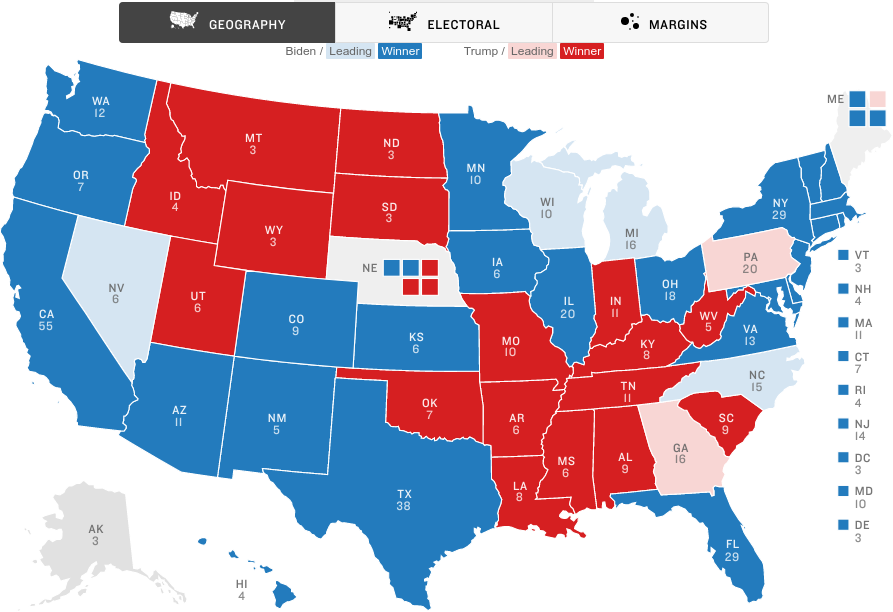


---
## Maps in ElectionViz

```{r electionvizmaps, fig.width = 6, fig.height = 4, out.width = c("45%", "55%"), include = F, echo = F}
states <- state_1 %>%
  polls_plus(electoral_votes_2016) %>%
  mutate(
    state = reorder(state, pct_diff, mean)
  ) %>%
  filter(!str_detect(state, "CD-")) 

data(ushex_plus, package = "electionViz")

hexplot(states$state, states$pct_diff, labelcolor = "black") + 
  scale_fill_party_binned("") + 
  theme(legend.title = element_blank()) + 
  ggtitle("Hexbin Cartogram by State (2020 polls)") + 
  geom_path(aes(x = long, y = lat, group = group), color = "grey20")

state_mapping <- unique(select(elections, state_name = state, state_po)) %>%
  left_join(unique(select(electoral_hex, state_po = state, group))) %>%
  mutate(ev = abs(parse_number(group))) %>%
  mutate(state_name = ifelse(group %in% c("NE-1", "NE-2", "NE-3", "ME-1", "ME-2"),
                             paste0(state_name, " CD-", ev), state_name))

state_names <- unique(electoral_state_outline_hex[,c("centerX", "centerY", "state", "group")]) %>%
  left_join(select(state_mapping, -group), by = c("state" = "state_po")) %>%
  left_join(state_3, by = c("state_name" = "state")) %>%
  mutate(color = ifelse(abs(pct_diff) < 10, "grey40", "grey90"))

state_mapping %>% left_join(state_3, by = c("state_name" = "state")) %>%
  left_join(electoral_hex, by = "group") %>%
  ggplot(aes(x = long, y = lat, group = group)) +
  geom_polygon(aes(fill =  pct_diff), 
               colour = "grey60", size = 0.1, alpha = 0.9) +
  geom_text(aes(x = centerX, y = centerY, label = state, color = color), 
            size = 3, 
            data = state_names) +
  scale_color_identity() + 
  geom_path(colour = "grey70", size = 0.35, 
            data = electoral_state_outline_hex) +
  theme_void() +
  scale_fill_party_binned() +
#  coord_map() +
  theme(legend.position = "none") +
  ggtitle("Hexbin Cartogram by Electoral Votes (2020 polls+)")
```
```{r results='asis', echo = F, include = T, cache=F}
i1 <- img_modal(src = "index_files/figure-html/electionvizmaps-1.png", 
                alt = "Hexbin Cartogram by State",
                other=list(style="object-fit:contain;max-width:49%;max-height:400px;margin-left:auto;margin-right:auto;width:49%"))
i2 <- img_modal(src = "index_files/figure-html/electionvizmaps-2.png", 
                alt = "Hexbin Cartogram by Electoral Votes",
                other=list(style="object-fit:contain;max-width:49%;max-height:400px;margin-left:auto;margin-right:auto;width:49%"))
c(str_split(i1, "\\n", simplify = T)[1:2],
  str_split(i2, "\\n", simplify = T)[1:2],
  str_split(i1, "\\n", simplify = T)[3:12],
  str_split(i2, "\\n", simplify = T)[3:12]) %>% paste(collapse = "\n") %>% cat()
```

???

At the moment, ElectionViz has the ability to make two different hex cartograms, utilizing maps borrowed from other packages. Part of our reasoning here was that you can get so many different shapefiles that we just wanted to make it easy to make a couple of simple charts; the other reason is that creating these cartograms isn't easy and I had limited time to mess with svgs in Illustrator or Inkscape. 

I spent that time in Inkscape on other things, like the graphics which I'll show you next.


---
## The Electoral Snake (538 - 2016)

.center[
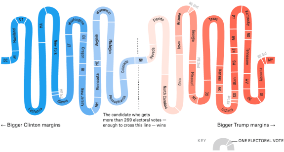
]

???

One of the most effective electoral visualizations out there is the 538 electoral snake. It orders each electoral unit by vote margin, from left to right (so DC is always on the left and the Nebraska 3rd district is most always on the right.) Each electoral vote has the same area, and it is easy to see where the "threshold" is crossed.

Typically, the snake is shaded either in a discrete scale showing "safe", "moderate", "lean", and "tossup" for each party, or it's shaded continuously by the margin of vote for each candidate. 

This is from September 22, 2016. It's easy to see what the predicted swing states would be, and that Michigan, Pennsylvania, and Wisconsin were close but not a complete tossup at this point in the election cycle. How things change.

---
## The Electoral Snake (538 - 2020)

<div class="wrap">
<iframe class="scale-frame" src = "https://projects.fivethirtyeight.com/2020-election-forecast/#ec-margins" width = "100%" height = "500px"/></div>

???

Here's the 2020 version, which has mostly changed so that it's tilted diagonally. There also seem to be slightly more variations in coloration (but it is hard to tell).

---

## The Electoral Snake (electionViz)

```{r, fig.width = 8, fig.height = 6}
label_fix <- c("District of Columbia" = "DC", "Maine CD" = "ME", "Nebraska CD" = "NE",
               "Rhode Island" = "RI", "New Hampshire" = "NH", "Wyoming" = "WY", "New York" = "NY",
               "Vermont" = "VT", "West Virginia" = "WV", "Kansas"="KS", "Montana" = "MT",
               "Nevada" = "NV", "South Carolina" = "SC", "Arkansas" = "AR",
               "New Mexico" = "NM", "Hawaii" = "HI", "Connecticut" = "CT",
               "Delaware" = "DE", "Colorado" = "CO", "Maine" = "ME", "Alaska" = "AK", 
               "South Dakota" = "SD", "North Dakota" = "ND", "Mississippi" = "MI", "Nebraska" = "NE")

state_3 %>%
  mutate(diff = perc_rep - perc_dem, 
         party = ifelse(perc_dem > perc_rep, "Dem", "Rep"),
         label = state) %>%
  mutate(label = str_replace_all(label, label_fix)) %>%
  ggsnake(order = diff, fill = diff, label = label, 
          color = party, size = electoral_votes) +
  scale_fill_party_binned(name = "") + 
  scale_color_party(guide = "none") +
  theme_void(base_size = 8) + 
  theme(legend.title = element_blank(), 
        legend.position = c(.5325, 0.45), 
        legend.justification = c(.5325, 0.45)) +
  ggtitle(sprintf("Based on polls from %s to %s",
                  min(state_polls$end_date), 
                  max(state_polls$end_date)))

```

???

Creating this in ElectionViz was actually really interesting. The underlying form is an SVG with 538 individual pieces; then, we just have to group the pieces together, take the union of the enclosed regions, and label them appropriately.

We're a bit hampered by a couple of things: 1, in order to keep the aspect ratio, it's difficult to resize this chart, and 2, R doesn't have a way to curve text around a path. We could output to svg if we were detail-oriented enough but for now, this is the ggplot2 version, and it's not half bad. I'm calculating the approximate angle to place the text when it goes around a curve, which is about as much as I can do...

It's also a bit hard to get the color scale on the text right so that it's readable, but again, I've basically decided not to mess too much with that for the moment. The perfect is the enemy of the good, and it's only a problem because in this election there are a lot of safe blue states.

---
## The Electoral Tower

```{r results='asis', echo = F, include = T, cache=F}
i1 <- img_modal(src = "figure/2000-NYT-tower.png", alt = "2000 NYT Electoral Tower", other=list(height = "400px", style = "margin:auto;padding:5%")) 
i2 <- img_modal(src = "figure/2016-FT-election-tower.jpg", alt = "2012/2016 Financial Times Electoral Tower Comparison", other=list(height = "400px", style = "margin:auto;padding:5%"))
c(str_split(i1, "\\n", simplify = T)[1:2],
  str_split(i2, "\\n", simplify = T)[1:2],
  str_split(i1, "\\n", simplify = T)[3:12],
  str_split(i2, "\\n", simplify = T)[3:12]) %>% paste(collapse = "\n") %>% cat()

```

.small.bottom[Images from [12 notable election visualization techniques](https://www.visualisingdata.com/2016/11/12-notable-election-visualisation-techniques/) post]

```{r, fig.width = 6, fig.height = 4, echo = F}
label_fix2 <- c("District of Columbia" = "DC", "Maine CD" = "ME", "Nebraska CD" = "NE")

state_3 <- state_3 %>% #filter(!(state %in% c("Maine", "Nebraska"))) %>% 
  mutate(label = str_replace_all(state, label_fix2))
```

???

A slightly less complicated-to-draw option is the Electoral Tower. It has essentially the same idea as the snake, but instead of displaying the margin of victory as the fill of the object, instead, here, we plot it out explicitly: the x-axis tells us the margin of victory in each direction, and the y-axis tells us the number of electoral votes. 

This was first introduced by the NYTimes in 2000, and has since then been emulated by other outlets, including this version created by the Financial times in 2016. 


---
## The Electoral Tower

.pull-left[
```{r elec-building1, echo = T, eval = F}
state_3 %>% with(
electoral_building(
    state_district = label, 
    electoral_votes = 
      electoral_votes, 
    perc_dem = perc_dem, 
    perc_rep = perc_rep,
    source = source)
) +
  scale_color_party("Party") +
  scale_fill_party("Party")

```
]
.pull-right[
```{r elec-building, echo = F, eval = T, fig.width = 6, fig.height = 8}
state_3 %>% with(
electoral_building(
    state_district = label, 
    electoral_votes = electoral_votes, 
    perc_dem = perc_dem, 
    perc_rep = perc_rep,
    source = source)
) +
  scale_color_party("Party") +
  scale_fill_party("Party") +
  theme_void() + 
  theme(legend.position = "none") +
  ggtitle("Electoral building, based on polls")

```
]

???

We've also implemented the electoral building in electionViz. This version is the 2020 polling edition. You can't tell, but NE-3 is not filled in because it's the only jurisdiction that didn't have any polls this election. 

The only thing I'm not wild about here is that it doesn't quite give you a sense of the uncertainty that is inherent in the states with much less margin.

---
## Paths to the White House

[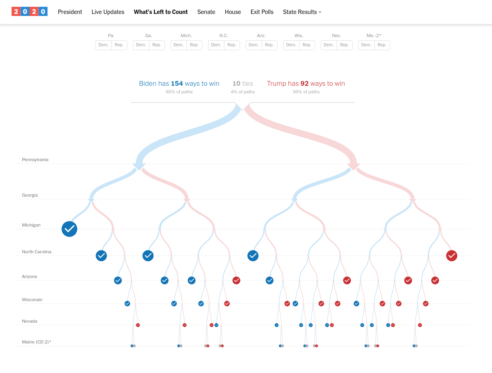](https://www.nytimes.com/interactive/2020/11/03/us/elections/forecast-uncounted-votes-president.html)

???

Another type of chart that has been relatively common historically is the "choose your own adventure" chart. This version was first introduced in 2012, and uses an actual tree to allow visitors to select which state would go to which candidate, and then to see the possible paths to victory for each candidate based on those choices.

Buried in the NYT coverage, you can see the graphic updated with the remaining states whose results aren't yet completely counted. I'm fond of this graphic, so it was nice to see it make a return this year.

---
## Paths to the White House

[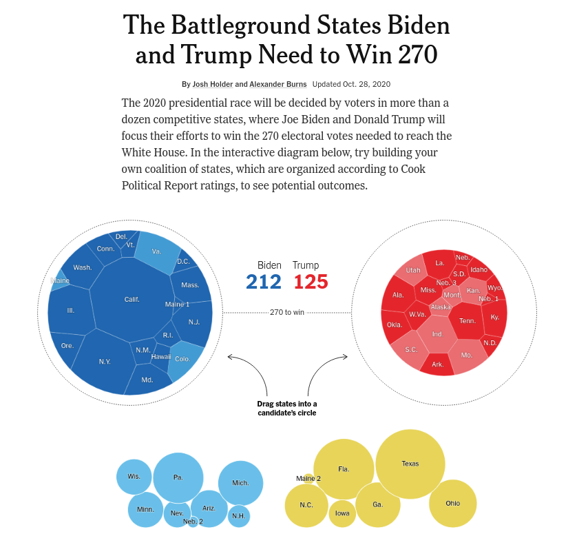](https://www.nytimes.com/interactive/2020/us/elections/election-states-biden-trump.html)

???

This version was the more prominent pre-election option; it doesn't quite have the same organizational appeal, but allows you to interact and play the what-if game. The one thing I don't like here is that we're bad at area and particularly bad with circles, so the "270 to win" threshold lines are not the most intuitive or easy-to-read and compare mechanisms to show getting past a threshold.

---
## Explore the Ways to Win


<div class="wrap">
<iframe class="scale-frame" src = "https://projects.fivethirtyeight.com/trump-biden-election-map/#ui" width = "100%" height = "500px"/></div>

???

I'm a bit more fond of 538's version, which lets you click either on the map or on the faces above the map to select which state will go to which person. The results update based on "wave" probability, so selecting e.g. Texas for Biden means that a lot of other states turn blue as well. The count at the bottom shows the "score" based on that updated information. 

---
## Uncertainty - The Needle (NYT)

.center[
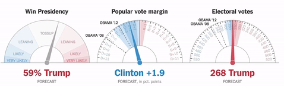
]

???

How many of you know what this refers to? 

--

- "jitter" motion to show simulation uncertainty

???

The needle used this jitter/twitching motion to show uncertainty in the predicted outcome - so as the night went on, the uncertainty was reduced.

--

- motion sometimes falsely interpreted as new data coming in

???

The problem is that not everyone really understood what they were showing - a lot of people saw it as "new data coming in" which really ramped up people's anxiety quite a bit.

--

- [The Needle and the Damage Done](https://fair.org/home/the-needle-and-the-damage-done/) (FAIR.org, from 2018)

- [The NYT Needle and the Damage Done](https://www.rollingstone.com/politics/politics-news/iowa-caucus-new-york-times-election-needle-donald-trump-947101/) (Rolling Stone)

- [Beyond the Needle: Probability Experts Assess 2020 race](https://apnews.com/article/election-2020-donald-trump-hillary-clinton-elections-nate-silver-a5b62d04f8747702c0ab3ae61423219b)

<!-- - ['The Needle' Won't Be Used on Election Night](https://politicalwire.com/2020/10/24/the-needle-wont-be-used-on-election-night/)      -->
<!-- .small[(for the overall election; it was still used for state-level results)] -->

???

As a result, this is maybe one of the most hated election graphics ever; I've provided a few different assessments of the needle's problems if you're interested. But the NYT used the needle throughout the 2020 primaries; instead of using it to show the full results this year, the times confined itself to showing the 

---
<iframe src="http://presidential-plinko.com/" width = "100%" height = "600px"></iframe>

???

Another attempt to show the same type of uncertainty was done by Matthew McKay, who's a professor at Northwestern studying uncertainty visualization. He decided to use a plinko board so that it was clear that the uncertainty was "random" instead of a result of new information.

McKay differentiates between anxiety due to uncertainty (which the needle successfully conveyed) and uncertainty due to temporal changes compared with existential uncertainty - this is where he says the needle failed.

---
## Outcome Uncertainty - 538
.pull-left[
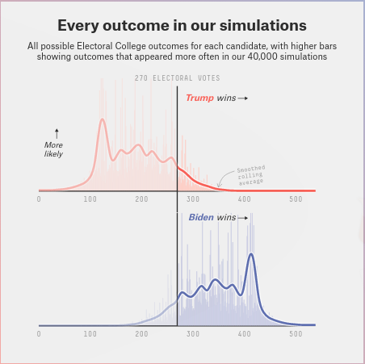
].pull-right[
[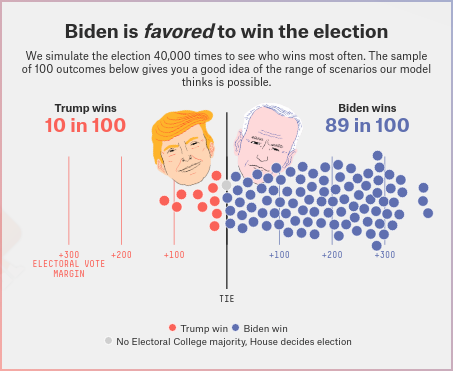](https://projects.fivethirtyeight.com/2020-election-forecast/#topline)
]

.bottom[This is also the only chart I've ever seen inspire a [halloween costume](https://twitter.com/thesarahkaym/status/1322747883544858625)]


???

538 uses balls to show the same sort of uncertainty, with a corresponding summary plot showing all of the 40k simulations they used to make their predictions. I Like the extra information you get from the ball summary plot with the mouseovers showing which states contributed to each simulation. I am less fond of the mirrored density plot - it would be just as easy to split the two pieces up and show the left half of the axis as red Trump win simulations. But I can see where that would be confusing as well. 

---
## Outcome Uncertainty

[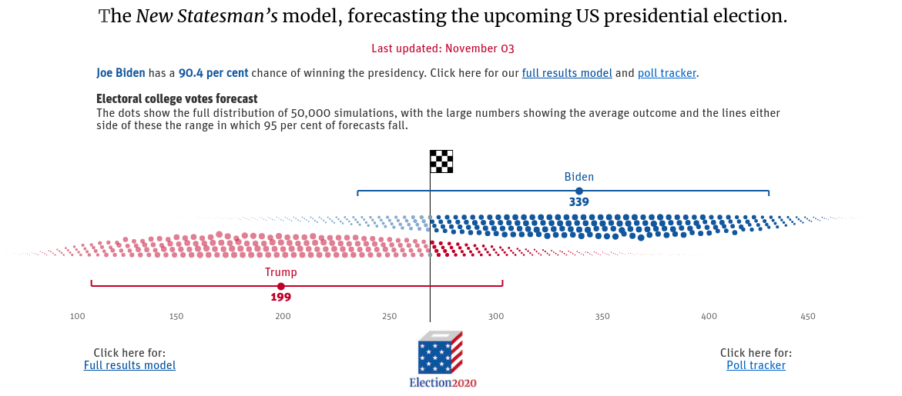](https://www.newstatesman.com/international/2020/11/us-2020-presidential-election-forecast-model-will-donald-trump-or-joe-biden)

???

This is an interesting way to show the distribution symmetry. I'm not completely sure that I like it, but I do think the result is at least visually appealing, and I think it does at least as good of a job as 538 at showing what the likely result is relative to the unlikely results.

---
## "Wave" Graphics

[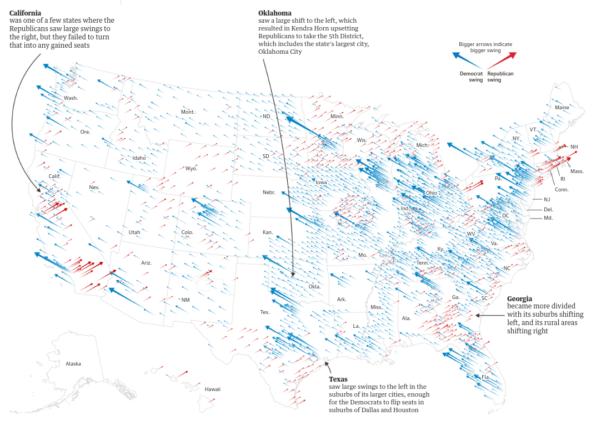](https://www.theguardian.com/us-news/ng-interactive/2018/nov/07/blue-wave-or-blue-ripple-a-visual-guide-to-the-democrats-gains)

???

The last chart I want to show is from 2018's "blue wave" election showing the size and direction of the swing in each location. It's not clear whether the swing shown is percentage or population shift, but the overall spatial clustering of the shifts is a very interesting way to do things - I really like what this chart shows.

The NYT seems to have liked this graphic enough to make it part of their standard 2020 coverage, though its impact wasn't nearly as great for showing presidential results, in my opinion, especially because precinct-level results weren't coming in all that quickly, leaving "no change" and "no result" as the same visual affect. 

---
## "Wave" Graphics

[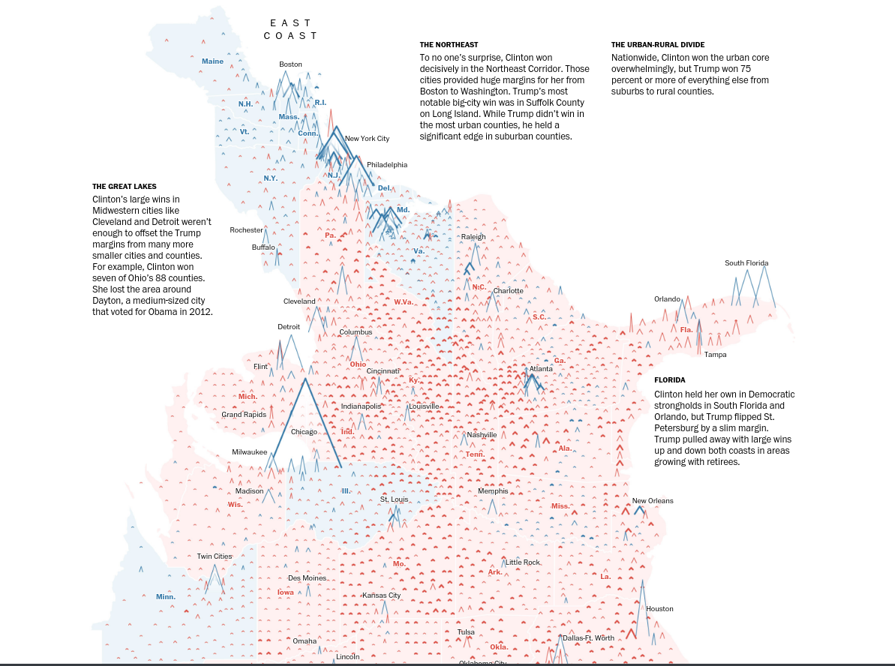](https://www.washingtonpost.com/graphics/politics/2016-election/election-results-from-coast-to-coast/)

???

This graphic shows a similar idea - the width is the vote margin, the height is the total votes cast. Stroke size indicates a landslide (50%+) county. This is from 2016 - I haven't yet seen a similar one for 2020.

---
## Other Factors affecting Election Graphics

- Majority/plurality voting, first-past-the-post, single transferable voting, ranked choice voting

- Split electoral votes - many charts don't show NE and ME correctly

- Parliamentary system (UK, Canada, Aus, NZ), Proportional Representation (e.g. Germany), Electoral College
    
- Data availability
    - Laws restricting polling (e.g. exit polling, polls X days before the election)
    - Polling not available in all areas
    - Not all areas are electing all offices each election

???

In compiling these pictures for you, I came across a few other factors I didn't have time to talk about but I'd like to bring up now - election graphics are complicated because the electoral system is complicated. I've mostly focused on the US Presidential election here, but even that isn't so straightforward anymore - in Maine, they're using ranked choice voting now, and it will be interesting to see whether that is adopted elsewhere - it could change how we're representing this data. 

The electoral system we use also impacts how these graphics are shown - with electionViz, we made the conscious choice not to bother with generalizing some variables to allow for other electoral systems, because these graphics don't really work for those systems anyways. You need different types of graphics for parliamentary systems, proportional representation, etc., and things that work for the electoral college are pretty much specific to the US.

The other thing that is very interesting is that the data you'd want to make these graphics isn't always available. For instance, this year, exit poll data is basically not worth looking at, for the first time in a long time. Senate elections, too, are tricky - we don't elect all senators each 2 year election, so you have to find a way to show "not up for re-election".


---
class:middle,inverse
# .emph[Group Participation]

---
## Partisanship and Swing States

[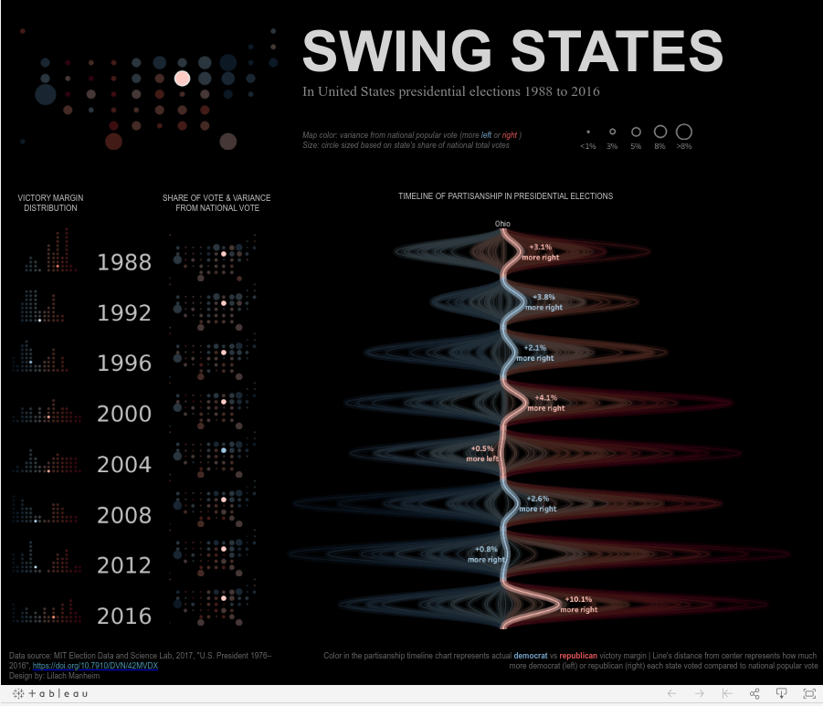](https://public.tableau.com/en-us/gallery/partisanship-swing-states-us-elections#gallery-page-container)

---
## Gender Gap and Representation

[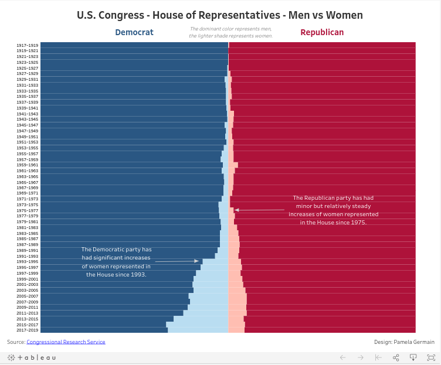](https://public.tableau.com/en-us/gallery/men-and-women-us-house-representatives?gallery=votd)


---
## Fun Reading

- [Reasons to consider a cartogram](https://medium.com/civic-tech-thoughts-from-joshdata/how-that-map-you-saw-on-538-under-represents-minorities-by-half-and-other-reasons-to-consider-a-4a98f89cbbb1)

- Visualizing Afghan Elections    
[How We Visualized an Election with No Political Parties](https://source.opennews.org/articles/how-we-visualized-election-no-political-parties/)

- [Muddy America: Color Balancing the Election Map](https://t.co/DpAodXAc0r?amp=1)

???

Here are a couple of interesting links that I came across while creating these slides that cover topics like why cartograms are better for showing minorities, and what to do when there aren't any parties to show (which is a problem we won't have in the US, but an interesting problem nonetheless.)

