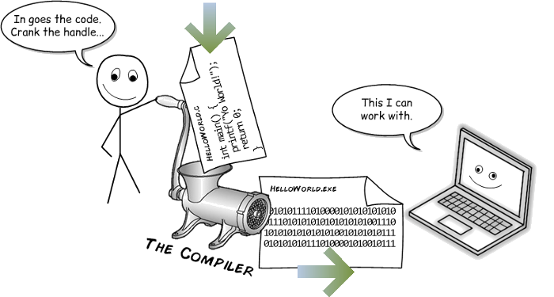
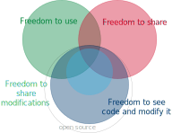

```{r setup, echo = F, include = F}
knitr::opts_chunk$set(echo = F)
```

class:inverse-grey,middle
## Overview

- Why Software Matters

- Concepts: Source code and Software

- Introduction to Open Source

- Moving toward Open Source Software

???

I'm excited to talk to you today about open-source software in forensics. As you've probably guessed by now, open science is an important part of CSAFE's goals. I'm going to start out by showing situations where software and the legal/regulatory framework have interacted in problematic ways. Hopefully, this will convince you to stick with me through the next part, where I'll talk about the difference between source code and software, and what each part allows us to do. Don't worry - I'm not going to show you code - this will be painless.

Then I'll talk about open source and spend some time de-mystifying the open-source community and showing why it's very much compatible with an equitable justice system. Finally, I'll talk a bit about how we can move toward open-source software and open science. 

---
class: primary-blue
## Software, Law, and Regulation

.right-column[
- Volkswagen's [pollution-control system used hidden code to circumvent EPA testing](https://www.nytimes.com/2015/09/23/nyregion/volkswagens-diesel-fraud-makes-critic-of-secret-code-a-prophet.html)

- Proprietary, probabilistic genotyping software has been [protected in court](https://www.courtlistener.com/opinion/2768743/people-v-chubbs-ca24/), even though [errors have been identified during criminal trials](www.couriermail.com.au/news/queensland/queensland-authorities-confirm-miscode-affects-dna-evidence-in-criminal-cases/news-story/833c580d3f1c59039efd1a2ef55af92b)

- Breathalyzer software challenges:
    - [Unreliable calibration and environmental detection components](https://casetext.com/case/in-re-source-code-evidentiary-hearings-in-implied-consent-matters?page=542) resulted in breathalyzer evidence being barred from a Minnesota court
    - [Source code audits confirmed the reliability of a different breathalyzer](https://caselaw.findlaw.com/nj-supreme-court/1094905.html) in a New Jersey supreme court case
]
.left-column[
 


]

???

This issue comes up in regulatory and legal circles fairly regularly. For instance, VW circumvented EPA testing with hidden source code - if they were required to submit the source code for the vehicle along with the vehicle, it would have been much more difficult to perpetrate fraud.

We've also seen challenges with probabilistic genotyping software such as STRmix and TrueAllele. Several different courts have refused to allow the defense to examine the source code - instead, they're limited to cross-examination of the forensic examiner using the software. In our analogy, that's like interrogating someone else who bought the same muffin about whether or not it is gluten-free, kosher, contains eggs, etc - it really doesn't help that much, because they're not the one who made the muffin.

While the DNA examples tend to work against the defense, there isn't really a bias here. While source code examination was used by the NJ supreme court to validate a breathalyzer's reliability; it was also used by a Minnesota court to throw out evidence from an unreliable breathalyzer.

---
class: inverse-blue,center,middle
## What is Source Code?<br/><br/> Software?

???

Next, I'm going to provide a very non-technical discussion of source code vs. software. You'll hear the term "open source software" thrown around, but it's helpful to be very explicit about what source code is, what software is, and what parts contribute to open science explicitly. 

---
class: primary-cyan
## Source and Software

Source Code | Software
----------- |  --------
 | 

???

I'm a pretty food-motivated person, so lets take this into a more familiar area: recipes. 
I've decided I'm hungry and I want to eat a muffin. So I walk down to my local coffee shop and I buy a muffin. So far, so good.

In my analogy, source code is like the muffin recipe, and the software I use is like the muffin I bought - the source code is the "recipe" the computer uses to create the graphical interface I interact with.
In this case, I have the muffin - the end result - but I don't necessarily have the recipe or know what went into that muffin. Most of the time, that's fine, but sometimes, it's a problem. 

---
class:secondary-cyan

**Source code** is the directions the programmer gives the computer.


.footer[Cartoon from [Young Coder](https://medium.com/young-coder/the-difference-between-compiled-and-interpreted-languages-d54f66aa71f0) guest post on medium.com]

???

I love this cartoon because it provides some common ground between us and computers - neither one of us understands both sides of the computer program. Source code is the set of instructions the programmer creates, but the computer doesn't speak the specific language the programmer does. So we have to go through another step: the source code has to get translated or interpreted into machine code. 


---
class:secondary-cyan

To be used by the computer, .b[Source code] must be turned into computer code.



Computer code is not human-readable.

**Software** is usually distributed as computer code.

.footer[Cartoon from [Young Coder](https://medium.com/young-coder/the-difference-between-compiled-and-interpreted-languages-d54f66aa71f0) guest post on medium.com]

???

So while both source code and computer code may be foreign languages to you, the software you use every day is compiled, not-human-readable, computer code. The part that's important here is that computer code doesn't let you see what is supposed to happen or the assumptions that went into the calculations. You can't really observe what's going on under the hood to see what went wrong.

---
class: primary-cyan
## Source and Software

In a legal setting, the software doesn't help us much: we can provide inputs and outputs, but we can't see the inner logic. We only see the surface, and even then, we might not find problem(s) that exist.

```{r out.width = "75%", fig.align="center"}
knitr::include_graphics("images/coffee-bean-illusion.png")
```
.footer[Image [source](https://www.huffingtonpost.co.uk/2015/12/30/coffee-bean-illusion_n_6105952.html)]

???

In a way, figuring out the inner workings of software is like trying to sort through coffee beans and decide which ones are bad. You can see the surface, and you can sometimes identify problems. But you might miss something right in front of you, and you know that there are potentially many more issues that you can't observe at all. 


---
class: primary-cyan
## Source and Software

In a legal setting, the software doesn't help us much: we can provide inputs and outputs, but we can't see the inner logic. We only see the surface, and even then, we might not find problem(s) that exist.

```{r out.width = "75%", fig.align="center"}

```
.footer[Image [source](https://www.huffingtonpost.co.uk/2015/12/30/coffee-bean-illusion_n_6105952.html)]

???

How many of you saw the non-coffee-bean in the picture? I had to look for a long time before I found it the first time. 

The problem with software is that there is no software out there that is completely bug free. There are lots of programs that are thoroughly tested and may not have any critical bugs that interfere with system performance or affect the "output" - for instance, code in nuclear reactors and airplanes is thoroughly checked and validated, with many redundancies. But, if the public can't see the source code, that checking and validation process is entirely opaque. The FAA and the Nuclear Regulatory Commission provide some oversight and licensing for these situations in aviation and nuclear energy, but the legal system is a lot more decentralized. As a result, it's far more important that the software used in forensics be available to the general public for examination and analysis: it's along the same lines as being able to see what the other side in the adversarial system has in evidence. 

---
class:primary-cyan

## Source and Software

So how do we make sure our software is doing what it says it is doing?

<table>
<thead>
<tr>
<th>Source Code</th>
<th>Software</th>
<th>Published paper Description</th>
<th>Source + Documentation + Paper + How To</th>
</tr>
</thead>
<tbody>
<tr>
<td></td>
<td></td>
<td></td>
<td></td>
</tr>
</tbody>
</table>

???

Source code doesn't exist in a vacuum, though. Any good programmer documents their code, providing some comments as to what's going on and how things work. Often, there's also formal user documentation, plus the associated papers where the methodology is validated in peer review (which is required for admissibility in court anyways). 

I like to watch the British Baking Show, and there, often, they given the contestants a list of ingredients and very minimal instructions. They actually remove information from the written recipe. If our recipe looks like that, it's probably equivalent to source code with no comments... 

The peer reviewed paper is another source for information - it describes the method and connects it to other available methods and pieces of information. So it's like the gif I've created with the pictures of each step... it's not enough to make the muffin from scratch (because you don't have the proportions of ingredients or even necessarily an idea of what the white powder is - is it self rising flour? All purpose? baking soda?), but it's certainly enough to give you a guided tour of what the process should look like. Similarly, our papers, even the very thorough ones, don't usually contain enough information to completely reimplement a method from scratch: it turns out that the reason we write programs in R, C, python, etc. is that written language isn't precise enough to describe algorithms exactly. It might be very informative, but the source code is necessary to fully understand the process. 

What I'm proposing - is more akin to a cooking blog: you share not only the code, but the documentation and any associated papers (or citations to those papers). So it's like having the ingredients list, the instructions, the progress pictures -- like having the more informative gif that helps you see exactly what you need to do. With that set of tools, we have a decent chance of being able to recreate the muffin from scratch. 

---
class: secondary-cyan
## The Perfect Combination

.move-down[.move-down[
1. Method description (conceptual) - from the research paper/presentation

2. Source code

3. Source code documentation

4. Written instructions for installation and use
]]

???

Essentially, the ideal combination of things we'd have to fully describe and demonstrate a piece of software would be the description of the method from the paper, the source code, the documentation for using that code (both programmer docummentation and user documentation), and a written set of instructions for installing and using the program. Obviously, depending on the amount of time and effort, some of these things are going to be patchier and less precise than we'd like them to be, but at least this way we have the puzzle pieces and just have to put them together properly. 

---
class: inverse-red,middle,center
# So what do we mean by open source?

???

Hopefully, at this point, you have a good idea of what I mean when I say source code, software, documentation, and where I'm going with this. The next thing I'm going to talk about briefly is open source. Like many areas, open-source has its own vocabulary and meanings behind common words, so when I say "freedom", I'm going to briefly explain what I mean by that. 

---
class:primary-red
## "Free and Open Source Software"

.pull-left[
4 freedoms:

1. Use the software for any purpose
2. See the code and modify it
3. Share copies of the software
4. Share copies of modified software

\#2 and \#4 require access to the source ("open source")

"Free" here refers to your rights, not to the price of the software

**Open Source** software is any software that allows the user to see the source code.
].pull-right[

]

???

In open source, we commonly talk about "free software", but that doesn't refer to the price tag. Instead, we're generally talking about some combination of the four "freedoms" listed here. 

---
class:primary-red
## Open Source in Forensics

The use of open-source code is **essential to maintaining public faith** in the judicial process. 

- Evidence is interpreted by algorithms and examiners

- Algorithms provide a (hopefully unbiased) "score" to assist examiners

- The defendant has been "accused" in part by the algorithm and should be able to examine it

Additional advantages:

- **Linus's Law**: "given enough eyeballs, all bugs are shallow"

    - Open-source code is more likely to have fixes for identified bugs (compared to proprietary code)
    
    - Bugs are more likely to be found


---
class:primary-red
## Open Source in Science
There are other advantages, too:

- Ability to reproduce results in papers
  - Comparisons between competing methods
  - Replication of results on new data

- Efficient scientific progress
  - Don't have to reinvent the wheel every time
  - Can easily modify others' code

- Software user community:
  - Wider evaluation and testing of software
  - Larger user base (more citations!)
  - "Inheritance" of project maintenance


---
class:primary-red
## Why Not Open Source?

- **Pride**
  - Research-level code is ugly and awkward
  - Making it "presentable" can be a lot of extra work    
    - [Community Research and Academic Programming License](http://matt.might.net/articles/crapl/)
    - [Open Source culture](https://fluca1978.github.io/2010/08/19/crapl-or-crap-of-university.html) - someone else will be proud to fix your ugly code

- **Competition** 
  - Force your competitors to reinvent the wheel to slow them down
  - Why go through the extra effort to help them?

- **There's no reward**

- **I'm not allowed** 
  - Organization release processes can be complex
  - Liability concerns - who is responsible if there are errors?
  

---
class:secondary-red
## Why Open Source?

- **Pride**    
  - Making the code presentable makes it easier for you to reuse later
  - Source code references (licensing) ensures you get credit for your work

- **Competition**    
  - Force your competitors to understand and fix your code
  - Become the standard option that everyone uses

- **There's no reward**
  - You can release the code as a package, with another separate publication

---
class:secondary-red
## Why Open Source?

- **I'm not allowed**    
  - Government agencies have a responsibility to release their developments to the general public.    
.small[[NIST](https://github.com/usnistgov), [Los Alamos](https://github.com/lanl), [Pacific Northwest](https://github.com/pnnl), [US DOJ](https://github.com/usdoj), [US Naval Research Lab](https://github.com/USNavalResearchLaboratory), [UK Min. of Justice](https://github.com/ministryofjustice), [Canada DOJ](https://github.com/justicecanada)]    
  - Many private organizations maintain open-source libraries to improve their software and contribute to the community's development.    
.small[[Google](https://github.com/google), [Microsoft](https://github.com/microsoft), [Facebook](https://github.com/facebook), [Apple](https://github.com/apple)]
  - Small private companies have the most to gain from open source software - expert software developers in the community may contribute for free
    - Open Source and free ($0) aren't synonymous. There are many different [open source business models](https://en.wikipedia.org/wiki/Business_models_for_open-source_software)
    
  - Guide to the legal considerations for open-source software: https://opensource.guide/legal/

---
class:secondary-red
## Why Open Source?

- **Liability**
  - Open-source licenses typically place liability on the end-user for any defects or malfunctions in the software
  - Because the code is written by a community, there is some diffusion of liability

---
class:secondary-red
## Software Liability

GNU General Public License 3.0

.small[
> 15 Disclaimer of Warranty.

> **THERE IS NO WARRANTY FOR THE PROGRAM**, TO THE EXTENT PERMITTED BY APPLICABLE LAW. EXCEPT WHEN OTHERWISE STATED IN WRITING THE COPYRIGHT HOLDERS AND/OR OTHER PARTIES PROVIDE THE PROGRAM “AS IS” WITHOUT WARRANTY OF ANY KIND, EITHER EXPRESSED OR IMPLIED, INCLUDING, BUT NOT LIMITED TO, THE IMPLIED WARRANTIES OF MERCHANTABILITY AND FITNESS FOR A PARTICULAR PURPOSE. THE ENTIRE RISK AS TO THE QUALITY AND PERFORMANCE OF THE PROGRAM IS WITH YOU. SHOULD THE PROGRAM PROVE DEFECTIVE, YOU ASSUME THE COST OF ALL NECESSARY SERVICING, REPAIR OR CORRECTION.

> 16 Limitation of Liability.

> **IN NO EVENT** UNLESS REQUIRED BY APPLICABLE LAW OR AGREED TO IN WRITING **WILL ANY COPYRIGHT HOLDER**, OR ANY OTHER PARTY WHO MODIFIES AND/OR CONVEYS THE PROGRAM AS PERMITTED ABOVE, **BE LIABLE TO YOU FOR DAMAGES**, INCLUDING ANY GENERAL, SPECIAL, INCIDENTAL OR CONSEQUENTIAL DAMAGES ARISING OUT OF THE USE OR INABILITY TO USE THE PROGRAM (INCLUDING BUT NOT LIMITED TO LOSS OF DATA OR DATA BEING RENDERED INACCURATE OR LOSSES SUSTAINED BY YOU OR THIRD PARTIES OR A FAILURE OF THE PROGRAM TO OPERATE WITH ANY OTHER PROGRAMS), **EVEN IF SUCH HOLDER OR OTHER PARTY HAS BEEN ADVISED OF THE POSSIBILITY OF SUCH DAMAGES.**
]

???

Note that most of the license is not in all caps. So they're literally yelling at us.

---
class:secondary-red
## Why Open Source?

- **Liability**
  - Open-source licenses typically place liability on the end-user for any defects or malfunctions in the software
    
      - Responsibility is to know how the software is working as an end-user
      - This is already part of forensics - the examiner is the ultimate authority
      - From a liability perspective, open-source is very compatible with forensics
    
  - Because the code is written by a community, there is some diffusion of liability
  
In forensics, where there isn't a single regulatory body, open-source may be a step private companies can take to reduce their own liability. 

???

It also happens to be the right thing to do and makes the system more fair for all parties. 

---
class:inverse-green,center,middle
# Moving Toward Reproducible, Open-source Science

---
class:primary-green
## Steps toward Reproducible, Open-source Science


0. Describe the methodology in the published paper, release uncurated code on request

1. Describe the methodology in the published paper, provide reproducible code in a repository and link to it in the paper

2. Describe the methodology in the published paper, provide reproducible code **and data** in a repository

3. Archive the code, data, and paper in a curated repository on e.g. figshare

---
class:primary-green
## Writing Reproducible Code

- Make the code modular, so that each step is encapsulated in a reusable function

- Make a habit of documenting each step in the code explicitly (Documentation-driven development)

- Use unit and integration tests to document each function and record the output (to provide a log of how function results change over time)

- Release your code as a package, with documentation, to make it easier for others to use (and cite) your work

