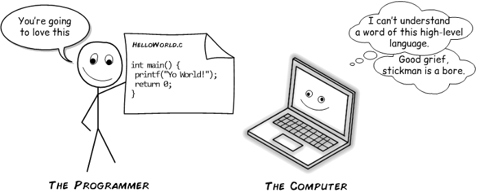

```{r setup, echo = F, include = F}
knitr::opts_chunk$set(echo = F)
```

class:inverse-grey,middle
## Overview

- Why Software Matters

- Concepts: Source code and Software

- Introduction to Open Source

- Moving toward Open Source Software

???

I'm excited to talk to you today about open-source software in forensics. As you've probably guessed by now, open science is an important part of CSAFE's goals. I'm going to start out by showing situations where software and the legal/regulatory framework have interacted in problematic ways. Hopefully, this will convince you to stick with me through the next part, where I'll talk about the difference between source code and software, and what each part allows us to do. Don't worry - I'm not going to show you code - this will be painless.

Then I'll talk about open source and spend some time de-mystifying the open-source community and showing why it's very much compatible with an equitable justice system. Finally, I'll talk a bit about how we can move toward open-source software and open science. 

---
class: primary-blue
## Software, Law, and Regulation

.right-column[
- Volkswagen's [pollution-control system used hidden code to circumvent EPA testing](https://www.nytimes.com/2015/09/23/nyregion/volkswagens-diesel-fraud-makes-critic-of-secret-code-a-prophet.html)

- Proprietary, probabilistic genotyping software has been [protected in court](https://www.courtlistener.com/opinion/2768743/people-v-chubbs-ca24/), even though [errors have been identified during criminal trials](www.couriermail.com.au/news/queensland/queensland-authorities-confirm-miscode-affects-dna-evidence-in-criminal-cases/news-story/833c580d3f1c59039efd1a2ef55af92b)

- Breathalyzer software challenges:
    - [Unreliable calibration and environmental detection components](https://casetext.com/case/in-re-source-code-evidentiary-hearings-in-implied-consent-matters?page=542) resulted in breathalyzer evidence being barred from a Minnesota court
    - [Source code audits confirmed the reliability of a different breathalyzer](https://caselaw.findlaw.com/nj-supreme-court/1094905.html) in a New Jersey supreme court case
]
.left-column[
 


]

???

This issue comes up in regulatory and legal circles fairly regularly. For instance, VW circumvented EPA testing with hidden source code - if they were required to submit the source code for the vehicle along with the vehicle, it would have been much more difficult to perpetrate fraud.

We've also seen challenges with probabilistic genotyping software such as STRmix and TrueAllele. Several different courts have refused to allow the defense to examine the source code - instead, they're limited to cross-examination of the forensic examiner using the software. 

While the DNA examples tend to work against the defense, there isn't really a bias for one side or the other. While source code examination was used by the NJ supreme court to validate a breathalyzer's reliability; it was also used by a Minnesota court to throw out evidence from an unreliable breathalyzer.

---
class: inverse-blue,center,middle
## What is Source Code?<br/><br/> Software?

???

Next, I'm going to provide a very non-technical discussion of source code vs. software. You'll hear the term "open source software" thrown around, but it's helpful to be very explicit about what source code is, what software is, and what parts contribute to open science explicitly. 

---
class: primary-cyan
## Source and Software

Source Code | Software
----------- |  --------
 | 

???

I'm a pretty food-motivated person, so lets take this into a more familiar area: recipes. 
I've decided I'm hungry and I want to eat a muffin. So I walk down to my local coffee shop and I buy a muffin. So far, so good.

In my analogy, source code is like the muffin recipe, and the software I use is like the muffin I bought - the source code is the "recipe" the computer uses to create the graphical interface I interact with.
In this case, I have the muffin - the end result - but I don't necessarily have the recipe or know what went into that muffin. Most of the time, that's fine, but sometimes, it's a problem. 

---
class:secondary-cyan

**Source code** is the directions the programmer gives the computer.



.footer[Cartoon from [Young Coder](https://medium.com/young-coder/the-difference-between-compiled-and-interpreted-languages-d54f66aa71f0) guest post on medium.com]

???

I love this cartoon because it provides some common ground between us and computers - neither one of us understands both sides of the computer program. Source code is the set of instructions the programmer creates, but the computer doesn't speak the specific language the programmer does. So we have to go through another step: the source code has to get translated or interpreted into machine code. 


---
class:secondary-cyan

To be used by the computer, .b[Source code] must be turned into computer code.


Computer code is not human-readable.

**Software** is usually distributed as computer code.

.footer[Cartoon from [Young Coder](https://medium.com/young-coder/the-difference-between-compiled-and-interpreted-languages-d54f66aa71f0) guest post on medium.com]

???

So while both source code and computer code may be foreign languages to you, the software you use every day is compiled, not-human-readable, computer code. The part that's important here is that computer code doesn't let you see what is supposed to happen or the assumptions that went into the calculations. You can't really observe what's going on under the hood to see what went wrong.

---
class: primary-cyan
## Source and Software

In a legal setting, the software doesn't help us much: we can provide inputs and outputs, but we can't see the inner logic. We only see the surface, and even then, we might not find problem(s) that exist.

```{r out.width = "75%", fig.align="center"}
knitr::include_graphics("images/coffee-bean-illusion.png")
```
.footer[Image [source](https://www.huffingtonpost.co.uk/2015/12/30/coffee-bean-illusion_n_6105952.html)]

???

In a way, figuring out the inner workings of software from the user interface or the compiled files is like trying to sort through coffee beans and decide which ones are bad. You can see the surface, and you can sometimes identify obvious problems. But you might miss something right in front of you, and you know that there are potentially many more issues that you can't observe at all. 


---
class: primary-cyan
## Source and Software

In a legal setting, the software doesn't help us much: we can provide inputs and outputs, but we can't see the inner logic. We only see the surface, and even then, we might not find problem(s) that exist.

```{r out.width = "75%", fig.align="center"}
knitr::include_graphics("images/coffee-bean-illusion2.png")
```
.footer[Image [source](https://www.huffingtonpost.co.uk/2015/12/30/coffee-bean-illusion_n_6105952.html)]

???

How many of you saw the non-coffee-bean in the picture? I had to look for a long time before I found it the first time. 

The problem with software is that there is no software out there that is completely bug free. 
There are lots of programs that are thoroughly tested and may not have any critical bugs that interfere with system performance or affect the "output" - for instance, code in nuclear reactors and airplanes is thoroughly checked and validated, with many redundancies, and licensed by the appropriate federal agency. So even if the code isn't available, there's some trust that people who know what they're doing have checked the code.

The legal system is more decentralized: there isn't a central authority for checking that the software are valid under a set of circumstances. As a result, it is important that the software used in forensics be available to the general public for examination and analysis, to build trust in the tools which underlie the legal and criminal justice systems.

---
class:primary-cyan

## Source and Software

So how do we make sure our software is doing what it says it is doing?

<table>
<thead>
<tr>
<th>Source Code</th>
<th>Software</th>
<th>Published paper Description</th>
<th>Source + Documentation + Paper + How To</th>
</tr>
</thead>
<tbody>
<tr>
<td></td>
<td></td>
<td></td>
<td></td>
</tr>
</tbody>
</table>

???

Hopefully, you're to the point of considering that the source code may be important. I'd like to illustrate just how important the development ecosystem is by returning to our muffin analogy.

I like to watch the British Baking Show, and there, often, they given the contestants a list of ingredients and very minimal instructions. They actually remove information from the written recipe. If our recipe looks like that, it's probably equivalent to source code with no comments... but most programmers add comments that help to explain their code (like a full recipe that hasn't been redacted).

In addition, usually the method is documented with a peer-reviewed paper that describes the method and connects it to other available methods and pieces of information. We could think of this as a bunch of progress pictures - not enough to create the recipe from scratch (because we don't know the exact proportion of ingredients), but it's very helpful to understand the process. Our papers, even the very thorough ones, don't usually contain enough information to completely reimplement a method from scratch: it turns out that the reason we write programs in R, C, python, etc. is that written language isn't precise enough to describe algorithms exactly. It might be very informative, but the source code is necessary to fully understand the process. 

The full ecosystem that we use for developing these methods is like a cooking blog post: you share not only the code, but the documentation and any associated papers (or citations to those papers). So it's like having the ingredients list, the instructions, the progress pictures -- like having the more informative gif that helps you see exactly what you need to do. With that set of tools, we have a decent chance of being able to recreate the muffin from scratch.

---
class: secondary-cyan
## The Perfect Combination

.move-down[.move-down[
1. Method description (conceptual) - from the research paper/presentation

2. Source code

3. Source code documentation

4. Written instructions for installation and use
]]

???

For good science, what we really need is to have the method description, the source code, the documentation, and ideally some instructions for how to use things.

This is the best case scenario for open science. But I'm talking about open source, so let's transition from open science to open source - specifically, why the source code is an integral part of this process.

---
class: inverse-red,middle,center
# So what do we mean by open source?

???

Like many areas, open-source has its own vocabulary and meanings behind common words, so when I say "freedom", I'm going to briefly explain what I mean by that. 

---
class:primary-red
## "Free and Open Source Software"

.pull-left[
4 freedoms:

1. Use the software for any purpose
2. See the code and modify it
3. Share copies of the software
4. Share copies of modified software

\#2 and \#4 require access to the source ("open source")

"Free" here refers to your rights, not to the price of the software

**Open Source** software is any software that allows the user to see the source code.
].pull-right[

]

???

In open source, we commonly talk about "free software", but that doesn't refer to the price tag. Instead, we're generally talking about some combination of the four "freedoms" listed here. 

Specifically, the first freedom is the freedom to use the software for any purpose. If you've ever read the itunes user agreement, you know that it has a clause prohibiting you from violating US law, including (and it actually specifies this) development, design, manufacture, or production of nuclear, missile, or chemical and biological weapons. So-called free and open source software will generally not restrict you from developing weapons with a music player, but they might assume that you would find a better open-source program out there for your purposes, so I wouldn't ask about it on the forums.

You generally also have the freedom when using free software to see and modify the code. So this requires, by default, that you have access to the code - that the software is open-source. But open-source software doesn't require that you allow any user to actually run the software for any purpose, or that you allow any of the other freedoms listed here. That's an important distinction - I'm of course happy to advocate for free and open source software, but for forensic purposes my big goal is to promote the open-source part - the rest of the freedoms are nice but not essential.

The third freedom is the freedom to share the software - to pass a copy on to a friend or colleague. And the fourth is the freedom to share your modified version of the source code or compiled software.

Now, freedoms 3 and 4 are really useful and important for scientific progress. So they're not nothing. But if you're using a common open-source license, generally speaking freedoms 1-4 are included.

Note that nowhere in here is there any reference to money explicitly. There's an implicit part of freedom 3 that could go along with "free software" but there are lots of business models that revolve around open source software and still maintain these freedoms. Open source isn't anti-business or anti-intellectual-property; it's mostly concerned with being pro-knowledge and pro-science.


---
class:primary-red
## Open Source in Forensics

The use of open-source code is **essential to maintaining public faith** in the judicial process. 

- Evidence is interpreted by algorithms and examiners

- Algorithms provide a (hopefully unbiased) "score" to assist examiners

- The defendant has been "accused" in part by the algorithm and should be able to examine it

Additional advantages:

- **Linus's Law**: "given enough eyeballs, all bugs are shallow"

    - Open-source code is more likely to have fixes for identified bugs (compared to proprietary code)
    
    - Bugs are more likely to be found

???

Hopefully at this point you can see why I make the claim that open source is essential to maintaining public faith in the judicial process. We're advocating for a world in which the evidence is interpreted by examiners with the help of algorithms. These algorithms provide a score to help examiners, but as a result, the defendant is being "accused" in part by the algorithm. We have a constitutional right to confront our accusers, which means the defense and the prosecution should both be able to examine the source code and see how the algorithm arrived at the decision. 

Another advantage to this model is that if the source code is available and being reviewed by the community, bugs are more likely to be found. No code is bug free - that's really important to understand. Generally we hope to reduce the impact of bugs through software testing. But, the assumptions I am operating under when I write software tests may not match how the software is being used in the lab - so it's good to have other people testing my code too, because they might test something I didn't think about. This has been examined with google projects - google open-sources some of its code, and the open-source code generally gets bugs identified and fixed faster than similar closed-source projects. 


---
class:primary-red
## Open Source in Science
There are other advantages, too:

- Ability to reproduce results in papers
  - Comparisons between competing methods
  - Replication of results on new data

- Efficient scientific progress
  - Don't have to reinvent the wheel every time
  - Can easily modify others' code

- Software user community:
  - Wider evaluation and testing of software
  - Larger user base (more citations!)
  - "Inheritance" of project maintenance

???

The open-source movement developed out of early academic computer science: at its core, it starts with the assumption that progress should be available for everyone to benefit from in proportion to their interest in the field in which progress is made. It's a radical idea.

But, along with that means that we can more easily reproduce results in papers, compare competing methods, and replicate results on new data. This leads to more efficient progress in science: we can collaborate more, build off of past inventions - we don't have to rebuild everything constantly, and we're all working together instead of competing constantly (there are of course still competitions - some of the mailing lists are pretty passionate). 

For the software user community, there are benefits too - projects can be maintained and inherited much more easily, instead of abandoned. As academics, we get to make use of a larger user base, which leads to more citations - even across disciplines. I've gotten inquiries about some of the shoe alignment software I wrote, and I believe it has at this point been used for several other non-shoe projects. And with that use, as software developers we get several advantages - we get to make connections across disciplines, but we also get other people identifying and sometimes fixing the bugs for us. This is a great advantage when the goal is to have nice, robust, reliable software.


---
class:primary-red
## Why Not Open Source?

- **Pride**
  - Research-level code is ugly and awkward
  - Making it "presentable" can be a lot of extra work    
    - [Community Research and Academic Programming License](http://matt.might.net/articles/crapl/)
    - [Open Source culture](https://fluca1978.github.io/2010/08/19/crapl-or-crap-of-university.html) - someone else will be proud to fix your ugly code

- **Competition** 
  - Force your competitors to reinvent the wheel to slow them down
  - Why go through the extra effort to help them?

- **There's no reward**

- **I'm not allowed** 
  - Organization release processes can be complex
  - Liability concerns - who is responsible if there are errors?
  
???

So why don't people open source their code by default?

In some cases, it's just pure embarrassment. I try not to look at code that I wrote more than 3 years ago - it's awful - so why would I want to make that public?
Plus, making it presentable can be agonizing, especially if certain parts are held together with duct tape and bailing wire.
We're not the first people to have this issue - so much that someone proposed making a community research and academic programming license (which has the acronym CRAP-L). While this isn't a completely serious computing license, I find the idea to be helpful - you release the code in the state it's in, with no apologies, because doing so makes the community better and helps you improve. But I think the more positive way to look at it is that you're helping someone else contribute to the community too, by improving your code even if they're not familiar enough to innovate themselves. 

Sometimes, we also get a bit competitive and don't want to help out that one annoying guy at the conference that's just going to be annoying during Q&A. But frankly, sometimes, my code would confuse them more than writing it over again, so... maybe it's better to release the code? (I'm mostly kidding). 

Other arguments involve the academic and social rewards for releasing software - it doesn't necessarily e.g. get you tenure, so why bother? 

But in my experience, the biggest argument against open source is that the process to make something open source is a bit scary and intimidating. I worked in nuclear power for a while, so I get it - lawyers are not something you generally seek out. But I managed to open source the code I wrote during that time, because they had explicit processes for how to do something and I could follow them. It just took a few emails back and forth with legal. 

So now that I've argued the other side a little, I"m going to address each of these and explain why open-source is worth it.


---
class:secondary-red
## Why Open Source?

- **Pride**    
  - Making the code presentable makes it easier for you to reuse later
  - Source code references (licensing) ensures you get credit for your work

- **Competition**    
  - Force your competitors to understand and fix your code
  - Become the standard option that everyone uses

- **There's no reward**
  - You can release the code as a package, with another separate publication
  
???

If you're worried about your code being presentable, there are a few things to consider. One, you wrote the code and may want to build off of that research later. If you come back to it in 2 years, don't you want to have it in good condition so that you can figure out what's going on? The documentation and open-source process to make code presentable is a worthwhile investment for future you. 

If pride is the issue, then use a license that requires attribution - that someone cite your code and your work if they reuse it. It's a nice ego boost, or so I would assume.

If you're worried about helping your competitors, then maybe just let them fix your code - that's revenge enough in some cases. But also, what's sweeter than becoming the defacto standard otpion that everyone uses? That's winning in a way that publishing a paper first just isn't quite going to beat.

On the academic side of things, I've found that it's very easy to publish the methods paper first, and then release the code as a separate software package that has its own publication. So you get double the publications for the effort of packaging things up nicely and making them available to the community. Plus, the software availability means that you have a much higher chance of being cited if someone is considering between multiple implementations of a method - the most user-friendly option gets the users!

---
class:secondary-red
## Why Open Source?

- **I'm not allowed**    
  - Government agencies have a responsibility to release their developments to the general public.    
.small[[NIST](https://github.com/usnistgov), [Los Alamos](https://github.com/lanl), [Pacific Northwest](https://github.com/pnnl), [US DOJ](https://github.com/usdoj), [US Naval Research Lab](https://github.com/USNavalResearchLaboratory), [UK Min. of Justice](https://github.com/ministryofjustice), [Canada DOJ](https://github.com/justicecanada)]    
  - Many private organizations maintain open-source libraries to improve their software and contribute to the community's development.    
.small[[Google](https://github.com/google), [Microsoft](https://github.com/microsoft), [Facebook](https://github.com/facebook), [Apple](https://github.com/apple)]
  - Small private companies have the most to gain from open source software - expert software developers in the community may contribute for free
    - Open Source and free ($0) aren't synonymous. There are many different [open source business models](https://en.wikipedia.org/wiki/Business_models_for_open-source_software)
    
  - Guide to the legal considerations for open-source software: https://opensource.guide/legal/

???

The next issue is one that I think is a much more common perception than reality. 

There are many public agencies which develop code and release it as part of their work, including NIST, NASA, national labs, the DOJ, the naval research lab, and equivalent organizations in other countries. These organizations do so because the taxpayers have already paid for the work, so they deserve to have access to it. Technically, I suppose, I could file FOIA requests for NIST code/data/methods, but that is a bit of a pain in the rear - it's easier for the researchers to just release the code directly. I'll talk about liability issues in a minute, don't worry. For now, it's enough to say that there is a lot of precedent for government organizations to provide their work as open-source software. 

But, the same issue is true in organizations that are privately held or for-profit. Google, Microsoft, Facebook, and Apple all maintain large open-source projects that have broad user bases. But, small companies have even more to gain from open-source - by releasing the code, they can get access to a wider pool of developers and more extensive testing than they might be able to hire. It's really common for programmers to have side projects, hobby projects, and contribute to open-source projects on the weekend. Again, this type of model is not incompatible with for-profit operation - there are many diferent open source business models. What is important in the private business situation is to carefully set up the framework for open-surce. The opensource guide I've linked to is designed to help small businesses think through how to manage intellectual property and other considerations for open source software. 


---
class:secondary-red
## Why Open Source?

- **Liability**
  - Open-source licenses typically place liability on the end-user for any defects or malfunctions in the software
  - Because the code is written by a community, there is some diffusion of liability


???

The next big issue is liability - some organizations worry about releasing code because they're worried about the liability for the code being used (properly or improperly). Open source licenses are very explicit about putting liability on the user rather than the developer (I'll show an example in a minute). This is both a cya issue and an issue of practicality - if the code was contributed by an anonymous person, who do you sue? What if the code is written by 30+ collaborators who are all different organizations and where it isn't clear who exactly was responsible for the fault in the code? The community aspect of open-source is protective in that it actually diffuses the ability for the legal system to actually pursue liability claims. 

This hasn't actually played out in court much, in part because it's not something that comes up often. But, it's worth pointing out that these licenses are explicit and that there are organizations who would jump to the defense of any open-souce community involved in such a lawsuit.

---
class:secondary-red
## Software Liability

GNU General Public License 3.0

.small[
> 15 Disclaimer of Warranty.

> **THERE IS NO WARRANTY FOR THE PROGRAM**, TO THE EXTENT PERMITTED BY APPLICABLE LAW. EXCEPT WHEN OTHERWISE STATED IN WRITING THE COPYRIGHT HOLDERS AND/OR OTHER PARTIES PROVIDE THE PROGRAM “AS IS” WITHOUT WARRANTY OF ANY KIND, EITHER EXPRESSED OR IMPLIED, INCLUDING, BUT NOT LIMITED TO, THE IMPLIED WARRANTIES OF MERCHANTABILITY AND FITNESS FOR A PARTICULAR PURPOSE. THE ENTIRE RISK AS TO THE QUALITY AND PERFORMANCE OF THE PROGRAM IS WITH YOU. SHOULD THE PROGRAM PROVE DEFECTIVE, YOU ASSUME THE COST OF ALL NECESSARY SERVICING, REPAIR OR CORRECTION.

> 16 Limitation of Liability.

> **IN NO EVENT** UNLESS REQUIRED BY APPLICABLE LAW OR AGREED TO IN WRITING **WILL ANY COPYRIGHT HOLDER**, OR ANY OTHER PARTY WHO MODIFIES AND/OR CONVEYS THE PROGRAM AS PERMITTED ABOVE, **BE LIABLE TO YOU FOR DAMAGES**, INCLUDING ANY GENERAL, SPECIAL, INCIDENTAL OR CONSEQUENTIAL DAMAGES ARISING OUT OF THE USE OR INABILITY TO USE THE PROGRAM (INCLUDING BUT NOT LIMITED TO LOSS OF DATA OR DATA BEING RENDERED INACCURATE OR LOSSES SUSTAINED BY YOU OR THIRD PARTIES OR A FAILURE OF THE PROGRAM TO OPERATE WITH ANY OTHER PROGRAMS), **EVEN IF SUCH HOLDER OR OTHER PARTY HAS BEEN ADVISED OF THE POSSIBILITY OF SUCH DAMAGES.**
]

???

Note that most of the license is not in all caps. So they're literally yelling at us.

This is one of the more extreme open-source licenses, but it is very very explicit about the fact that there is no warranty and no liability implied or provided by use of the software.


---
class:secondary-red
## Why Open Source?

- **Liability**
  - Open-source licenses typically place liability on the end-user for any defects or malfunctions in the software
    
      - Responsibility is to know how the software is working as an end-user
      - This is already part of forensics - the examiner is the ultimate authority
      - From a liability perspective, open-source is very compatible with forensics
    
  - Because the code is written by a community, there is some diffusion of liability
  
In forensics, where there isn't a single regulatory body, open-source may be a step private companies can take to reduce their own liability. 

???

Examining the liability issue, we can see that the end-user is the one that is deemed responsible for relying on the software. But this is already how forensics operates - the examiner testifies based on their expertise and their reputation as an examiner. The software isn't licensed to do that job, because the examiner is the ultimate authority. So from a liability perspective, this is a non-issue - if the examiner doesn't trust the software or believes it has made an inaccurate conclusion, then they should discount the results and justify why the results are wrong - which they already would do if the situation came up.

So the liability issue (which is one of the big ones people worry about) is actually not really an issue in forensics, because of the way the system is structured.

It also happens to be the right thing to do and makes the system more fair for all parties. 

---
class:inverse-green,center,middle
# Moving Toward Reproducible, Open-source Science

???

Hopefully I've convinced you that open-source is a good option, and something worth considering. But for those of you who develop software, you may be wondering how to get there. And for those of you who use software, you may be wondering how this open-source thing works in practice. 

---
class:primary-green
## Steps toward Reproducible, Open-source Science

0. Describe the methodology in the published paper

1. Describe the methodology in the published paper, release uncurated code on request

2. Describe the methodology in the published paper, provide reproducible code in a repository and link to it in the paper

3. Describe the methodology in the published paper, provide reproducible code **and data** in a repository

4. Archive the code, data, and paper in a curated repository on e.g. figshare

???

From a scientific perspective, I've assembled a basic hierarchy: the basic option is to describe your methodology in the published paper. General courtesy is that if someone asks for your code and data for replication purposes, you release it - so I've made that step 1. 

If you're feeling a bit more open to open-source, then step 2 would be to put your code in a repository and link to it in the paper. Make it clear how people can get access to your results.

Step 3 is to release your code and data - this makes your analysis fully reproducible, which is the bare minimum expectation for good science (or at least, it should be)

Step 4 is to release the code, data, and paper in a curated repository, and as your methodology evolves, to continue linking new versions to that archive. This ensures long-term reproducibility in some form, so that the knowledge is not lost.

Now, these are strictly steps for archival purposes. But what about making your results more friendly for the community to use and understand?

---
class:primary-green
## Writing Reproducible Code

- Make the code modular, so that each step is encapsulated in a reusable function

- Make a habit of documenting each step in the code explicitly (Documentation-driven development)

- Use unit and integration tests to document each function and record the output (to provide a log of how function results change over time)

- Release your code as a package, with documentation, to make it easier for others to use (and cite) your work

???

If you write code with open-source end points in mind, then you actually start writing better, more useful code. 

Making code modular allows it to be re-used later, or for you to swap modules in and out when you find a better way of doing things

If you start with the documentation and then write the code, you tend to get clearer, cleaner functions that do only one task. So that's a really nice benefit because it's a lot easier to maintain - and you have the documentation when you come back to it.

If you know others are going to contribute to your project, it's a good idea to write some basic tests that let you know if functions break based on other changes. That makes it easier to check other people's contributions, but it also improves your ability to debug and fix your own code.

Finally, if you're starting out with the idea of reproducible, open-source, community contribution, software, then it's easy to just start out designing the code as a package. All of that documentation can be easily turned into a package website, and you can really save a ton of time by explaining the code as you write it instead of trying to go back and do that afterwards. 

---
class:secondary-green
## Using Open Source code

While open-source, doesn't necessarily mean free, there are many free AND open-source software packages

These are as good (though slightly different) than their expensive, closed-source counterparts.

- Photoshop : GiMP

- Microsoft Office : Libre Office

- Matlab : R, Octave, NumPy

- Edge : Chromium : Firefox (continuum of freedoms)

- Windows : Linux

Source code auditability is critical for forensics, and should be a major consideration when deciding which platform to use. 


???

I've listed a few open-source alternatives to common software packages, just for you to explore if you're interested. But the more important takeaway here is that this is an issue that is going to come up more and more as forensics starts to use more algorithms. Right now, it's not 100% that defendents will get to look at the source code, but it's just a matter of time until this issue is more prominent.

I would urge those of you on the lab side of things to be aware of the issues involved with proprietary software and hardware that locks you in to proprietary software. If there is an open option (hardware or software) you may find that investing in that option early will save you some pain in the long run. For instance, buying microscopes that use open data formats is one good step, but if you find an option that has support for open platforms as well as potentially having a closed platform, then that may give you more options in the future as the legal situation evolves. 