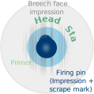
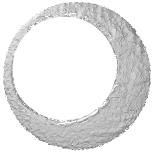
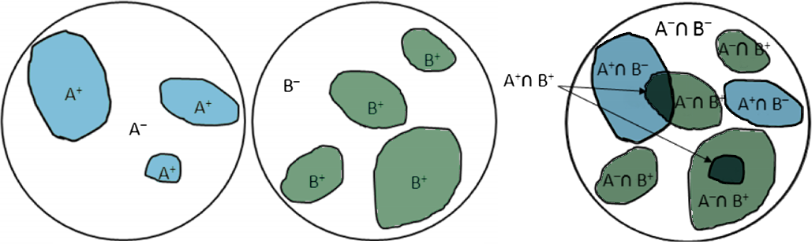
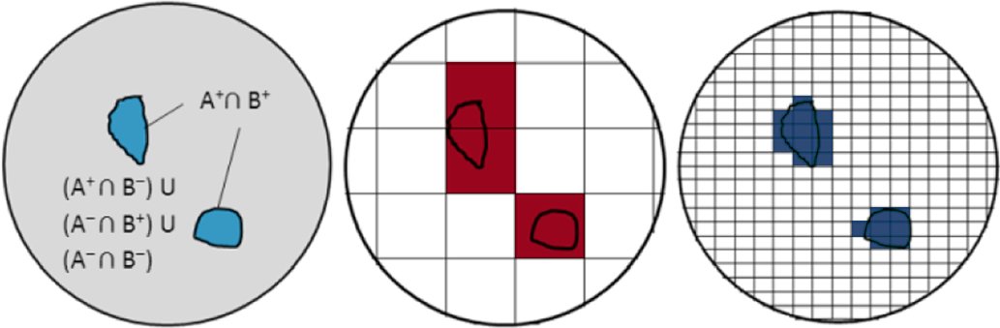
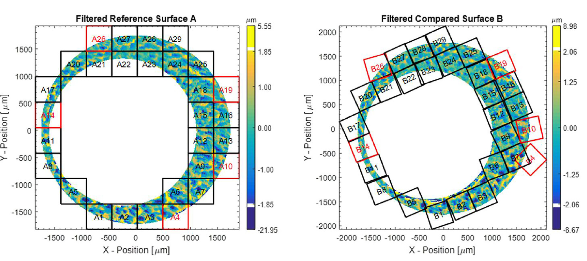
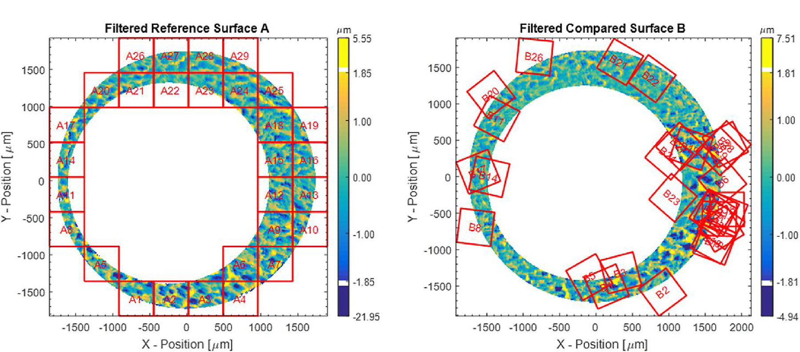
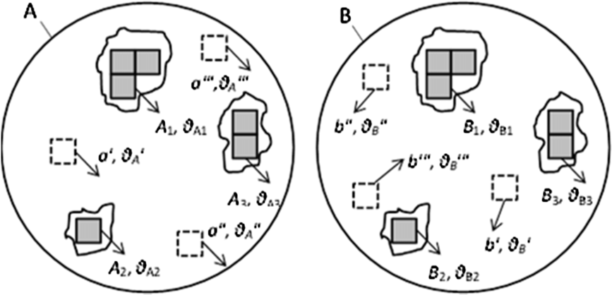

```{r setup, echo = F, include = F}
knitr::opts_chunk$set(echo = F)
```

class: primary-blue,center
## Cartridge Cases
Diagram | Scan | Scan (firing pin removed)
------- | ---- | --------
 |  | 

---
class: primary-blue
## Breech Face Comparison

- Cartridge impacts the breech face of the gun during the firing process

- Contact between the full cartridge case and the breech face is not guaranteed

- Matching should allow for areas of the cartridge which do not impact the cartridge case



.small[Image colorized from Song, J., Chu, W., Tong, M., & Soons, J. (2014). 3D topography measurements on correlation cells - A new approach to forensic ballistics identifications. Measurement Science and Technology, 25(6). https://doi.org/10.1088/0957-0233/25/6/064005
]

---
class: primary-blue
## Split the cartridge case into cells


- Number of cells that "match" indicate the amount of similarity
- Obviously dependent on cell grid size

.small[Image colorized from Song, J., Chu, W., Tong, M., & Soons, J. (2014). 3D topography measurements on correlation cells - A new approach to forensic ballistics identifications. Measurement Science and Technology, 25(6). https://doi.org/10.1088/0957-0233/25/6/064005
]


---
class:primary-blue
## Comparison Cell Alignment


Compare each region in image 1 to a larger area in image 2


---
class:primary-blue
## What about rotation?

Real scans are not aligned precisely

- Scanned at different rotations
- Firing pin may not line up with breech face alignment


---
class:primary-blue
## Comparing Translation + Rotation
### Matching scans


.small[Image from Song, J., Vorburger, T. V., Chu, W., Yen, J., Soons, J. A., Ott, D. B., & Zhang, N. F. (2018). Estimating error rates for firearm evidence identifications in forensic science. Forensic Science International, 284, 15???32. https://doi.org/10.1016/j.forsciint.2017.12.013
]
---
class:primary-blue
## Comparing Translation + Rotation
### Non-matching scans


.small[Image from Song, J., Vorburger, T. V., Chu, W., Yen, J., Soons, J. A., Ott, D. B., & Zhang, N. F. (2018). Estimating error rates for firearm evidence identifications in forensic science. Forensic Science International, 284, 15???32. https://doi.org/10.1016/j.forsciint.2017.12.013
]

---
class:primary-blue
## Comparing Translation + Rotation



.small[Image from Song, J., Chu, W., Tong, M., & Soons, J. (2014). 3D topography measurements on correlation cells - A new approach to forensic ballistics identifications. Measurement Science and Technology, 25(6). https://doi.org/10.1088/0957-0233/25/6/064005
]

---
class:primary-blue
## Comparing Same-source and Different-source scans

Same-source scans will have 
- many cells that have a high cross-correlation
- similar translation values and rotation values for each aligned cell

Declare cells with similar translation and rotation values to be "matching"

Same-source scans should have a high number of matching cells; different-source scans should have a very low number of matching cells